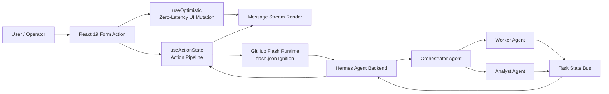

# `[ HERMES-AGENT-UI ]`

> EN: The Front-End Singularity for Multi-Agent Orchestration.  
> CN: 面向多智能体编排的前端奇点控制台。

```text
UNIT        hermes-agent-ui
SURFACE     #050505 / #121212
SIGNAL      #10B981
DEPLOY      GitHub Flash
RUNTIME     React 19
```

| Stack | EN | CN |
| --- | --- | --- |
| React 19 | Native actions. Optimistic mutation. No legacy ceremony. | 原生 Actions。乐观更新。拒绝旧式状态仪式。 |
| TypeScript | Strict physical model boundary. | 严格物理模型边界。 |
| Vite | Low-latency build core. | 低延迟构建核心。 |
| Framer Motion | Optical state transitions. | 光学状态过渡。 |
| GitHub Flash | Manifest-driven instant execution. | Manifest 驱动的即时云端执行。 |


---

## `01 / ARCHITECTURE ENGRAM`

> EN: The interface is not a decorative shell. It is the control membrane between human intent, React 19 action semantics, optimistic UI mutation, GitHub Flash execution, and Hermes agentic routing.  
> CN: 该界面不是装饰性外壳。它是人类意图、React 19 Action 语义、乐观 UI 突变、GitHub Flash 执行与 Hermes 智能体路由之间的控制膜。



---

## `02 / PHYSICAL MODELS`

> EN: PDM is treated as hardware geometry. UI components render from these surfaces, not from improvised object blobs.  
> CN: PDM 被视为硬件几何结构。UI 组件从这些结构渲染，而不是从随手拼出的对象块渲染。

### `Agent`

| Field | Type | EN | CN |
| --- | --- | --- | --- |
| `id` | `string` | Stable agent identity. | 稳定智能体身份。 |
| `name` | `string` | Operator-facing call sign. | 面向操作者的呼号。 |
| `role` | `"orchestrator" \| "worker"` | Routing class. | 路由类别。 |
| `status` | `"idle" \| "thinking" \| "executing"` | Live execution state. | 实时执行状态。 |
| `capabilities` | `string[]` | Declared execution affordances. | 已声明执行能力。 |

### `Message`

| Field | Type | EN | CN |
| --- | --- | --- | --- |
| `id` | `string` | Stream segment identity. | 消息流片段身份。 |
| `role` | `"user" \| "agent"` | Emission origin. | 发射来源。 |
| `content` | `string` | Render payload. | 渲染载荷。 |
| `metadata.latency` | `number?` | Response timing. | 响应耗时。 |
| `metadata.tools` | `string[]?` | Tool trace. | 工具轨迹。 |

### `Task`

```json
{
  "taskId": "string",
  "status": "pending | success | failed",
  "nodes": ["orchestrator", "worker", "analyst"]
}
```

---

## `03 / IGNITION SEQUENCE`

> EN: Flash deployment is manifest-locked. The repository must expose `flash.json`; otherwise the cloud runtime has no ignition key.  
> CN: Flash 部署由 manifest 锁定。仓库必须暴露 `flash.json`；否则云端运行时没有点火钥匙。

```json
{
  "name": "hermes-agent-ui",
  "version": "0.1.0",
  "entry": "src/main.tsx",
  "build": { "command": "vite build", "outDir": "dist" },
  "runtime": "react-19-latest"
}
```

### Local / 本地

```bash
pnpm install
pnpm dev
```

Current Hermes workspace layout / 当前 Hermes 工作区结构：

```bash
cd web
pnpm install
pnpm dev
```

Build / 构建：

```bash
cd web
pnpm build
```

---

## `04 / DIRECTORY STRICTURE`

```text
src/
├── App.tsx
├── main.tsx
├── index.css
├── components/
│   ├── agent/
│   │   ├── AgentHub.tsx
│   │   ├── AgentGrid.tsx
│   │   └── AgentCard.tsx
│   ├── ChatConsole.tsx
│   ├── ThemeSwitcher.tsx
│   └── LanguageSwitcher.tsx
├── pages/
│   ├── EnvPage.tsx
│   ├── SessionsPage.tsx
│   └── AnalyticsPage.tsx
├── themes/
│   ├── context.tsx
│   ├── presets.ts
│   └── types.ts
├── lib/
│   ├── api.ts
│   └── utils.ts
└── types/
    └── index.ts
```

---

## `05 / OPERATING DECISIONS`

> EN: Redux, Zustand, and React Query are not architectural defaults here. React 19 primitives own the interaction loop.  
> CN: Redux、Zustand、React Query 不是这里的默认架构。交互循环由 React 19 原语接管。

> EN: Loading state belongs to `useActionState`, not scattered boolean toggles.  
> CN: 提交态属于 `useActionState`，不属于散落的布尔开关。

> EN: User feedback must render optimistically before the backend returns.  
> CN: 用户反馈必须在后端返回前以乐观更新方式呈现。

> EN: Visual density is a feature. Empty ornament is a defect.  
> CN: 视觉密度是功能。空洞装饰是缺陷。

---

## `06 / VISUAL LANGUAGE`

| Token | Value | CN |
| --- | --- | --- |
| `background` | `#050505` | 主背景 |
| `surface` | `#121212` | 面板表面 |
| `emerald` | `#10B981` | 状态信号 |
| `slate` | `#1E293B` | 深层结构 |

> EN: Dark-mode first. Bento geometry. Glass overlays. Controlled motion.  
> CN: 暗色优先。Bento 几何。玻璃拟态覆盖层。受控动效。

---

## `07 / OPERATIONS & DEPLOYMENT PIPELINE`

### 1. 本地开发环境

在项目根目录安装依赖：

```bash
pnpm install
```

也可以使用 npm 或 yarn：

```bash
npm install
# 或
yarn install
```

启动 Vite 开发服务器：

```bash
pnpm dev
```

本地前端默认运行在：

```text
http://localhost:5173
```

### 2. 核心服务对接

前端界面需要连接 `hermes-agent` 后端服务才能完整工作。

在项目根目录创建 `.env.local`：

```bash
VITE_HERMES_API_URL=http://localhost:8000
```

> 确保后端 CORS 配置允许来自本地前端源的请求，例如 `http://localhost:5173`。

### 3. GitHub Flash 部署

项目已包含 `flash.json`，可用于 GitHub Flash 零配置部署。

1. 将本地仓库推送到 GitHub。

```bash
git push origin main
```

2. 在 GitHub Flash 控制台选择该仓库。

3. GitHub Flash 会自动解析 `flash.json`，执行构建命令：

```bash
vite build
```

构建完成后，Flash 会立即生成可访问的公开 URL。
