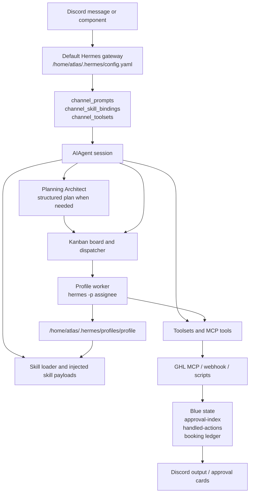
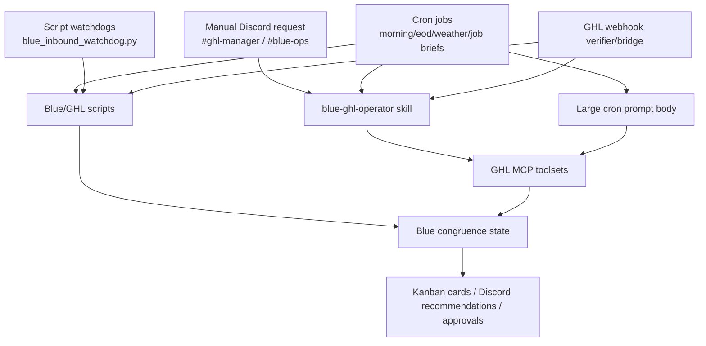

# Hermes Runtime Flow

Date: 2026-05-16

This document explains how the live Hermes/GHL system appears to route behavior today, based on read-only inspection of Atlas.

## Current Runtime Shape



## Discord Message Flow

1. Discord receives a message in a channel/thread.
2. The running gateway process is the default profile gateway.
3. Gateway loads config through `get_hermes_home() / config.yaml`.
4. For Discord, behavior is shaped by:
   - `discord.allowed_channels`
   - `discord.free_response_channels`
   - `discord.no_thread_channels`
   - `discord.channel_prompts`
   - `discord.channel_skill_bindings`
   - `discord.channel_toolsets`
5. On a new session, `channel_skill_bindings` auto-load skill payloads into the user message before the agent runs.
6. Toolsets are resolved from platform defaults plus channel overlays.
7. The AIAgent runs with the selected model/provider and enabled toolsets.
8. For complex, multi-agent, risky, or Blue/GHL-adjacent work, Hermes Steward can call Planning Architect before dispatching specialists or Kanban cards.

Important behavior:

- Channel auto-skills only inject on new sessions.
- Ongoing sessions rely on previous transcript history.
- If a session is compressed, stale, reset, or starts under a different profile, expected behavior may differ.
- Planning Architect is a specialist planning role in the active session context; it is not a separate Discord gateway or live routing owner by default.

## Profile Worker Flow

Kanban worker spawning uses:

```text
hermes -p <assignee> --skills kanban-worker chat -q "work kanban task <id>"
```

The worker sets:

```text
HERMES_PROFILE=<assignee>
HERMES_KANBAN_TASK=<task-id>
HERMES_KANBAN_DB=<board-db>
HERMES_KANBAN_WORKSPACES_ROOT=<board-workspaces-root>
HERMES_KANBAN_BOARD=<board>
```

Then `hermes_cli.main` applies the `--profile` override before imports. That changes `HERMES_HOME` to:

```text
/home/atlas/.hermes/profiles/<profile>
```

Impact:

- Worker sessions load profile config and profile skill context.
- Default gateway improvements are not automatically inherited by profile workers.
- Backend, frontend, and coder workers currently share the same config hash, so role-specific behavior is weak unless supplied by task skills/prompt text.

## GHL Flow

There are at least four ways GHL work enters the system:



The design philosophy appears to be:

```text
Let many systems discover GHL work, but force every action through shared identity,
approval, live-state reconciliation, and handled-state memory.
```

Current risk:

- The discovery side is strong: webhook, watchdog, cron, manual channel, and Kanban all exist.
- The congruence layer is split between skill text, cron prompts, scripts, and `/home/atlas/.hermes/blue/*.json`.
- Some script-only paths have no skills loaded.
- Several cron prompts duplicate or extend Blue policy inline.

## Token/Context Flow

Relevant config fields in live default config include:

- `compression.enabled: true`
- `compression.threshold`
- `compression.target_ratio`
- `compression.protect_last_n`
- `compression.hygiene_hard_message_limit`
- `prompt_caching.cache_ttl`
- `tool_output.max_bytes`
- `tool_output.max_lines`
- `memory.memory_char_limit`

Observed risk:

- Token optimization changed live config around the same time behavior drift was reported.
- If compression or session hygiene removes or summarizes previous auto-loaded skill payloads, ongoing sessions may stop showing the expected learned behavior.
- Because channel skills only auto-load on new sessions, long-lived sessions are sensitive to compression and stale transcript behavior.

## Source-of-Truth Flow

Current behavior is determined by a stack:

1. Code defaults in `/home/atlas/.hermes/hermes-agent/hermes_cli/config.py`.
2. Default config in `/home/atlas/.hermes/config.yaml`.
3. Profile config in `/home/atlas/.hermes/profiles/<profile>/config.yaml`.
4. `SOUL.md`, memory files, skill snapshots, and state DBs in the active Hermes home.
5. Channel prompts and auto-loaded skills.
6. Cron prompt bodies and script context.
7. Kanban task body, skills, assignee, workspace, and board.
8. GHL/Blue congruence state files.

The core design problem is that these layers are not explicitly governed by a single manifest. That makes it easy for a change to update one layer while another layer keeps the old behavior.

## What Should Call What

Recommended intended flow:

- Default gateway should own Discord routing, channel prompts, high-level platform toolsets, and live platform adapters.
- Hermes Steward should own user-facing coordination; Planning Architect should only decompose complex work and hand control back.
- Named profiles should own role-specific worker behavior only: Blue, backend, frontend, coder, creator.
- Profile configs should derive from a declared base profile plus small overlays, not full duplicated configs.
- Skills should be the main source of procedural behavior.
- Cron jobs should call skills/runbooks/scripts by reference, not contain long independent policy blocks.
- GHL scripts should perform mechanical reconciliation and state checks, not redefine agent policy.
- GHL action decisions should pass through one congruence contract before creating cards, sending notifications, or mutating CRM state.
- Kanban worker tasks should name explicit required skills when the profile does not guarantee them.
- Planner output should name owner profile, allowed actions, forbidden actions, verification, approval boundaries, and shared-context requirements.

## Where The Flow Is Fractured

| Fracture | Evidence | Effect |
| --- | --- | --- |
| Profile config duplication | backend-eng, frontend-eng, coder config hashes identical | Profiles may not behave like specialists. |
| Profile config drift from default | default has more channel prompts/bindings than profile configs | Behavior differs when a worker starts under a profile. |
| Profile skill drift | profile-local skills missing default skills | Expected trained workflows may not load. |
| Long cron prompts | cron jobs embed Blue/GHL operating doctrine | Policy changes must be updated in many places. |
| Script-only cron paths | inbound watchdog has no skills | Some GHL paths bypass skill doctrine. |
| Code and config changed together | gateway/Kanban/tool diffs plus config/token changes | Hard to isolate regression without staged restoration. |
| Secret-like channel title | channel directory contains an old token-like thread title | Data hygiene issue and possible prompt/context leak. |
