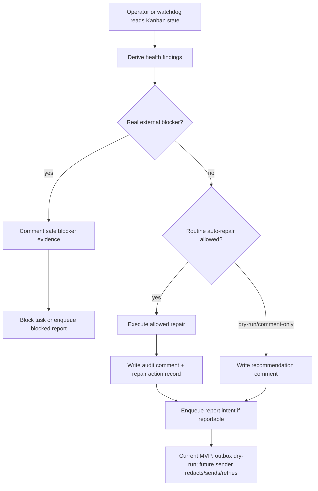
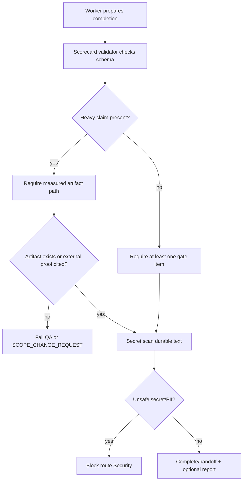

# Architecture: Default-profile Office Operator Superpowers

Status: proposed implementation architecture; current implementation is dry-run diagnostics plus local runner only
Last verified: 2026-05-13T00:39:21Z
Source task: t_18c840af

## Problem statement

The default Hermes profile, Akhil, needs to operate the Office/Kanban control plane hands-free without becoming an unsafe superuser. The target system must inspect, recommend or repair when reviewed support exists, reroute, dispatch, verify, and report routine Office failures while preserving evidence gates, reviewer/QA/security coverage, browser/profile boundaries, and strict secret redaction.

This architecture converts the PRD and research artifacts into an implementable Hermes-native reliability kit using existing Kanban, gateway, logs, Python stdlib, and shell tooling. It intentionally avoids npm installs, local GPU assumptions, and wholesale adoption of external orchestration platforms.

Current honest capability statement: this package provides dry-run Office diagnostics, evidence scorecard validation, and a local watchdog runner; live notification and safe repair remain follow-up work. Sections below describe the target architecture unless explicitly labeled implemented. Current code must not be described as production-ready, live-notifying, safely auto-repairing, or enforcing security boundaries.

## Design goals

- Default-profile operator can diagnose routine Office/Kanban failures now; safe repair is a target capability behind reviewed implementation and tests.
- Every autonomous action has an explicit authority boundary, audit comment, and rollback or compensating action.
- Watchdog and Doctor diagnose from durable state, not assistant memory or optimistic prose.
- Telegram reporting target is low-noise, redacted, and replayable through an outbox contract; current `office_report_outbox.py` live sending is dry-run only.
- Evidence gates are structured enough for programmatic validation by QA/reviewer workers.
- GPU-heavy work uses CPU proof or optional Colab remote artifacts; no local GPU proof is claimed.
- Browser/dashboard/log access is documented as bounded operational inspection, not unrestricted logged-in Chrome control.
- Skill and memory maintenance remain a reviewed discipline, not uncontrolled self-modification.

## Non-goals

- Replacing Hermes Kanban with Temporal, Airflow, Celery, RQ, or another queue.
- Granting default profile unrestricted access to logged-in browser profiles, cookies, credentials, or private dashboard sessions.
- Auto-approving destructive irreversible actions, paid/cloud actions, legal/license decisions, or required human approvals.
- Claiming Telegram delivery when gateway credentials or channel configuration are missing.
- Claiming GPU reproducibility on the local machine.
- Installing npm/pnpm/yarn packages or adding JavaScript dependencies.

## Architecture decision

Accepted direction: build a small Hermes-native Office reliability kit around the existing Kanban database, gateway dispatcher, logs, and Python CLI modules.

Rejected alternatives:

1. Full workflow engine adoption
   - Rejected because it adds dependencies and operational burden, duplicates Kanban, and is unnecessary for the requested Office MVP.
2. Documentation-only runbooks
   - Rejected because they do not satisfy watchdog, Doctor, outbox, evidence validation, or repair requirements.
3. Direct best-effort Telegram sends from workers
   - Rejected because task state and notification delivery can diverge. Use an outbox intent plus idempotent sender.
4. Browser-profile control as an operator primitive
   - Rejected because browser tools can automate pages and inspect screenshots/console state, but logged-in cookies/profile control requires explicit setup or human login.
5. Mandatory Colab/GPU proof for all ML tasks
   - Rejected because no local GPU exists and some tasks are CPU-sufficient. Use task-specific GPU policy.

Confidence: high for local Python/shell control-plane MVP; medium for Telegram smoke testing because it depends on configured gateway credentials/channel.

## Components

### 1. Default-profile Office Operator

Owner skill: system-architect for contract; implementation owner: orchestration-builder / backend-tooling.

Responsibilities:
- Inspect Kanban board, task runs, comments, events, parent handoffs, workspace paths, and dispatcher status.
- Classify routine vs real blockers.
- Recommend allowed routine repair actions or create child tasks for the correct specialist profile; executing repairs is follow-up unless a reviewed repair path exists.
- Preserve reviewer/QA/security gates by routing review work, not by treating routine review as a human blocker.
- Emit durable comments for repair recommendations now, and for executed repairs only after a reviewed repair implementation exists.

Allowed actions:
- Inspect tasks, runs, comments, events, board stats, current board, workspaces, and logs.
- Comment on a task with rationale and evidence paths.
- Recommend reclaim of stale claims once policy conditions are met; automatic reclaim is follow-up.
- Recommend unblock of protocol-only review-required or stale protocol blocks when evidence is present and no real external blocker remains; automatic unblock is follow-up.
- Recommend reassignment from nonspawnable seat to an equivalent concrete profile when prior runs show spawn failure or repeated crash and task scope still matches the destination profile; automatic reassignment is follow-up.
- Create child tasks for Security, QA/reviewer, docs, DevOps/tooling, gateway, or implementation owners.
- Enqueue Telegram report intents in the Office report outbox; live send remains dry-run/follow-up until reviewed sender evidence exists.

Denied actions without explicit approval or specialist review:
- Destructive irreversible filesystem or production-state changes outside the workspace.
- Credential creation, token/cookie exposure, or paid/cloud resource use.
- License/legal decisions for ambiguous sources.
- Bypassing required Security/QA/reviewer gates.
- Claiming benchmark/release/deploy/GPU proof without real artifacts.
- Editing protected artifacts outside this profile's authority boundary.

Inputs:
- Kanban task/run/comment/event records.
- Worker handoff metadata and gate scorecards.
- Local workspace artifacts.
- Gateway/dispatcher status.
- Office watchdog findings.
- Doctor summaries.

Outputs:
- Kanban comments and task status transitions.
- Child task creation records.
- Outbox report intents.
- Operator repair recommendation audit entries; executed repair audit entries are future work.
- Gate scorecard in completion metadata.

Failure modes:
- Misclassification of a real blocker as routine repair.
- Secret leakage in comments or reports.
- Duplicate repair actions after retries.
- Reassignment to an incompatible profile.

Controls:
- Policy allowlist for future auto-repair actions.
- Idempotency keys for outbox and future repair actions.
- Secret/PII redaction before durable writes.
- Audit comments for all transitions.
- QA/reviewer downstream gate for substantive implementation work.

### 2. Office Watchdog

Owner skill: orchestration-builder / backend-tooling; review by security and QA/evals.

Responsibilities:
- Periodically or manually derive issue findings from Kanban state, logs, worker runs, notification outbox, and required report fields.
- Stay quiet or emit a concise healthy summary when nothing is actionable.
- In dry-run mode, return JSON findings only.
- In future repair mode, execute only approved routine repairs; current watchdog scripts are dry-run diagnostics and do not mutate Kanban state.

Recommended module/script:
- `scripts/office_watchdog.py`
- Shared helpers in `hermes_cli/office_superpowers.py` or `hermes_cli/office_health.py`.
- Tests in `tests/hermes_cli/test_office_watchdog.py`.

Finding schema:

```json
{
  "issue_id": "stable hash of board/task/run/type/evidence",
  "issue_type": "stale_running|repeated_crash|ready_not_spawning|nonspawnable_assignee|blocked_protocol_violation|missing_required_report|outbox_backlog|secret_risk|evidence_gate_failure",
  "severity": "info|warn|page|block",
  "board": "default",
  "task_id": "t_xxx",
  "run_id": 0,
  "assignee": "profile",
  "age_seconds": 0,
  "evidence": ["safe event ids, artifact paths, or redacted log references"],
  "recommended_action": "human-readable action",
  "auto_repair_allowed": false,
  "repair_action": "none|comment|reclaim|unblock|reassign|create_child|enqueue_report|route_security",
  "redaction_status": "checked|redacted|unsafe_blocked"
}
```

Issue detection matrix:

| Issue | Detection source | Default recommendation | Auto-repair |
|---|---|---|---|
| stale_running | `tasks.status=running`, claim/run older than TTL, heartbeat missing or PID dead | reclaim or reroute after audit comment | yes when no active PID/heartbeat and within workspace |
| repeated_crash | multiple crashed runs for same task/profile with no useful summary | reassign or create profile repair task | yes for reassignment to equivalent profile; no for credentials |
| ready_not_spawning | ready/todo task age exceeds dispatch SLA and gateway dispatcher absent/degraded | start gateway or dispatch daemon; profile check | no if service start changes system state; yes for diagnostic comment |
| nonspawnable_assignee | ready tasks plus spawn_failed/crashed process errors for assignee | reassign or repair profile | yes for routine reassign; no if missing credential/config |
| blocked_protocol_violation | blocked only for review-required or routine handoff despite evidence | route QA/reviewer child or unblock | yes when no real blocker text is present |
| missing_required_report | missing intake/start/progress/handoff/review/closeout or gate scorecard fields | request/route evidence remediation | comment/create child only |
| outbox_backlog | queued/failed report rows older than retry SLA | retry due sends or surface config blocker | retry yes; block only if credentials/config missing |
| secret_risk | token/cookie/private-key pattern in pending report/doc/log excerpt | redact and route Security | no auto-send; security route |
| evidence_gate_failure | completion lacks required scorecard or heavy claim artifact | QA/reviewer changes requested | create QA/remediation child |

Thresholds for MVP:
- stale claim: use existing Kanban default claim TTL from `hermes_cli/kanban_db.py` (`DEFAULT_CLAIM_TTL_SECONDS`, currently 15 minutes) unless a task has a longer runtime cap and heartbeat.
- ready-not-spawning: warning after 2 dispatcher tick intervals; page after 10 minutes.
- outbox backlog: warning after 5 minutes; page after 30 minutes or retry exhaustion.
- repeated crash: warning after 2 consecutive crashes; route repair after 3, unless dispatcher already gave up earlier.

### 3. Office Doctor

Owner skill: backend-tooling / DevOps; documentation owner for runbook wording.

Responsibilities:
- Provide a local diagnostic command/script for humans and operators.
- Print scannable terminal sections plus optional JSON.
- Exit 0 when healthy/informational, 1 for actionable local unhealthy states, 2 for external blocker or unsafe secret exposure.
- Never print raw secrets, credential values, cookies, tokens, or large logs.

Recommended CLI surfaces:
- MVP script: `python3 scripts/office_doctor.py --json` and `python3 scripts/office_doctor.py`.
- Later integrated command: `hermes office doctor` or `hermes doctor --office`.

Output contract:

```json
{
  "schema_version": 1,
  "generated_at": "2026-05-13T00:39:21Z",
  "overall_verdict": "pass|warn|fail|blocked",
  "exit_code": 0,
  "sections": [
    {
      "name": "kanban_board",
      "verdict": "pass|warn|fail|blocked",
      "checks": [
        {
          "check": "default board reachable",
          "status": "pass|warn|fail|blocked|not_applicable",
          "evidence": "safe summary or artifact path",
          "recommended_fix": "safe command or next owner"
        }
      ]
    }
  ],
  "redaction_status": "checked|redacted|unsafe_blocked"
}
```

Required sections:
1. Runtime context: Hermes home/root display path, profile, current board, cwd, Python version.
2. Gateway health: service status, gateway PID if available, dispatcher enabled flag, safe log path.
3. Messaging health: Telegram/Slack config presence, not raw values; outbox backlog summary.
4. Kanban board: board DB path, task counts by status, stale/running/blocked summary.
5. Workers/profiles: nonspawnable or degraded assignees, repeated crash clusters.
6. Notifications: queued/failed report intents, oldest age, retry status.
7. Evidence gates: recent completed/blocked tasks lacking scorecards or malformed SCOPE_CHANGE_REQUEST blocks.
8. Logs: safe log paths and redacted last-error summaries.
9. Browser/dashboard: available routes and boundary statement; dashboard API status if inspectable.
10. Recommendations: sorted concrete next actions and whether each is safe auto-repair, specialist task, or human blocker.

### 4. Office Report Outbox and Telegram Reporting Contract

Owner skill: gateway/builder; security review for redaction; QA for smoke tests.

Responsibilities:
- Record report intent durably before send.
- Redact payload before it leaves local state.
- Future reviewed sender sends through existing Hermes messaging/gateway path when configured; current MVP remains dry-run.
- Future sender retries with backoff and keeps failures inspectable.
- Avoid noisy duplicate messages.

Recommended module/script:
- `scripts/office_report_outbox.py` for MVP.
- Later shared module: `hermes_cli/office_reports.py`.
- Optional SQLite table in the Kanban board DB or separate `office_report_outbox.jsonl` under Kanban home. Prefer SQLite when implementation can safely migrate DB schema; JSONL is simpler for first MVP.

Outbox row schema:

```json
{
  "id": "uuid or deterministic key",
  "idempotency_key": "board:task_id:run_id:report_type:payload_hash",
  "board": "default",
  "task_id": "t_xxx",
  "run_id": 0,
  "report_type": "started|blocked|completed|qa_failed|scope_change|watchdog_digest|doctor_summary",
  "destination": "telegram:home",
  "payload_redacted": "message text after redaction",
  "payload_hash": "sha256 of redacted payload",
  "redaction_status": "checked|redacted|unsafe_blocked",
  "created_at": "iso8601",
  "next_retry_at": "iso8601",
  "sent_at": null,
  "attempt_count": 0,
  "last_error_redacted": null,
  "status": "queued|sent|retrying|blocked_external_config|unsafe_blocked|dead_letter"
}
```

Telegram message schemas:

Started:
```text
Office started: <title> (<task_id>)
Owner: <assignee/profile>
Goal: <one-line goal>
Evidence expected: <gate summary or artifact path>
Next: working hands-free unless a real blocker appears.
```

Blocked:
```text
Office blocked: <title> (<task_id>)
Blocker: <credential|paid_cloud|destructive|legal_license|missing_runtime|unverifiable_claim|explicit_approval|unsafe_secret>
Evidence: <safe artifact/check summary>
Need from Akhil: <one concrete decision or permission>
```

Completed:
```text
Office completed: <title> (<task_id>)
Result: <one-line result>
Evidence: <scorecard summary or safe artifact path>
Next owner/action: <QA/reviewer/downstream/done>
```

QA failed:
```text
Office QA failed: <title> (<task_id>)
Failed gate: <gate name>
Evidence: <safe check/artifact>
Next: <remediation owner/task>
```

Scope change:
```text
Office scope change requested: <title> (<task_id>)
Requirement: <requirement ref>
Reason: <safe blocker summary>
Options: <short options>
Impact: <acceptance gate impact>
```

Rules:
- No raw tokens, cookies, credentials, PII, full logs, or unredacted environment dumps.
- Artifact paths are allowed when they are local repo paths and do not encode secrets or private PII.
- Large scorecards are summarized; full scorecard remains in Kanban metadata or docs.
- Routine review-required handoffs should not page Akhil as blocked; route QA/reviewer and optionally send digest.

### 5. Evidence Gate Validator

Owner skill: QA/evals; implementation owner: backend/tooling.

Responsibilities:
- Validate scorecard schema in docs, Kanban handoff metadata, and sample reports.
- Reject heavy claims without real artifacts.
- Parse and validate SCOPE_CHANGE_REQUEST blocks.
- Secret-scan candidate durable artifacts before completion/reporting.

Recommended script:
- `scripts/office_scorecard_validate.py`
- Tests: `tests/hermes_cli/test_office_scorecard_validate.py`

Canonical scorecard item:

```json
{
  "gate": "short gate name",
  "command_or_check": "exact command, tool call, or deterministic artifact check",
  "exit_code_or_artifact": "exit 0, path exists, json field result, or external blocker marker",
  "verdict": "PASS|FAIL|PARTIAL|BLOCKED|NOT_APPLICABLE|PASS_WITH_CAVEAT",
  "rationale": "why this satisfies or fails the gate",
  "artifact_paths": ["relative/or/absolute/safe/path"],
  "redaction_status": "checked|redacted|unsafe_blocked"
}
```

Heavy-claim evidence classes:
- benchmark/performance: measured output such as JSON, Criterion, k6, pytest report, logs, BENCHMARKS.md with raw artifact links.
- runtime/deploy/release: live-server test report, package/release artifact, helm/kind/minikube log, install output, versioned release evidence.
- ML/data: dataset card, manifest/checksum, metrics JSON/CSV, evaluation report, model card, Colab remote artifact where applicable.
- security/privacy: redaction/secret scan output, threat model, permission decision log.

SCOPE_CHANGE_REQUEST block:

```text
SCOPE_CHANGE_REQUEST
requirement_ref: <PRD/Rx or task line>
requested_change: <exact reduced or alternate scope>
reason: <why original requirement cannot be met>
attempted_evidence:
  - <commands/checks/artifacts tried>
impact:
  - <acceptance gates affected>
options:
  - <option A>
  - <option B>
END_SCOPE_CHANGE_REQUEST
```

### 6. Colab/GPU Policy Component

Owner skill: documentation/research with ML tooling review.

Responsibilities:
- Classify GPU needs per task.
- Prevent false local GPU claims.
- Define remote Colab artifact requirements when GPU proof is required or useful.

Decision matrix:

| GPU state | Meaning | Allowed completion |
|---|---|---|
| CPU-sufficient | CPU smoke or small-scale run validates requested behavior | Complete with CPU artifacts; no GPU claim |
| Colab-optional | GPU improves signal but is not required by acceptance gates | Complete with CPU proof and optional Colab instructions; mark GPU as not run if absent |
| GPU-required | Acceptance gate requires GPU-scale measurement/training | Complete only with exported Colab/GPU artifacts, or emit SCOPE_CHANGE_REQUEST/BLOCKED |

Colab artifact requirements:
- Notebook revision or exported `.ipynb`/HTML without secrets.
- Environment cell output: runtime, GPU type, Python version, package install log when applicable.
- Exact repo command invoked from notebook, not hidden notebook-only training logic.
- Exported metrics/logs/model artifacts back to repo or safe storage.
- Secret scan of notebook outputs before durable storage.

### 7. Browser, Dashboard, and Log Access Boundary

Owner skill: security-threat-model for boundary, documentation for operator docs, backend/tooling for diagnostics.

Browser automation allowed:
- Open URLs, click/type, inspect accessibility snapshot, inspect console output, collect image URLs, take screenshots, and analyze screenshots through vision when available.

Browser automation not guaranteed:
- Access to Akhil's logged-in Chrome profile.
- Private cookies, stored credentials, extension state, or user-specific browser sessions.
- Bypassing CAPTCHAs, MFA, legal walls, or site access restrictions.

Dashboard/log access allowed:
- Inspect local dashboard/API routes that are available without new credentials.
- Read Hermes logs through safe paths and redacted summaries.
- Link dashboard/API/log route in Doctor output.

Denied or blocked:
- Tasks requiring human login, cookies, private browser profile state, or credential prompts.
- Publishing screenshots/log excerpts that contain secrets or raw PII.

### 8. Skill and Memory Maintenance Loop

Owner skill: documentation / curator policy; implementation owner if CLI support is needed.

Responsibilities:
- Capture reusable procedures as skills after complex successful workflows or user corrections.
- Save only stable, compact, declarative facts to memory.
- Never save task progress, PR/issue numbers, commit SHAs, phase completion logs, or temporary TODOs to memory.
- Patch loaded skills immediately when stale/wrong steps are discovered.

Loop:
1. Worker completes complex or corrected workflow.
2. Worker decides whether knowledge is procedural skill, durable fact memory, or ephemeral task state.
3. Procedural workflow becomes skill proposal/update with verification steps and pitfalls.
4. Stable preference/environment fact becomes memory entry.
5. Task-specific progress stays in Kanban/session only.
6. Curator later reviews stale skills; pinned/bundled skills are protected from deletion.

## Data model

### Core entities

- `office_health_finding`: derived issue from watchdog/Doctor.
- `office_repair_action`: proposed or executed repair with audit metadata.
- `office_report_outbox_item`: redacted notification intent and delivery state.
- `office_gate_scorecard_item`: evidence item for completions and QA.
- `office_scope_change_request`: parseable unmet requirement request.
- `office_operator_policy`: local policy config for allowed actions, thresholds, destinations, and blockers.

### Suggested storage

MVP:
- No schema migration required initially.
- Generate findings from existing `hermes_cli.kanban_db` reads.
- Store report outbox as JSONL under shared Kanban home, e.g. `<kanban_home>/office_report_outbox.jsonl`, or under board-specific directory for non-default boards.
- Store docs/templates under `docs/office-superpowers/`.

Hardening:
- Add SQLite tables to the Kanban board DB once schema migration is reviewed:
  - `office_report_outbox`
  - `office_repair_actions`
  - `office_health_snapshots`
- Keep each row board-scoped and redacted.

### Policy config

Recommended config keys in `~/.hermes/config.yaml` after implementation review:

```yaml
office:
  operator:
    enabled: true
    yolo_default: true
    routine_repair_mode: dry_run   # dry_run|comment_only|repair_routine
    report_destination: telegram
  watchdog:
    enabled: true
    stale_claim_seconds: 900
    ready_not_spawning_seconds: 120
    outbox_warn_seconds: 300
    outbox_page_seconds: 1800
  evidence:
    require_scorecard: true
    heavy_claim_artifacts_required: true
  gpu:
    local_gpu_available: false
    colab_optional: true
```

Secrets remain in `.env` or existing gateway auth storage, not in config docs or Kanban rows.

## Control flow

### Routine repair flow



### Worker completion evidence flow



### Telegram report flow

```mermaid
sequenceDiagram
  participant Worker
  participant Kanban
  participant Outbox
  participant Gateway
  participant Telegram
  Worker->>Kanban: complete/block/comment with scorecard
  Worker->>Outbox: enqueue redacted report intent
  Outbox->>Outbox: dedupe by idempotency key
  Outbox-->>Gateway: future reviewed sender only; current MVP is dry-run
  Gateway-->>Telegram: deliver message only after live sender remediation
  Telegram-->>Gateway: delivery result
  Gateway-->>Outbox: sent_at or redacted error + retry
```

## Permission boundaries

| Boundary | Allowed | Requires specialist/human |
|---|---|---|
| Kanban state | inspect/comment/create child now; routine unblock/reassign only after reviewed implementation and policy evidence | destructive archive/delete, bypassing review/QA/security, protected artifacts |
| Workspace files | create/edit docs/scripts/tests in task workspace | outside workspace or production state |
| Gateway/Telegram | enqueue dry-run report intents now; send redacted reports only after reviewed live sender and configured path | new credentials, channel secrets, claiming delivery without proof |
| Browser | automation and diagnostics through available tools | logged-in profile/cookies/MFA/human login |
| Logs | read safe summaries and paths | exposing raw secrets/PII or entire private logs |
| GPU/Colab | optional remote guidance/artifact capture | paid/cloud permission, local GPU claim, missing required GPU proof |
| Skills/memory | propose/update procedures and stable declarative facts | saving task progress, secrets, protected profile policy changes |

## Failure modes and mitigations

| Failure mode | Mitigation |
|---|---|
| Watchdog noisy spam | group findings by issue type/profile/task; send digest; suppress duplicates by issue_id |
| Unsafe repair | repair allowlist, dry-run default for MVP, human block for destructive/external actions |
| Duplicate repair after retry | idempotency keys and audit comments checked before action |
| Secret leak in report/comment | redaction helper plus validator secret scan before durable writes/sends |
| False completion with prose-only claim | scorecard validator and QA gate reject heavy claims without artifacts |
| Outbox delivery fails | retry with backoff; Doctor exposes backlog; never claim delivery unless sent_at recorded |
| Gateway unavailable | Doctor reports service guidance; outbox marks blocked_external_config if config missing |
| Nonspawnable profile loop | repeated crash/spawn failure clustering; reassign or create profile repair task |
| Browser login unavailable | explicit blocked state for human login/profile setup |
| GPU proof unavailable | SCOPE_CHANGE_REQUEST or BLOCKED; no local GPU claim |
| License ambiguity | Security/legal block before copying source/template code |

## Observability hooks

Recommended event names:
- `office_operator_action_planned`
- `office_operator_action_executed`
- `office_watchdog_issue_detected`
- `office_watchdog_repair_attempted`
- `office_doctor_run`
- `office_report_enqueued`
- `office_report_sent`
- `office_report_failed`
- `office_evidence_gate_validated`
- `office_evidence_gate_failed`
- `office_scope_change_requested`
- `office_skill_memory_action`

Common attributes:
- `board`, `task_id`, `run_id`, `assignee`, `issue_type`, `severity`, `repair_action`, `report_type`, `verdict`, `artifact_path_hash`, `redaction_status`.

Do not include raw token values, cookies, private user identifiers, or unredacted log excerpts in event attributes.

## Tests/evals

Implementation must include tests that run with existing Python/shell tooling only:

- Unit tests for redaction helper: token/cookie/private-key/API-key patterns become `[REDACTED]`.
- Unit tests for scorecard validator: valid scorecard passes; missing keys fail; heavy claims without artifacts fail; SCOPE_CHANGE_REQUEST parses.
- Kanban fixture tests for stale running, repeated crash, ready-not-spawning, nonspawnable assignee, blocked protocol violation, and missing report.
- Outbox tests for idempotency, retry/backoff fields, no raw payload prints, missing config behavior.
- Doctor tests for section presence, exit codes, JSON schema, and redacted output.
- Policy tests for auto-repair allowlist and real blocker taxonomy.
- Documentation checks for required sections and no forbidden npm install instructions.

Use `scripts/run_tests.sh` for repository test execution, not direct `pytest`, unless a platform-specific exception is documented.

## Rollout plan

1. Docs/contracts only
   - Land architecture, implementation plan, and security model.
   - No runtime behavior changes.
2. Validator MVP
   - Add `scripts/office_scorecard_validate.py` and tests.
   - Use against sample docs and Kanban metadata exports.
3. Doctor MVP
   - Add `scripts/office_doctor.py` in diagnostic-only mode.
   - Print required sections; no repairs.
4. Watchdog dry-run
   - Add `scripts/office_watchdog.py --dry-run --json`.
   - Seed fixture boards in tests.
5. Outbox MVP
   - Add JSONL outbox and sender dry-run/status commands.
   - Prove idempotency and redaction; do not require live Telegram for unit tests.
6. Repair-routine mode
   - Enable comment-only then routine repairs behind config.
   - Keep destructive/external blockers disabled.
7. Telegram smoke
   - If configured credentials exist, send a safe test report and record sent evidence; otherwise mark blocked_external_config honestly.
8. Dashboard/Doctor JSON integration
   - Expose Doctor JSON for dashboard consumption without reimplementing chat/TUI.

## Owner handoffs

- `orchestration-builder`: implement watchdog state derivation, operator action state machine, Kanban repair APIs.
- `permission-gateway`: review/implement policy enforcement for auto-repair allowlist and approval boundaries.
- `security-threat-model`: threat model redaction, outbox, browser boundary, log/dashboard exposure.
- `observability`: wire events, attributes, logs, and Doctor JSON contract.
- `documentation`: produce runbook/templates and user-facing Office Doctor docs.
- `QA/evals`: build validators, seeded fixture boards, and evidence gate tests.
- `gateway/builder`: implement Telegram outbox sender through existing gateway/send-message infrastructure.

## Acceptance gates for this architecture doc

| Gate | Command/check | Exit code / artifact | Verdict | Rationale |
|---|---|---|---|---|
| Source plan read | `read_file docs/akhil-default-profile-superpowers-plan.md` | 39-line artifact read | PASS | Architecture preserves source mission and constraints. |
| Parent PM docs read | `read_file PRD.md, GATE_SCORECARD.md, TASK_GRAPH.md` | Artifacts read successfully | PASS | Requirements R1-R10 and work package sequencing informed the design. |
| Parent research read | `read_file ML_TEMPLATE_RESEARCH.md and OPS_AGENT_TEMPLATE_RESEARCH.md` | Artifacts read successfully | PASS | Watchdog/Doctor/outbox/evidence and Colab/ML policy reflect research recommendations. |
| Architecture deliverable | File path | `docs/office-superpowers/ARCHITECTURE.md` | PASS | This artifact defines problem, components, data model, flow, permission boundaries, failure modes, tests, and rollout. |
| No npm installs | Session command review | No npm/pnpm/yarn/npx commands executed | PASS | Work used file tools, reads/searches, and Python/shell-safe checks only. |
| No local GPU claim | Content review | This document states no local GPU proof may be claimed | PASS | Colab is optional/remote evidence only. |
| Secret safety | Planned verification | regex scan in final task scorecard | PENDING_FINAL_SCAN | No secrets intentionally included; final verification will scan docs. |
