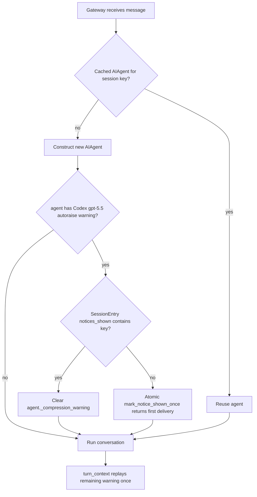

# fix: Show Codex gpt-5.5 autoraise notice once per gateway session

## Summary

Hermes should keep the Codex `gpt-5.5` compression threshold autoraise, but gateway users should see its explanatory notice only once per durable gateway session. The fix persists a gateway-session notice latch and gates the existing `_compression_warning` replay when an in-memory `AIAgent` is rebuilt.

---

## Problem Frame

The upstream Codex `gpt-5.5` autoraise feature is useful: on `openai-codex`, Hermes raises auto-compaction from `50%` to `85%` so the 272K Codex OAuth window is not half-wasted. The notification is currently latched on `AIAgent._compression_warning`, so it is cleared only for the current in-memory agent. Gateway sessions can rebuild that agent while preserving the visible Telegram or WhatsApp transcript, causing the same notice to reappear in what users reasonably consider the same session.

---

## Requirements

### Notice behaviour

- R1. Preserve the Codex `gpt-5.5` threshold autoraise behaviour for `provider=openai-codex` and keep the existing notice text for first delivery.
- R2. Show the autoraise notice at most once per durable gateway session backed by `SessionStore`, including Telegram and WhatsApp, even when a new `AIAgent` is constructed for the same session key.
- R3. Keep CLI behaviour unchanged: CLI users may still see the startup notice per process because there is no gateway session store.
- R4. A new durable session created by `/new`, `/reset`, auto-reset, or normal session creation should be eligible to show the notice once.

### Persistence and compatibility

- R5. Persist the notice latch through gateway process restarts and agent cache eviction.
- R6. Load existing gateway session files that do not contain the new latch without migration errors.
- R7. Keep notice delivery gateway-owned and do not persist the notice as assistant conversation content.

### Tracking and review

- R8. Open a GitHub feature request/bug issue describing the gateway-session UX problem and acceptance criteria.
- R9. Link the implementation PR to the tracking issue and include verification details.

---

## Key Technical Decisions

- **Persist the latch on `SessionEntry`:** The repeated notice is caused by rebuilding in-memory agents, so the latch must live with durable gateway session state rather than on `AIAgent` or process-local runner sets.
- **Use a generic notice map instead of a single boolean:** A normalized `dict[str, bool]` keeps this fix small while giving future one-shot gateway notices a reusable session-scoped mechanism.
- **Make check-and-mark atomic:** A single `SessionStore` helper should check, set, save, and return whether the caller won first-delivery rights while holding the store lock.
- **Gate after fresh agent construction in `gateway/run.py`:** The `status_callback` is wired after `AIAgent` construction, so the gateway can clear `agent._compression_warning` before `agent.run_conversation()` reaches the turn-context replay path.
- **Mark before replay, not after send acknowledgement:** Status notices are best-effort user-facing lifecycle messages. Marking before replay avoids duplicates across crashes between scheduling and completion, matching the goal of suppressing repeated nags over guaranteed delivery.

---

## High-Level Technical Design

The session store owns whether the user has already been told. The agent still owns the existing threshold and warning computation.

---

## Implementation Units

### U1. Persist gateway notice latch on session entries

- **Goal:** Add durable session-level storage for one-shot gateway notices.
- **Requirements:** R2, R4, R5, R6, R7.
- **Dependencies:** None.
- **Files:**
  - `gateway/session.py`
  - `tests/gateway/test_session_notice_latch.py`
- **Approach:** Add `notices_shown: Dict[str, bool] = field(default_factory=dict)` to `SessionEntry`, include it in `to_dict()`, and normalize missing or malformed values in `from_dict()`. Add a single `SessionStore` helper such as `mark_notice_shown_once(session_key, notice_key) -> bool` that checks, sets, saves, and returns `True` only for the first caller under the existing store lock.
- **Patterns to follow:** Existing `SessionEntry` fields such as `resume_pending`, `expiry_finalized`, and `is_fresh_reset`; existing session-store mutation helpers that acquire the lock and persist `sessions.json`.
- **Test scenarios:**
  - Loading an existing session JSON entry without `notices_shown` returns an entry with an empty notice map.
  - Loading malformed `notices_shown` values such as `None`, strings, lists, integers, or non-normalized dict values does not fail and produces a safe `dict[str, bool]`.
  - Marking a notice key persists it to disk and a new `SessionStore` instance reads it back.
  - Calling `mark_notice_shown_once()` twice for the same session and notice returns `True` then `False` without losing persisted state.
  - Marking one notice key does not make a different notice key appear shown.
  - A freshly reset or newly created session entry starts with no notice keys shown.
- **Verification:** The session-store tests prove backwards-compatible load, durable persistence, and fresh-session reset behaviour.

### U2. Gate Codex autoraise warning replay through the durable latch

- **Goal:** Suppress repeat gateway delivery when a fresh `AIAgent` is built for an already-notified session.
- **Requirements:** R1, R2, R3, R5, R7.
- **Dependencies:** U1.
- **Files:**
  - `gateway/run.py`
  - `tests/gateway/test_codex_autoraise_notice_once.py`
- **Approach:** Define a stable notice key for the Codex `gpt-5.5` autoraise notice in gateway code. After a fresh `AIAgent` is constructed and before callbacks are wired for the turn, inspect `agent._compression_threshold_autoraised` and `agent._compression_warning`. Call the atomic session-store helper; if it returns `True`, leave the warning for the existing turn-context replay, and if it returns `False`, clear `agent._compression_warning`. Keep cached-agent hits unchanged because the agent-level warning is already cleared after first replay.
- **Patterns to follow:** `_agent_cache` miss path in `GatewayRunner._run_agent()`, status callback replay in `agent/turn_context.py`, and gateway-owned one-shot UX patterns from onboarding hints and pending model notes.
- **Test scenarios:**
  - First fresh agent for a session with a populated Codex autoraise warning keeps the warning and marks the session notice key.
  - Second fresh agent for the same durable session has the warning cleared before replay.
  - An integration-style gateway test forces two fresh-agent constructions for one session and asserts exactly one lifecycle/status send reaches the fake adapter or callback path.
  - A different session key remains eligible to show the warning once.
  - An agent without `_compression_threshold_autoraised` is not latched or modified.
- **Verification:** Gateway tests simulate rebuilt agents for the same session and prove only the first one remains eligible to replay the warning.

### U3. Verify existing agent-level compression warning behaviour

- **Goal:** Ensure the lower-level compression warning replay contract still sends once per agent when no gateway latch is involved.
- **Requirements:** R1, R3, R7.
- **Dependencies:** U2.
- **Files:**
  - `tests/agent/test_turn_context.py`
  - `tests/run_agent/test_compression_feasibility.py`
- **Approach:** No agent-layer production code change is expected. Keep `_replay_compression_warning()` and `build_turn_context()` clearing behaviour intact, and rely on existing tests unless the gateway gating creates a specific coverage blind spot.
- **Patterns to follow:** Current tests that assert `_compression_warning` is replayed through `status_callback` and then cleared.
- **Test scenarios:**
  - Existing replay-and-clear tests continue to pass.
  - No gateway-specific state is required for agent-only compression warning replay.
- **Verification:** Existing agent tests stay green alongside the new gateway tests.

### U4. Add tracking issue and PR linkage

- **Goal:** Make the UX request durable in GitHub and connect the code change to it.
- **Requirements:** R8, R9.
- **Dependencies:** U1, U2.
- **Files:**
  - Pull request body only.
- **Approach:** Create a GitHub issue describing the repeated notice in Telegram/WhatsApp gateway sessions, expected once-per-session behaviour, and acceptance criteria. Reference the issue in the PR body with a closing keyword if appropriate.
- **Patterns to follow:** Repository PRs should include what changed, why, verification, risks, and follow-up without provenance language.
- **Test scenarios:** Test expectation: none -- this unit is tracker hygiene, not runtime behaviour.
- **Verification:** The GitHub issue URL exists, and the PR body links it.

---

## Scope Boundaries

- This plan does not disable `compression.codex_gpt55_autoraise` or change the `0.85` threshold.
- This plan does not hide the notice globally; it remains visible once for each eligible durable gateway session.
- This plan does not redesign gateway lifecycle/status delivery or conversation transcript persistence.
- This plan does not alter non-gateway CLI startup notices.

### Deferred to Follow-Up Work

- A broader gateway notice registry could consolidate onboarding hints, credit notices, and lifecycle notices later if more repeated-notice issues appear.

---

## Risks & Dependencies

- **Session-store concurrency:** The latch helper must use the existing store lock and save path so concurrent gateway turns do not race into duplicate delivery.
- **Reset semantics:** The latch must be scoped to `SessionEntry`, not global chat ID, so a real `/new` or auto-reset gets a fresh one-time notice allowance.
- **Delivery best effort:** Marking before replay may suppress a notice if delivery fails after marking, but this is acceptable because repeated user-facing nags are the observed issue and status messages are already best-effort.

---

## Sources & Research

- `agent/agent_init.py` builds and stores the Codex `gpt-5.5` autoraise notice on `agent._compression_warning`.
- `agent/auxiliary_client.py` gates the `0.85` threshold override to `gpt-5.5` on `openai-codex`.
- `agent/turn_context.py` replays `agent._compression_warning` and clears it once per in-memory agent.
- `gateway/run.py` reuses or rebuilds `AIAgent` instances through `_agent_cache` and passes `gateway_session_key` plus `session_db` into fresh agents.
- `gateway/session.py` persists durable `SessionEntry` state across visible Telegram and WhatsApp sessions.
- `tests/agent/test_arcee_trinity_overrides.py`, `tests/run_agent/test_compression_feasibility.py`, and `tests/gateway/test_agent_cache.py` contain the closest existing coverage patterns.
