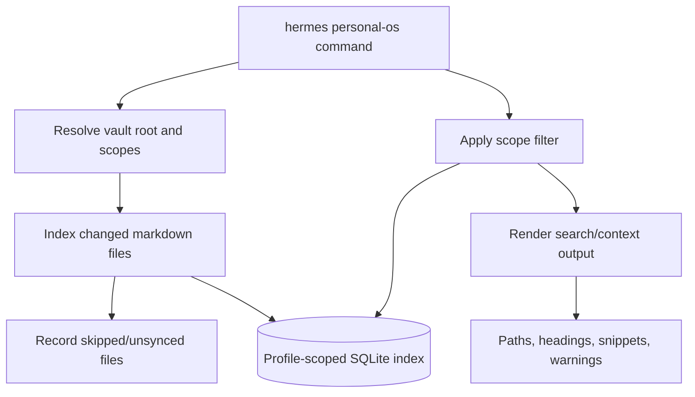
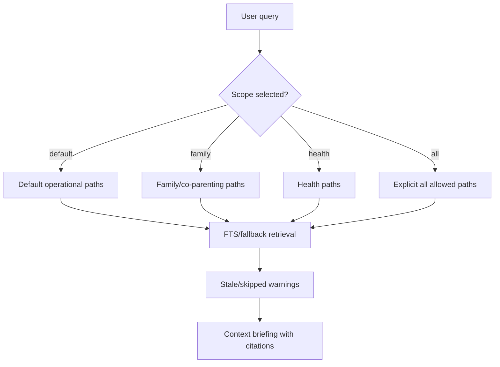

# feat: Personal OS vault retrieval MVP

## Summary

Build a read-only local retrieval MVP for Marek's Personal OS Obsidian vault: index markdown notes into a profile-scoped SQLite/FTS5 cache, search with privacy-aware scopes, and render concise context briefings with source citations. The MVP deliberately avoids embeddings, cloud APIs, and vault mutation so Personal OS remains the source of truth and the index remains disposable.

---

## Problem Frame

Marek's highest-value memory use case is practical Personal OS recall, not broad `mrkvault` knowledge-base search. He needs fast answers to operational questions like family logistics, home/admin context, shopping/product research, open loops, and health-related notes when explicitly requested. The risky failure modes are privacy leakage, stale context, iCloud/Obsidian file handling bugs, and accidentally treating an index as canonical memory.

---

## Requirements

**Read-only Personal OS retrieval**

- R1. The feature indexes `.md` files from a configured Personal OS vault without writing to, renaming, deleting, or patching any vault file.
- R2. The index is stored under profile-aware Hermes home, not inside the Obsidian vault, and can be rebuilt from vault files at any time.
- R3. Indexing tracks file path, title, headings/chunks, modified time, size, hash, frontmatter/tags when available, skipped-file status, and index timestamps.

**Privacy and scoped recall**

- R4. Search/context commands apply a scope before retrieval so generic queries do not accidentally pull health or family context.
- R5. Health notes are excluded unless the user explicitly selects health scope or the query is routed to health intent by a future agent wrapper.
- R6. Family/co-parenting notes are available through an explicit family scope and are kept separate from generic/admin recall.
- R7. The default scope prioritizes safe operational notes such as `HOME.md`, `TASKS.md`, `Open Loops.md`, projects, home/admin, and shopping, while excluding `.obsidian`, archive-heavy noise, and unsafe/sensitive folders.

**Retrieval quality and maintainability**

- R8. Search works locally with stdlib SQLite FTS5 and falls back gracefully when FTS5 is unavailable.
- R9. Results cite repo/vault-relative file paths and include enough title/heading/snippet context for an agent or human to verify the source.
- R10. Context output separates practical synthesis inputs from stale/possibly-unsynced warnings and skipped files.
- R11. The CLI supports index, search, context, and doctor flows with deterministic JSON output for future Hermes tool integration.
- R12. The implementation adds tests for scope filtering, read-only behavior, iCloud edge cases, FTS search/fallback, and CLI output shape.

---

## Key Technical Decisions

- KTD1. **SQLite/FTS5 first, vector DB later:** Use stdlib `sqlite3` with FTS5 for the MVP because Hermes already depends on SQLite patterns, the active environment supports FTS5/trigram tokenization, and Chroma/sentence-transformers are not installed or appropriate as core dependencies.
- KTD2. **Profile-scoped disposable cache:** Store the index in `get_hermes_home()` so different Hermes profiles do not share personal retrieval state; never store index metadata inside the vault.
- KTD3. **CLI-only MVP with JSON mode:** Add a terminal CLI first (`hermes personal-os ...`) rather than an agent tool or slash command. This proves indexing/search behavior and gives future tools a stable local interface without expanding the agent prompt/tool schema yet.
- KTD4. **Scope filter before retrieval:** Apply domain/path allowlists before FTS or fallback search. This prevents semantically broad queries from pulling sensitive family/health notes by accident.
- KTD5. **No new heavy dependencies:** Use stdlib modules plus already-core YAML support for frontmatter/config parsing. Do not add embeddings, vector stores, markdown parser packages, or cloud APIs in this PR.
- KTD6. **iCloud-safe reads:** Treat 0-byte files and read errors as skipped/possibly-unsynced files, not empty truth. Report them in index/doctor output and continue.

---

## High-Level Technical Design

---

## Scope Boundaries

### In scope

- Read-only local indexing of markdown files from a Personal OS vault.
- SQLite/FTS search, snippets, citations, simple heading-aware chunks.
- CLI commands for `index`, `search`, `context`, and `doctor`.
- Privacy scopes implemented as deterministic path include/exclude rules.
- Tests against temporary fixture vaults.

### Deferred to Follow-Up Work

- Semantic embeddings, Chroma, sentence-transformers, cloud embeddings, or rerankers.
- Agent tool registration and automatic Telegram query routing.
- Obsidian note creation, updates, merging, tagging, movement, or cleanup.
- Daily cron maintenance or integration into the morning brief.
- Rich domain classifiers beyond explicit CLI scope flags.

### Out of scope

- Making the index canonical memory.
- Auto-editing Personal OS or `mrkvault`.
- Indexing every vault indiscriminately.
- Sending Personal OS chunks to an external model/provider.

---

## Implementation Units

### U1. Add Personal OS indexing core

- **Goal:** Create a pure-Python indexing module that discovers markdown files, reads them safely, chunks them by headings/size, and stores metadata plus FTS rows in SQLite.
- **Requirements:** R1, R2, R3, R8, R12
- **Dependencies:** None
- **Files:**
  - `hermes_cli/personal_os_index.py`
  - `tests/hermes_cli/test_personal_os_index.py`
- **Approach:**
  - Define a `PersonalOSIndex` class with explicit `vault_root` and optional `db_path` constructor arguments.
  - Resolve default DB path via a function that calls `get_hermes_home()` at runtime.
  - Use tables for files, chunks, skipped files, and index metadata.
  - Create an FTS5 virtual table when available; fall back to LIKE-based search when not.
  - Track `mtime`, `size`, and `sha256` to skip unchanged files.
  - Skip `.obsidian`, hidden directories, non-markdown files, archives by default, 0-byte files, symlink escapes, and unreadable/iCloud-deadlock files.
- **Patterns to follow:** `hermes_state.py` for SQLite/FTS patterns and `hermes_constants.py` for profile-aware paths.
- **Test scenarios:**
  - Indexing a fixture vault creates rows for markdown files and chunks with title/path/heading metadata.
  - Re-indexing unchanged files does not duplicate chunks.
  - Updating a file hash replaces its old chunks with fresh chunks.
  - A 0-byte markdown file is recorded as skipped rather than indexed as empty content.
  - A read error is recorded as skipped and does not abort the full index run.
  - A symlink escaping the vault root is ignored or skipped.
  - When FTS5 creation is unavailable, LIKE fallback still returns matching rows.
- **Verification:** The core module can index/search a temporary markdown vault without touching vault files and without relying on external packages.

### U2. Implement privacy scopes and ranking hints

- **Goal:** Add deterministic Personal OS domain scopes so retrieval is constrained before searching.
- **Requirements:** R4, R5, R6, R7, R9, R12
- **Dependencies:** U1
- **Files:**
  - `hermes_cli/personal_os_index.py`
  - `tests/hermes_cli/test_personal_os_index.py`
- **Approach:**
  - Model scopes as named include/exclude glob rules: `default`, `family`, `health`, `shopping`, `projects`, and `all`.
  - Default scope includes operational/root/project/admin paths and excludes health/family/archive/noise paths.
  - Health scope explicitly includes health paths and excludes unrelated content.
  - Family scope includes family/co-parenting/child logistics paths and excludes health unless separately selected later.
  - Add ranking boosts for `AGENTS.md`, `CLAUDE.md`, `HOME.md`, `TASKS.md`, `Open Loops.md`, area hubs, title matches, and recent modification.
  - Keep scope rules inspectable through a small config/data structure rather than hard-coded across search functions.
- **Patterns to follow:** Obsidian skill safety conventions for Personal OS root files and iCloud/unicode path handling.
- **Test scenarios:**
  - Default scope excludes fixture health and family notes while returning generic admin/project notes.
  - Family scope returns family notes but does not return health notes.
  - Health scope returns health notes only when explicitly selected.
  - Ranking puts command-center/open-loop notes above lower-priority matches when scores are otherwise similar.
  - Unicode and spaces in paths are handled correctly.
- **Verification:** A generic search cannot retrieve health/family fixture notes unless the matching scope is explicitly requested.

### U3. Add `hermes personal-os` CLI commands

- **Goal:** Expose the MVP through terminal commands suitable for manual use and future tool wrapping.
- **Requirements:** R8, R9, R10, R11, R12
- **Dependencies:** U1, U2
- **Files:**
  - `hermes_cli/personal_os.py`
  - `hermes_cli/main.py`
  - `tests/hermes_cli/test_personal_os_cli.py`
- **Approach:**
  - Add `register_cli(parent)` in a self-contained module with subcommands:
    - `index`: crawl changed files, print counts and skipped warnings.
    - `search <query>`: return ranked matches with snippets/citations.
    - `context <query>`: return a concise briefing-oriented output from top matches.
    - `doctor`: report vault readability, DB path, indexed counts, skipped counts, stale status, and FTS availability.
  - Support `--vault-root`, `--db-path`, `--scope`, `--limit`, `--json`, and `--rebuild` where relevant.
  - Wire the top-level parser in `hermes_cli/main.py` and update built-in subcommand recognition.
  - Use concrete absolute paths internally, but display vault-relative citations in results.
- **Patterns to follow:** `hermes_cli/curator.py` modular CLI registration and existing `hermes_cli/main.py` top-level command wiring.
- **Test scenarios:**
  - Parser accepts `personal-os index/search/context/doctor` and dispatches to the correct handler.
  - `--json` output is valid JSON with stable keys.
  - Search/context commands return non-zero or clear errors for missing vault roots.
  - `index --rebuild` recreates the cache for a fixture vault.
  - Doctor reports skipped files and FTS status without failing on partial index issues.
- **Verification:** `hermes personal-os --help` and subcommand help work; fixture-vault CLI tests pass under isolated `HERMES_HOME`.

### U4. Add context rendering and staleness/skipped-file warnings

- **Goal:** Make retrieval output useful in Telegram/Hermes workflows by returning answer-ready context with citations and warnings.
- **Requirements:** R9, R10, R11, R12
- **Dependencies:** U1, U2, U3
- **Files:**
  - `hermes_cli/personal_os.py`
  - `hermes_cli/personal_os_index.py`
  - `tests/hermes_cli/test_personal_os_cli.py`
- **Approach:**
  - Render `context` output with sections for strongest matches, practical snippets, possibly stale matches, and skipped/unsynced warnings.
  - Mark stale results using file `mtime` thresholds rather than pretending old notes are current.
  - Include `indexed_at` and `modified` metadata in JSON mode.
  - Keep synthesis mechanical: no LLM summarization inside the CLI.
- **Patterns to follow:** `tools/session_search_tool.py` result grouping style, but without auxiliary model summarization.
- **Test scenarios:**
  - Context output includes file path, title, heading, snippet, modified time, and score for each result.
  - Old fixture notes are marked as possibly stale.
  - Skipped files appear as warnings when they might affect recall.
  - JSON mode preserves enough metadata for future agent wrappers.
- **Verification:** A CLI context query over fixture notes produces concise, cited, deterministic output.

### U5. Add documentation and safety notes

- **Goal:** Document how to run, maintain, rebuild, and safely scope the Personal OS retrieval MVP.
- **Requirements:** R1, R2, R4, R5, R6, R10, R11
- **Dependencies:** U3, U4
- **Files:**
  - `website/docs/user-guide/features/personal-os-retrieval.md`
  - `website/sidebars.ts` or relevant docs navigation file if needed
  - `tests/website/test_personal_os_retrieval_docs.py` if docs navigation/content tests are appropriate
- **Approach:**
  - Document the read-only guarantee, profile-scoped DB path, scope behavior, iCloud skipped-file handling, and rebuild command.
  - Explain that Personal OS is source of truth and the SQLite index is disposable.
  - Give example commands for default, family, health, shopping, context, doctor, and rebuild flows.
  - State that embeddings/vector search and agent auto-routing are intentionally deferred.
- **Patterns to follow:** Existing feature docs under `website/docs/user-guide/features/`.
- **Test scenarios:**
  - Documentation references the actual command name and scope names.
  - Any docs navigation update imports/builds without broken references if the repo has such tests.
- **Verification:** Users can discover the command and understand that it is read-only and locally cached.

---

## Acceptance Examples

- AE1. Given a temporary Personal OS fixture with `TASKS.md`, `Areas/Personal/Health/Symptoms.md`, and `Areas/Personal/Family.md`, when `hermes personal-os search "doctor" --scope default` runs, then health-specific content is not returned.
- AE2. Given the same fixture, when `hermes personal-os search "doctor" --scope health` runs, then the health note can be returned with a citation.
- AE3. Given a fixture file that is 0 bytes, when indexing runs, then the command completes and reports the file as skipped/possibly unsynced.
- AE4. Given an already indexed fixture, when `hermes personal-os context "Kalda mower" --json` runs, then the output contains stable JSON with query, scope, matches, warnings, and index metadata.
- AE5. Given the index database is deleted, when `hermes personal-os index --rebuild` runs, then search works again and no vault markdown file is modified.

---

## System-Wide Impact

This change introduces a new local index cache and CLI surface but does not alter the main agent loop, gateway behavior, memory provider, or Obsidian vault contents. The primary cross-cutting concerns are privacy scoping, profile isolation, and future extensibility toward an agent tool/Telegram workflow. Keeping the MVP CLI-only limits prompt/tool-schema growth and makes the cache behavior testable before any autonomous retrieval is added.

---

## Risks & Dependencies

- **Privacy scope mistakes:** A wrong default include/exclude rule could surface sensitive notes. Mitigation: default excludes family/health, tests assert exclusions, and health/family require explicit scope.
- **Stale context:** Old notes can look current in search results. Mitigation: include modified/indexed timestamps and staleness warnings in context output.
- **iCloud sync edge cases:** 0-byte or deadlocked files could be misread. Mitigation: skip and report rather than treating as empty or fatal.
- **Dirty repo baseline:** The repository currently contains unrelated modified/untracked files. Mitigation: keep implementation changes narrow and avoid committing unrelated files.
- **FTS portability:** Some SQLite builds may lack FTS5. Mitigation: implement and test LIKE fallback.

---

## Documentation / Operational Notes

- The index is disposable; `--rebuild` should be safe and cheap for Personal OS scale.
- The Personal OS vault path should default from `OBSIDIAN_VAULT_PATH` when available, with CLI override for tests and other machines.
- Future maintenance can add cron indexing, but the MVP should not schedule jobs automatically.
- Future agent integration can wrap `hermes personal-os context --json` and apply Marek's routing preference: Personal OS for practical recall, `mrkvault` for knowledge-base context.

---

## Sources / Research

- `AGENTS.md` — Hermes repo development guidance and architecture overview.
- `hermes_cli/main.py` — top-level CLI parser and built-in subcommand wiring.
- `hermes_cli/curator.py` — modular CLI registration pattern.
- `hermes_constants.py` — profile-aware `get_hermes_home()` path convention.
- `hermes_state.py` — SQLite/FTS5 search, WAL fallback, and sanitization patterns.
- `tools/file_operations.py` — existing Obsidian/iCloud path recovery and safe file-operation behavior.
- `tests/tools/test_file_operations.py` — tests for Obsidian path recovery behavior.
- Installed `obsidian` skill references — Personal OS vault path conventions, iCloud safety notes, command-center/root file priorities, family/health path cautions.
- Dependency check on 2026-06-12 — active Python has SQLite FTS5 and PyYAML; Chroma/sentence-transformers/FAISS are not installed.
