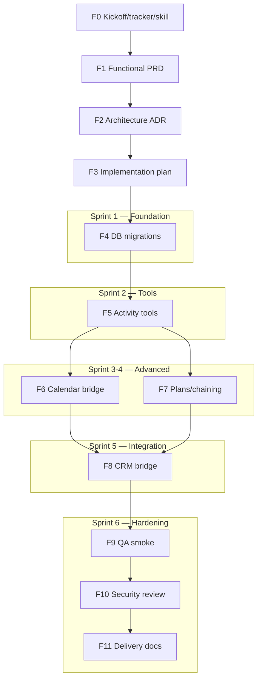

# Task Graph — Agent Core Follow-up / Reminders

## Estado

- Incremento: F3 — Implementation plan and task graph
- Run: `run-1780712703-2092c8a2`
- Owner: `implementation-planner`
- Reviewer: `factory-orchestrator`
- Fecha: `2026-06-05`

## Sprint Decomposition

| Sprint | Incrementos | Objetivo | Gate de entrada | Gate de salida |
|--------|-------------|----------|-----------------|-----------------|
| Sprint 1 | F4 | DB schema y grants — foundation ejecutable | `planning=passed` + `architecture=passed` | `implementation` parcial |
| Sprint 2 | F5 | Tools activity_* — layer de interacción | Sprint 1 verificado | `implementation` parcial |
| Sprint 3 | F6 | Calendar bridge + dispatcher | Sprint 2 tools verificadas | `implementation` parcial |
| Sprint 4 | F7 | Plans/chaining/recurrence/quick-capture | Sprint 2 tools verificadas | `implementation` parcial |
| Sprint 5 | F8 | CRM bridge + deduplicación | Sprint 4 plans verificados | `implementation` completo |
| Sprint 6 | F9 + F10 + F11 | QA + Security + Delivery | Sprint 5 completo | `delivery` |

**Regla secuencial**: no iniciar sprint N hasta que Sprint N-1 haya registrado gate `implementation` parcial o completo en Factory DB. Excepciones requieren autorización explícita de `factory-orchestrator`.

---

## Dependency Graph

---

## Sprint 1 Detail — F4: DB Migrations

**Owner:** `claude-builder` | **Reviewer:** `codex-builder` | **Sprint goal:** Schema activity.* creado y verificado en test DB

### F4.1 — Module registry + schema seed

| Campo | Valor |
|-------|-------|
| File | `db/modules/activity/000001_activity_schema.sql` |
| Verification | `psql $TEST_DB_URL -c "SELECT module, schema_name FROM agent_core.modules WHERE module='activity';"` |
| Output | 1 row con module=activity |
| Owner | claude-builder |
| Reviewer | codex-builder |
| Evidence | SQL file + dry-run output + DB readback |

**Acceptance criteria:**
- [ ] `CREATE SCHEMA IF NOT EXISTS activity;` presente
- [ ] `INSERT INTO agent_core.modules` con module='activity' y metadata JSON con project tag
- [ ] `ON CONFLICT (module) DO UPDATE` para idempotencia
- [ ] dry-run no arroja errores de sintaxis
- [ ] readback confirma fila en `agent_core.modules`

---

### F4.2 — Tabla `activity.activities`

| Campo | Valor |
|-------|-------|
| File | `db/modules/activity/000002_activities.sql` |
| Verification | `psql $TEST_DB_URL -c "\\d activity.activities"` + column check |
| Output | Tabla con todas las columnas definidas en ADR-002 |
| Owner | claude-builder |
| Reviewer | codex-builder |
| Evidence | SQL file + `\d` output + row count (0 inicialmente) |

**Acceptance criteria:**
- [ ] Tabla `activity.activities` creada con todas las columnas del ADR
- [ ] `activity_id` es PK con serial o uuid
- [ ] `dedupe_key` tiene UNIQUE constraint
- [ ] `status` con CHECK constraint en ('open','completed','cancelled','snoozed')
- [ ] `due_at` con timezone (timestamptz)
- [ ] Index en `(owner_id, status, due_at)` para queries frecuentes
- [ ] `\d` output muestra tabla y constraints
- [ ] `SELECT COUNT(*) FROM activity.activities LIMIT 0` retorna 0 rows

---

### F4.3 — Tabla `activity.activity_links`

| Campo | Valor |
|-------|-------|
| File | `db/modules/activity/000003_activity_links.sql` |
| Verification | `psql $TEST_DB_URL -c "\\d activity.activity_links"` |
| Output | Tabla con link_id PK, source_id, target_id, relationship_type |
| Evidence | SQL file + `\d` output |

**Acceptance criteria:**
- [ ] Tabla `activity.activity_links` creada
- [ ] FK a `activity.activities(activity_id)` en source_id y target_id con ON DELETE CASCADE
- [ ] Unique constraint en (source_id, target_id, relationship_type)
- [ ] Index en source_id y target_id por separado
- [ ] `\d` output confirma estructura

---

### F4.4 — Tabla `activity.reminder_rules`

| Campo | Valor |
|-------|-------|
| File | `db/modules/activity/000004_reminder_rules.sql` |
| Verification | `psql $TEST_DB_URL -c "\\d activity.reminder_rules"` |
| Output | Tabla con rule_id PK, activity_id FK, next_fire_at, enabled |
| Evidence | SQL file + `\d` output |

**Acceptance criteria:**
- [ ] Tabla `activity.reminder_rules` creada
- [ ] FK a `activity.activities(activity_id)` con ON DELETE CASCADE
- [ ] `next_fire_at` timestamptz con index
- [ ] `enabled` boolean con DEFAULT true
- [ ] `\d` output confirma

---

### F4.5 — Tabla `activity.activity_events`

| Campo | Valor |
|-------|-------|
| File | `db/modules/activity/000005_activity_events.sql` |
| Verification | `psql $TEST_DB_URL -c "\\d activity.activity_events"` |
| Output | Tabla con event_id PK, activity_id FK, event_type, created_at |
| Evidence | SQL file + `\d` output |

**Acceptance criteria:**
- [ ] Tabla `activity.activity_events` creada
- [ ] FK a `activity.activities(activity_id)` con ON DELETE CASCADE
- [ ] `event_type` con CHECK constraint listing valid event types
- [ ] Index en (activity_id, created_at)
- [ ] `\d` output confirma

---

### F4.6 — Tablas `activity_plans`, `activity_plan_steps`, `activity_plan_runs`, `activity_plan_run_steps`

| Campo | Valor |
|-------|-------|
| File | `db/modules/activity/000006_activity_plans.sql` |
| Verification | `\d activity.activity_plans` + `\d activity.activity_plan_steps` + run tables |
| Output | 4 tablas con FK chain completa |
| Evidence | SQL file + 4x `\d` outputs |

**Acceptance criteria:**
- [ ] `activity_plans` con plan_id PK, name, description, created_by
- [ ] `activity_plan_steps` con step_id PK, plan_id FK, title, relative_after_days, activity_type
- [ ] `activity_plan_runs` con run_id PK, plan_id FK, target_type, target_id, status, started_at
- [ ] `activity_plan_run_steps` con run_step_id PK, run_id FK, step_id FK, activity_id FK (nullable, se llena al crear activity)
- [ ] FK chain completa con ON DELETE CASCADE
- [ ] Los 4 `\d` outputs confirman

---

### F4.7 — Tablas `activity.recurrence_rules` y `activity.recurrence_instances`

| Campo | Valor |
|-------|-------|
| File | `db/modules/activity/000007_recurrence_rules.sql` |
| Verification | `\d activity.recurrence_rules` |
| Output | recurrence_rules creada; recurrence_instances opcional |
| Evidence | SQL file + `\d` output(s) |

**Acceptance criteria:**
- [ ] `activity.recurrence_rules` creada con rule_id PK, activity_id FK, rrule_text, from_date, count
- [ ] FK a `activity.activities(activity_id)` con ON DELETE CASCADE
- [ ] `rrule_text` tipo TEXT
- [ ] `\d activity.recurrence_rules` confirma
- [ ] `recurrence_instances` opcional: si existe, crea con instance_id PK, rule_id FK, instance_date

---

### F4.8 — Runtime grants para `activity_runtime`

| Campo | Valor |
|-------|-------|
| File | `db/modules/activity/000008_runtime_grants.sql` |
| Verification | `psql $TEST_DB_URL -c "SELECT grantee, privilege_type FROM information_schema.table_privileges WHERE table_schema='activity' AND grantee='activity_runtime';"` |
| Output | Múltiples filas con grants |
| Evidence | SQL file + readback query |

**Acceptance criteria:**
- [ ] `GRANT USAGE ON SCHEMA activity TO activity_runtime`
- [ ] `GRANT SELECT, INSERT, UPDATE, DELETE ON ALL TABLES IN SCHEMA activity TO activity_runtime`
- [ ] `GRANT USAGE, SELECT ON ALL SEQUENCES IN SCHEMA activity TO activity_runtime`
- [ ] Readback confirma al menos 4 filas para activity_runtime
- [ ] `activity_runtime` puede hacer SELECT en `agent_core.modules`

---

## Sprint 2 Detail — F5: Activity Tools

**Owner:** `claude-builder` | **Reviewer:** `quality-reviewer` | **Sprint goal:** tool handlers activity_* ejecutables y probados

### F5.1 — Toolset registry

| Campo | Valor |
|-------|-------|
| File | `tools/toolsets.py` |
| Change | Agregar `'activity'` a `_HERMES_CORE_TOOLS` |
| Verification | `python3 -c "from toolsets import _HERMES_CORE_TOOLS; print('activity' in _HERMES_CORE_TOOLS)"` |
| Output | `True` |

**AC:** `'activity'` presente en `_HERMES_CORE_TOOLS` después del patch.

---

### F5.2 — `activity_upsert`

| Campo | Valor |
|-------|-------|
| File | `tools/activity_tool.py` |
| Handler | `activity_upsert()` |
| Verification | Python import + call con test args |
| Evidence | JSON output con `activity_id`, `operation`, `dedupe_key` |

**AC:**
- [ ] `registry.register("activity_upsert")` en tools/activity_tool.py
- [ ] Función exportable como `from tools.activity_tool import activity_upsert`
- [ ] Params: todos los listados en IMPLEMENTATION_PLAN.md F5.2
- [ ] INSERT con ON CONFLICT sobre dedupe_key
- [ ] Retorna JSON parseable con `activity_id`, `operation` (created|updated|linked_existing), `dedupe_key`
- [ ] Test: `activity_upsert(title='Test', owner_id='zeus', source='test')` produce JSON válido

---

### F5.3 — `activity_list`

| Campo | Valor |
|-------|-------|
| File | `tools/activity_tool.py` |
| Handler | `activity_list()` |
| Verification | `activity_list(owner_id='zeus', limit=5)` retorna JSON con `activities` array |
| Evidence | JSON output |

**AC:**
- [ ] Retorna JSON con `activities` (array) o `ok` con estructura
- [ ] Soporta filtros: owner_id, status, due_filter
- [ ] Soporta pagination: limit, offset
- [ ] `activity_list()` sin argumentos no crashea

---

### F5.4 — `activity_complete`

**AC:**
- [ ] `activity_complete(activity_id=<id>, completion_note='Done')` retorna JSON con `completed_at`
- [ ] actualiza `status='completed'` en DB
- [ ] Si activity_id no existe, retorna error JSON (no exception)

---

### F5.5 — `activity_snooze`, `activity_reschedule`, `activity_cancel`

**AC para cada una:**
- [ ] `activity_snooze(activity_id, snoozed_until)` → JSON con `snoozed_until`
- [ ] `activity_reschedule(activity_id, new_due_at)` → JSON con nuevo `due_at`
- [ ] `activity_cancel(activity_id, reason)` → JSON con `cancelled_at`

---

### F5.6 — `activity_link` / `activity_unlink`

**AC:**
- [ ] `activity_link(activity_id, target_type, target_id, relationship_type)` → JSON con `ok` o `link_id`
- [ ] `activity_unlink(link_id)` → JSON con `ok`
- [ ] Si link ya existe, no crea duplicado

---

### F5.7 — `activity_timeline`

**AC:**
- [ ] `activity_timeline(target_type, target_id, limit)` → JSON estructurado
- [ ] Incluye todos los eventos de la actividad ordenados por created_at

---

### F5.8 — `activity_dispatcher_scan`

**AC:**
- [ ] `activity_dispatcher_scan(limit)` → JSON con keys `due`, `upcoming`, `overdue`
- [ ] No envía notificaciones (solo prepara output)
- [ ] Si no hay resultados, retorna JSON válido con arrays vacíos

---

### F5.9 — Tests

| Campo | Valor |
|-------|-------|
| File | `tests/tools/test_activity_tool.py` |
| Verification | `pytest tests/tools/test_activity_tool.py -v` |
| Evidence | pytest output con todos los tests passing |

**AC:**
- [ ] Al menos 1 test por handler (F5.2–F5.8)
- [ ] Tests usan fixtures o setup/teardown
- [ ] No crashea con argumentos faltantes
- [ ] `pytest` exit code 0

---

## Sprint 3 Detail — F6: Calendar Bridge + Dispatcher

**Owner:** `claude-builder` | **Reviewer:** `devops-release`

### F6.1 — `activity_to_calendar_event`

**AC:**
- [ ] `activity_to_calendar_event(activity_id, title, start_at, end_at)` → JSON con `calendar_event_id` y `status`
- [ ] Si activity_id no existe, retorna error JSON
- [ ] Si calendar service falla, escribe event en `activity_events` con event_type='calendar_failed' y retorna `status=retryable`

---

### F6.2 — Dispatcher job

| Campo | Valor |
|-------|-------|
| File | `cron/activity_dispatcher.py` |
| Handler | `run_dispatcher_scan(limit)` |
| Verification | Python import + call con limit=10 |
| Evidence | JSON output con `activities` array |

**AC:**
- [ ] `from cron.activity_dispatcher import run_dispatcher_scan` funciona
- [ ] Retorna JSON con `activities` (array de activities due/overdue)
- [ ] No depende de memoria de chat; solo DB
- [ ] No envía notificaciones externas (output es para consumo interno)

---

### F6.3 — Dispatcher smoke tests

| Campo | Valor |
|-------|-------|
| File | `tests/cron/test_activity_dispatcher.py` |
| Verification | `pytest tests/cron/test_activity_dispatcher.py -v` |
| Evidence | pytest output |

**AC:**
- [ ] Al menos 2 tests: smoke test y empty-result test
- [ ] `pytest` exit code 0

---

## Sprint 4 Detail — F7: Plans / Chaining / Recurrence / Quick Capture

**Owner:** `claude-builder` | **Reviewer:** `product-analyst`

### F7.1 — `activity_plan_create`

**AC:**
- [ ] `activity_plan_create(plan_name, description, steps)` → JSON con `plan_id`
- [ ] steps es array de objetos con title, relative_after_days, activity_type, priority
- [ ] Crea filas en `activity_plans` y `activity_plan_steps`

---

### F7.2 — `activity_plan_apply`

**AC:**
- [ ] `activity_plan_apply(plan_id, target_type, target_id, target_name)` → JSON con `run_id`
- [ ] Crea fila en `activity_plan_runs`
- [ ] Genera activities en `activities` para cada step con due_at calculado
- [ ] Links cada activity generated al run via `activity_plan_run_steps`

---

### F7.3 — `activity_next_actions`

**AC:**
- [ ] `activity_next_actions(owner_id, limit)` → JSON con next actionable activities
- [ ] Filtra: solo status='open', due_at <= now() + 24h
- [ ] Ordena por priority ASC, due_at ASC

---

### F7.4 — `activity_detect_from_text`

**AC:**
- [ ] `activity_detect_from_text(text, mode)` → JSON con `candidates` array
- [ ] mode='suggest_only' no persiste nada en DB
- [ ] Detecta: title, due_date, activity_type, priority
- [ ] Al menos 3 patterns reconocidos (follow-up, meeting, deadline, recurring)

---

### F7.5 — `activity_recurrence_expand`

**AC:**
- [ ] `activity_recurrence_expand(rrule_text, from_date, count)` → JSON con `instances` array
- [ ] Cada instance tiene `date` (ISO 8601)
- [ ] Soporta FREQ=WEEKLY, FREQ=DAILY, FREQ=MONTHLY
- [ ] count limita el output

---

### F7.6 — Plan tool tests

| Campo | Valor |
|-------|-------|
| File | `tests/tools/test_activity_plan_tool.py` |
| Verification | `pytest tests/tools/test_activity_plan_tool.py -v` |
| Evidence | pytest output |

**AC:**
- [ ] Al menos 1 test por handler (F7.1–F7.5)
- [ ] `pytest` exit code 0

---

## Sprint 5 Detail — F8: CRM Bridge + No Duplicates

**Owner:** `codex-builder` | **Reviewer:** `claude-builder`

### F8.1 — CRM schema audit

**AC:**
- [ ] `psql $CRM_DB_URL -c "\\d crm.follow_ups"` confirma estructura
- [ ] Documenta mapping de columnas crm.follow_ups → activity.activities

---

### F8.2 — CRM → activity bridge

**AC:**
- [ ] `crm_follow_up_create()` en `tools/crm_tool.py` hace INSERT en `activity.activities` además de `crm.follow_ups`
- [ ] Link creado con relationship_type='crm_follow_up'
- [ ] Test: crear CRM follow-up y verificar que activity se creó

---

### F8.3 — Dedupe cross-table

**AC:**
- [ ] `activity_upsert` con dedupe_key que existe en `crm.follow_ups` retorna `operation=linked_existing`, no crea duplicado
- [ ] `crm_follow_up_create` con dedupe_key que existe en `activity.activities` retorna `operation=linked_existing`

---

### F8.4 — CRM regression tests

| Campo | Valor |
|-------|-------|
| File | `tests/tools/test_crm_tool.py` |
| Verification | `pytest tests/tools/test_crm_tool.py -v -k follow_up` |
| Evidence | pytest output |

**AC:**
- [ ] Tests existentes de crm_tool no se rompen
- [ ] Nuevos tests para follow_up + activity bridge pasan
- [ ] `pytest` exit code 0

---

## Risk Register

| ID | Risk | Likelihood | Impact | Mitigation |
|----|------|------------|--------|------------|
| R1 | `architecture` gate pendiente de security-reviewer — bloquea Sprint 1 | High | High | Notificar a security-reviewer; mientras tanto preparar F4.1–F4.3 en branch |
| R2 | CRM schema diferente al asumido en ADR | Medium | Medium | F8.1 incluye schema audit antes de implementar bridge |
| R3 | Calendar tool no tiene `calendar_event_create` | Medium | Medium | F6.1 diseñado defensivamente — falla gracefully y loguea event |
| R4 | Test DB no disponible para dry-run | Low | High | Usar migración idempotente con `IF NOT EXISTS` |
| R5 | activity_runtime role no existe en prod | Low | Medium | F4.8 incluye CREATE ROLE IF NOT EXISTS + grant |

---

## Gate Dependencies

| Gate | Status | Required for |
|------|--------|--------------|
| intake (F0) | passed | F1 |
| functional (F1) | passed | F2, F3 |
| architecture (F2) | review_ready — security-reviewer pendiente | F4 |
| planning (F3) | este incremento — factory-orchestrator | F4 |
| implementation (F4) | Sprint 1 output | F5 |
| implementation (F5) | Sprint 2 output | F6, F7 |
| implementation (F6, F7) | Sprint 3-4 output | F8 |
| implementation (F8) | Sprint 5 output | F9 |
| quality (F9) | Sprint 6 | F10 |
| security (F10) | Sprint 6 | F11 |
| delivery (F11) | Sprint 6 | — |

---

## Owner/Reviewer Assignment Summary

| Task | Owner | Reviewer | Sprint |
|------|-------|----------|--------|
| F4 | claude-builder | codex-builder | Sprint 1 |
| F5 | claude-builder | quality-reviewer | Sprint 2 |
| F6 | claude-builder | devops-release | Sprint 3 |
| F7 | claude-builder | product-analyst | Sprint 4 |
| F8 | codex-builder | claude-builder | Sprint 5 |
| F9 | qa-verifier | quality-reviewer | Sprint 6 |
| F10 | security-reviewer | solution-architect | Sprint 6 |
| F11 | factory-reporter | devops-release | Sprint 6 |
