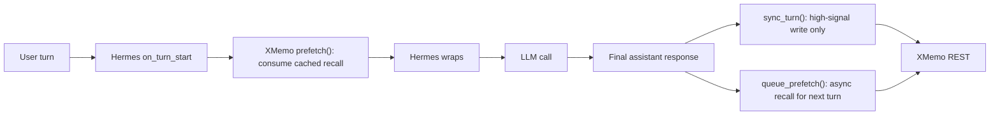

# XMemo x Hermes Agent 记忆体插件实施计划（审核增强版）

> 状态：审核后可执行计划  
> 原计划结论：方向可行，但需要修正依赖策略、setup 流程、prefetch 语义、profile 隔离和工具分期。  
> 审核日期：2026-06-18  
> 审核者：pc-codex  
> 目标：让 XMemo 成为 Hermes Agent 的可选外部 `MemoryProvider`，与 Honcho、Mem0、Hindsight 等 provider 并列。

---

## 0. 审核结论

### 0.1 总体判断

**可行，建议推进，但必须先做 Phase 0 的接口校准。**

Hermes 已经具备外部记忆 provider 的完整接入点：

- `plugins/memory/<name>/` 自动发现。
- `MemoryProvider` 生命周期覆盖启动、prefetch、turn sync、session end、session switch、built-in memory mirror、delegation。
- `hermes memory setup` 可消费 provider 的 `get_config_schema()` 和 `save_config()`。
- `run_agent.py` 已经把 prefetched memory 作为当前 user message 的临时上下文注入，不写入持久会话，也不破坏系统 prompt 的稳定前缀。

XMemo 侧也具备所需能力：

- REST / Python client 能覆盖 `recall_context`、`search`、`remember`、`update_state`、`record_event`、reminders、pending decisions、restart snapshots、usage feedback 等核心能力。
- XMemo 支持 `X-Memory-OS-Agent-ID` / `X-Memory-OS-Agent-Instance-ID` attribution envelope，适合 Hermes profile / device 级归因。

关键调整是：**MVP 不直接依赖 `memory-os` Python 包和 async `RemoteMemoryManager`，而是在 Hermes 插件内用已有 `httpx` 写轻量同步 REST client。** 这样可以避免把 Memory OS 服务端依赖（FastAPI、Supabase、Redis、Azure SDK 等）拖进 Hermes runtime，也规避 sync/async event loop 包装复杂度。

### 0.2 必改点摘要

| 原计划点 | 审核结论 | 修正 |
| --- | --- | --- |
| `XMemoMemoryProvider.name = "xmemo"` 类属性 | 不符合 ABC 最佳写法 | 实现 `@property def name(self) -> str` |
| `is_available()` 可验证连通性 | Hermes 明确要求不做网络调用 | 只检查配置和可导入依赖，网络检查放 `initialize()` 或 `status` |
| 使用 async `RemoteMemoryManager` 包同步 | 可行但不推荐作 MVP | MVP 用 `httpx.Client` 同步 REST；后续再评估共享 SDK |
| `prefetch()` 直接调用 `build_memory_context_block` | provider 不应返回 fenced block | provider 返回 raw context；Hermes `build_memory_context_block()` 统一包裹 |
| `initialize()` 调 `get_control_plane_context` | 本地 client 未见该方法 | 使用 `/health` 或低预算 read smoke，且失败不阻断启动 |
| `hermes memory setup xmemo` 会完整配置 | 当前 direct provider path 只激活，不走 schema | Phase 2 修 `cmd_setup_provider()` 复用 schema，或实现 XMemo `post_setup()` |
| E2E passphrase 存 `xmemo.json` | 有明文密钥风险 | passphrase 默认只从 env / OS secret 读取，不写 JSON |
| Ledger / `add_expense` 进入早期承诺 | REST/SDK 暴露不如 MCP 层直接 | Phase 2/3 验证后实现；MVP 不作为阻断项 |

### 0.3 Go / No-Go Gate

开始写代码前先完成以下 Gate：

- [ ] 确认目标 XMemo 部署支持 `/health`、`/v1/recall/context`、`/v1/remember`、`/v1/memories/search`、`/v1/update_state`、`/v1/timeline/events`、`/v1/restart/snapshot`。
- [ ] 确认 Hermes `httpx[socks]` 现有依赖可满足插件 REST client，无需新增 heavy dependency。
- [ ] 确认 `XMEMO_KEY` / `MEMORY_OS_API_KEY` 的 header 映射：优先 `X-API-Key`，如服务端要求可兼容 `Authorization: Bearer`.
- [ ] 明确 direct setup 行为：要么修 `hermes_cli/memory_setup.py::cmd_setup_provider()`，要么在 XMemo provider 内实现 `post_setup()`。
- [ ] 确认 profile 隔离默认：`agent_id="hermes"`，`agent_instance_id` 每个 Hermes profile + device 稳定生成，`scope` 默认 `hermes/<profile>`。

---

## 1. 已核对的 Hermes 接口事实

### 1.1 MemoryProvider ABC

`agent/memory_provider.py` 中的关键约束：

- `name` 是 abstract property。
- `is_available()` 不应做网络调用。
- `initialize(session_id, **kwargs)` 会收到：
  - `hermes_home`
  - `platform`
  - `agent_context`
  - `agent_identity`
  - `agent_workspace`
  - gateway/user/chat/thread 相关字段（存在时）
- `sync_turn()` 必须非阻塞。
- `prefetch()` 应快速返回，推荐消费上一轮 `queue_prefetch()` 的缓存。
- `get_tool_schemas()` 返回 OpenAI function schema。
- `handle_tool_call()` 必须返回 JSON string。

### 1.2 插件发现

`plugins/memory/__init__.py` 支持：

- bundled provider: `plugins/memory/<name>/`
- user provider: `$HERMES_HOME/plugins/<name>/`
- 模块里有 `register(ctx)` 时优先通过 `ctx.register_memory_provider(...)` 注册。
- 无 `register(ctx)` 时会 fallback 找 `MemoryProvider` subclass 并实例化。

结论：XMemo 插件放在 `hermes-agent/plugins/memory/xmemo/` 是正确选择。

### 1.3 Setup Wizard

`hermes_cli/memory_setup.py` 的实际行为：

- `hermes memory setup` 交互式路径会：
  - 选择 provider
  - 安装 `plugin.yaml` 的 `pip_dependencies`
  - 读取 `get_config_schema()`
  - secret 写入 `$HERMES_HOME/.env`
  - non-secret 交给 provider `save_config()`
  - 写 `memory.provider`
- `hermes memory setup <provider>` 的 direct path 当前只激活 provider；除非 provider 实现 `post_setup()`，否则不会询问 schema 字段。

结论：如果文档承诺 `hermes memory setup xmemo`，必须补 direct setup 行为。

### 1.4 Prompt Caching 与上下文注入

`run_agent.py` 当前做法：

- provider 的 `system_prompt_block()` 进入系统 prompt，只应包含静态低变化内容。
- provider 的 `prefetch()` 结果在每轮 API call 前注入当前 user message。
- 注入时由 Hermes 统一调用 `build_memory_context_block()` 包成 `<memory-context>...</memory-context>`。
- 原始 `messages` 不被改写，因此不会把 external memory 写进 session history。

结论：XMemo provider 不要自己返回 `<memory-context>`，也不要把动态 recall 放进 `system_prompt_block()`。

---

## 2. 架构决策记录

### D1. 插件代码归属

**决策：核心 Python 插件放在 `hermes-agent`。**

原因：

- Hermes 的 provider discovery 原生扫描 `plugins/memory/<name>/`。
- `MemoryProvider` 是 Python ABC，放到 Node/npm CLI 仓库会增加跨语言安装和版本漂移。
- 测试可以直接进入 Hermes pytest 体系。

`memory-os-cli` 只做辅助 onboarding，不承载 Hermes runtime 插件。

### D2. MVP 客户端策略

**决策：MVP 使用轻量同步 REST client，不直接依赖 `memory-os` Python package。**

原因：

- Hermes 已有 `httpx[socks]` 依赖。
- `memory-os` Python package 当前包含服务端运行依赖，作为 Hermes 插件依赖过重。
- 同步 REST client 避免 async event loop 嵌套问题。
- REST surface 足够覆盖 MVP。

后续可以在 XMemo 侧拆出独立轻量 SDK（例如 `xmemo-python`）后再切换。

### D3. Identity 与隔离模型

**决策：用 `agent_instance_id` 做 attribution，用 `scope` 做默认 profile 隔离。**

默认值：

- `agent_id`: `hermes`
- `agent_instance_id`: 每个 Hermes profile + device 稳定生成，写入 `$HERMES_HOME/xmemo.json`
- `bucket`: `work`
- `scope`: `hermes/<profile>`；无 profile 时为 `hermes/default`

理由：

- XMemo 文档把 `agent_instance_id` 定义为 attribution envelope，不应把它当唯一隔离手段。
- `scope` 更适合项目、profile、workspace 边界。
- 用户仍可在 `xmemo.json` 覆盖 scope，例如 `memory-os`、`customer-a`、`incident-123`。

### D4. 写入策略

**决策：MVP 不把每个 turn 全量写进长期记忆。**

默认只写：

- explicit `xmemo_remember`
- built-in memory tool 的 add/replace mirror
- `xmemo_update_state`
- 高信号 turn（决策、修复、用户纠正、明确偏好、架构选择、失败根因）

普通对话 turn 可作为 timeline / working state 的候选，但不得无过滤写成 semantic memory。

### D5. E2E 加密

**决策：E2E passphrase 不是 MVP；实现时不得默认写入 `xmemo.json`。**

允许来源：

- `XMEMO_PASSPHRASE`
- OS secret store（未来）
- 交互式临时输入（未来）

不允许默认明文写入 `$HERMES_HOME/xmemo.json`。

---

## 3. 目标架构

### 3.1 Hermes 侧目录结构

```text
plugins/memory/xmemo/
├── __init__.py       # XMemoMemoryProvider + register(ctx)
├── client.py         # 同步 REST client，封装 httpx
├── config.py         # 配置加载、生成 agent_instance_id、保存 xmemo.json
├── capture.py        # turn/event -> XMemo write candidate 的轻量高信号策略
├── tools.py          # tool schemas + handler helpers
├── README.md         # 用户配置、故障排查、scope/profile 说明
└── plugin.yaml       # provider 元数据；MVP 不声明 heavy pip dependency
```

`cli.py` 放到 Phase 2，因为 memory plugin CLI 只在 provider active 时注册，不影响 MVP 启动路径。

### 3.2 核心类形态

```python
class XMemoMemoryProvider(MemoryProvider):
    @property
    def name(self) -> str:
        return "xmemo"

    def is_available(self) -> bool: ...
    def initialize(self, session_id: str, **kwargs) -> None: ...
    def system_prompt_block(self) -> str: ...
    def prefetch(self, query: str, *, session_id: str = "") -> str: ...
    def queue_prefetch(self, query: str, *, session_id: str = "") -> None: ...
    def sync_turn(self, user_content: str, assistant_content: str, *, session_id: str = "") -> None: ...
    def get_tool_schemas(self) -> list[dict[str, Any]]: ...
    def handle_tool_call(self, tool_name: str, args: dict, **kwargs) -> str: ...
    def on_session_end(self, messages: list[dict[str, Any]]) -> None: ...
    def on_session_switch(self, new_session_id: str, **kwargs) -> None: ...
    def on_memory_write(self, action: str, target: str, content: str, metadata: dict | None = None) -> None: ...
    def on_delegation(self, task: str, result: str, *, child_session_id: str = "", **kwargs) -> None: ...
    def shutdown(self) -> None: ...
    def get_config_schema(self) -> list[dict[str, Any]]: ...
    def save_config(self, values: dict[str, Any], hermes_home: str) -> None: ...
```

### 3.3 Data Flow



### 3.4 配置来源

按优先级读取：

1. 环境变量：
   - `XMEMO_KEY`
   - `XMEMO_URL`
   - `XMEMO_AGENT_ID`
   - `XMEMO_AGENT_INSTANCE_ID`
   - `XMEMO_SCOPE`
   - `XMEMO_BUCKET`
   - `XMEMO_PASSPHRASE`（未来可选）
2. 兼容环境变量：
   - `MEMORY_OS_API_KEY`
   - `MEMORY_OS_URL`
3. `$HERMES_HOME/xmemo.json`
4. `config.yaml` 中的 `memory.xmemo`（只放非 secret，可选）

`xmemo.json` 示例：

```json
{
  "base_url": "https://xmemo.dev",
  "agent_id": "hermes",
  "agent_instance_id": "hermes-default-device-8f42c1b7",
  "bucket": "work",
  "scope": "hermes/default",
  "timeout_seconds": 5.0,
  "prefetch_max_items": 5,
  "prefetch_max_tokens": 900
}
```

禁止写入：

- `api_key`
- `passphrase`
- bearer token
- OAuth token

### 3.5 Setup Schema

为了保持 `hermes memory setup` 简短，schema 只提示必需项：

```python
[
    {
        "key": "api_key",
        "description": "XMemo API key",
        "secret": True,
        "required": True,
        "env_var": "XMEMO_KEY",
        "url": "https://xmemo.dev",
    },
    {
        "key": "base_url",
        "description": "XMemo base URL",
        "default": "https://xmemo.dev",
        "env_var": "XMEMO_URL",
    },
]
```

`save_config()` 自动补齐：

- `agent_id`
- `agent_instance_id`
- `bucket`
- `scope`
- timeout / prefetch defaults

高级项通过手动编辑 `xmemo.json` 或 Phase 2 的 `hermes xmemo scope` / `hermes xmemo status` 管理。

---

## 4. XMemo REST Client 设计

### 4.1 MVP 方法

`client.py` 暴露同步方法：

```python
class XMemoClient:
    def health(self) -> dict: ...
    def recall_context(self, query: str, **filters) -> dict: ...
    def search(self, query: str, limit: int = 5, **filters) -> list[dict]: ...
    def remember(self, content: str, path: str, **fields) -> str: ...
    def update_state(self, **fields) -> dict: ...
    def record_event(self, **fields) -> dict: ...
    def create_restart_snapshot(self, **fields) -> dict: ...
```

MVP 先不实现：

- E2E encryption
- OAuth
- MCP tool bridge
- local spool
- low-level admin/audit APIs

### 4.2 Header Contract

默认 header：

```text
X-API-Key: <XMEMO_KEY>
X-Memory-OS-Agent-ID: hermes
X-Memory-OS-Agent-Instance-ID: <stable-instance-id>
```

兼容模式：

- 如服务端或部署要求 `Authorization: Bearer <token>`，client 支持配置 `auth_header_mode: bearer`。
- 默认不在日志中输出 headers。

### 4.3 Failure Contract

所有 REST 调用必须遵循：

- 设置短 timeout：prefetch 默认 3-5 秒，tool call 默认 15-30 秒。
- circuit breaker：连续失败 5 次后暂停后台 API 调用 120 秒。
- provider 失败不得阻断 Hermes 对话。
- tool handler 返回 `tool_error(...)` JSON，而不是抛出到 agent 主循环。
- `initialize()` 的 health check 可失败开放，只记录 debug/warn。

---

## 5. 工具设计

### 5.1 MVP 工具

| Tool | 类型 | 参数 | 说明 |
| --- | --- | --- | --- |
| `xmemo_recall_context` | read | `query`, `max_items`, `max_tokens`, `scope`, `bucket`, `memory_type` | 获取 explainable context block；适合当前任务前手动召回 |
| `xmemo_search` | read | `query`, `limit`, `scope`, `bucket`, `memory_type`, `threshold` | 语义搜索，返回结构化 memory items |
| `xmemo_remember` | write | `content`, `path`, `memory_type`, `scope`, `bucket`, `importance`, `confidence` | 显式保存 durable fact / decision / procedure |
| `xmemo_update_state` | write | `current_task`, `next_action`, `blocked_reason`, `state_key`, `ttl_seconds`, `scope`, `bucket` | 保存当前工作状态 |

MVP 不暴露 destructive tools。

### 5.2 Phase 2 工具

| Tool | 说明 |
| --- | --- |
| `xmemo_record_event` | 记录 timeline event |
| `xmemo_get_timeline` | 查询最近事件 |
| `xmemo_create_reminder` | 创建 TODO/reminder |
| `xmemo_list_reminders` | 列出 TODO/reminder |
| `xmemo_complete_reminder` | 完成 TODO/reminder |
| `xmemo_create_pending_decision` | 记录未决决策 |
| `xmemo_list_pending_decisions` | 列出未决决策 |
| `xmemo_resolve_decision` | 解决决策 |
| `xmemo_create_restart_snapshot` | 创建 restart snapshot |
| `xmemo_restore_restart_snapshot` | 恢复 restart snapshot |
| `xmemo_mark_used` | 标记 recall memory 被使用 |

### 5.3 Phase 3 / 可选工具

| Tool | 前置条件 |
| --- | --- |
| `xmemo_add_expense` | 验证 REST `/v1/remember` + ledger adapter 行为或补轻量 client helper |
| `xmemo_list_ledger_transactions` | 需要 REST ledger endpoint 或 memory projection fallback |
| `xmemo_get_monthly_ledger_summary` | 需要 REST ledger endpoint |
| `xmemo_forget` | 需要明确 destructive confirmation 语义 |
| `xmemo_reflect` | 只在用户/admin 明确要求时暴露，默认 dry-run |

---

## 6. 生命周期映射

### 6.1 initialize()

任务：

- 读取 env + `$HERMES_HOME/xmemo.json`。
- 生成缺失的 stable `agent_instance_id`。
- 解析 profile：`agent_identity` -> default scope。
- 创建 `XMemoClient`。
- 如果 `agent_context != "primary"`，默认禁用自动写入，但保留 read tools（可配置）。
- 可选后台 health check，失败不阻断启动。

### 6.2 system_prompt_block()

只返回静态说明，例如：

```text
# XMemo Memory
External memory provider is active. Use xmemo_recall_context or xmemo_search for relevant prior context, xmemo_remember for durable facts, and xmemo_update_state for active task continuity.
```

禁止包含：

- 动态 recall 内容
- API key
- session-specific volatile text
- 大段配置

### 6.3 queue_prefetch() / prefetch()

`queue_prefetch()`：

- 在后台线程调用 `/v1/recall/context`。
- 使用当前 `session_id`、default `scope`、`bucket`。
- 控制 `max_items` / `max_tokens`。
- 只保留最近一次结果，按 `session_id` 分桶。

`prefetch()`：

- 最多短暂 join 上一次线程（例如 2-3 秒）。
- 返回缓存中的 raw text。
- 消费后清空缓存，避免重复注入。
- 不返回 `<memory-context>` fence。

### 6.4 sync_turn()

默认高信号过滤：

- 用户明确要求记住、保存、以后记得。
- 出现决策、架构选择、根因、修复、用户纠正、长期偏好。
- assistant 明确总结了可复用流程或 runbook。
- 失败命令/测试结论被用户或 assistant 确认为重要。

写入方式：

- semantic/procedural: `/v1/remember`
- active work: `/v1/update_state`
- task/session event: `/v1/timeline/events`

普通闲聊、短 ACK、低信号 tool output 不写入。

### 6.5 on_memory_write()

Hermes built-in memory tool 写入时：

- `action in {"add", "replace"}`：mirror 到 `/v1/remember`。
- `action == "remove"`：先 `record_event`，不要盲目 delete XMemo memory，因为没有稳定 remote memory id 映射。
- metadata 透传前必须移除 provider secrets 和 reserved identity fields。

### 6.6 on_session_end()

Phase 2 起启用：

- flush pending background sync。
- `record_event(event_type="session_end")`。
- `create_restart_snapshot(session_id=...)`。
- 可选 `reflect(dry_run=True)` 放到 CLI 手动触发，不默认每次跑。

### 6.7 on_session_switch()

在 `/resume`、`/branch`、`/reset`、context compression 后：

- 更新 `_session_id`。
- 清理旧 session 的 prefetch cache。
- 对 `reset=True` 清空 turn buffer。
- 记录 session switch event（Phase 2）。
- 不自动合并两个 session 的记忆 scope，避免串扰。

### 6.8 on_delegation()

Phase 3：

- parent provider 记录子代理完成事件。
- payload 包含 task、result summary、child_session_id、parent session。
- 对长 result 做截断/摘要，避免写入大量 transient output。

---

## 7. 实施阶段

### Phase 0：接口校准与阻断项清理（0.5-1 天）

目标：把计划中所有可能导致返工的接口假设先落地验证。

- [ ] 用 `rg` / openapi / docs 确认 XMemo REST endpoints 和 request/response shape。
- [ ] 确认 `httpx.Client` 方案无需新增 Hermes 依赖。
- [ ] 确认 `X-API-Key` vs `Authorization: Bearer` 的默认策略。
- [ ] 写一个 `httpx.MockTransport` spike，模拟 `recall_context` / `remember` / `update_state`。
- [ ] 决定 direct setup 修复方式：
  - 推荐：修 `cmd_setup_provider()` 复用 generic schema setup。
  - 备选：XMemo provider 实现 `post_setup()`。
- [ ] 明确 live E2E 环境变量：
  - `XMEMO_LIVE_TEST=1`
  - `XMEMO_KEY`
  - `XMEMO_URL`

验收：

- [ ] 有一份确认过的 endpoint mapping。
- [ ] direct setup 行为有明确实现方案。
- [ ] 没有 heavy Python package dependency 被引入 MVP。

### Phase 1：MVP Provider（1-2 天）

目标：Hermes 能激活 XMemo provider，自动 prefetch，下轮注入，支持基础 tools 和高信号写入。

#### 7.1.1 插件骨架

- [ ] 创建 `plugins/memory/xmemo/`。
- [ ] `plugin.yaml`：
  - `name: xmemo`
  - `version: 0.1.0`
  - `description`
  - 不声明 `memory-os` pip dependency。
- [ ] `__init__.py` 实现 `XMemoMemoryProvider`。
- [ ] `register(ctx)` 注册 provider。

#### 7.1.2 配置

- [ ] `config.py` 读取 env、兼容 env、`xmemo.json`。
- [ ] 自动生成 stable `agent_instance_id`。
- [ ] 默认 `scope=hermes/<profile>`。
- [ ] `get_config_schema()` 只提示 API key 和 base URL。
- [ ] `save_config()` 只写 non-secret。
- [ ] `is_available()` 只检查 `api_key` 和 `base_url`。

#### 7.1.3 REST Client

- [ ] `client.py` 实现同步 `XMemoClient`。
- [ ] 覆盖 `health`、`recall_context`、`search`、`remember`、`update_state`。
- [ ] 支持 identity headers。
- [ ] timeout、error normalization、redacted logging。

#### 7.1.4 Prefetch

- [ ] `queue_prefetch()` 后台线程请求 `recall_context`。
- [ ] `prefetch()` 消费缓存。
- [ ] 空结果返回 `""`。
- [ ] provider 不返回 `<memory-context>`。
- [ ] 针对 gateway 并发 session，用 `session_id` 分缓存。

#### 7.1.5 写入

- [ ] `sync_turn()` 使用 `capture.py` 过滤高信号。
- [ ] 显式高信号事实调用 `remember`。
- [ ] 当前任务状态调用 `update_state`。
- [ ] 所有写入后台执行，失败只记录 warning/debug。

#### 7.1.6 MVP Tools

- [ ] `xmemo_recall_context`
- [ ] `xmemo_search`
- [ ] `xmemo_remember`
- [ ] `xmemo_update_state`
- [ ] handler 输出 JSON string。
- [ ] 参数限制：limit/max_items/max_tokens 有上限，scope/bucket 默认配置值。

#### 7.1.7 Tests

- [ ] `tests/plugins/test_xmemo_plugin.py`：mock client / MockTransport。
- [ ] 覆盖 config merge、is_available、initialize、prefetch consume、queue background、tool routing、circuit breaker。
- [ ] 覆盖 provider 返回 raw context，不含 fence。
- [ ] 覆盖 `agent_instance_id` 稳定生成。

验收：

- [ ] `memory.provider: xmemo` 后 provider 可加载。
- [ ] 缺 API key 时不激活且不崩。
- [ ] XMemo 掉线时 Hermes 对话仍继续。
- [ ] `xmemo_remember` 能保存 mock memory。
- [ ] `queue_prefetch()` 后下一轮 `prefetch()` 返回 recall text。

### Phase 2：Setup、工作流工具与稳定性（2-3 天）

目标：用户配置顺滑，XMemo 工作流能力覆盖 AGENTS memory workflow。

#### 7.2.1 Setup 修复

- [ ] 修 `hermes memory setup xmemo` direct path：
  - 方案 A：改 `cmd_setup_provider()` 调用 generic schema setup。
  - 方案 B：XMemo provider 实现 `post_setup()`。
- [ ] 测试 interactive setup 和 direct setup 都写入：
  - `config.yaml: memory.provider=xmemo`
  - `.env: XMEMO_KEY`
  - `xmemo.json: base_url/agent_instance_id/scope/bucket`

#### 7.2.2 CLI

- [ ] 新增 `plugins/memory/xmemo/cli.py`。
- [ ] `hermes xmemo status`：显示 active、base_url、scope、bucket、agent_id、instance hash/short id、health。
- [ ] `hermes xmemo scope <name>`：切换 default scope。
- [ ] `hermes xmemo doctor`：检查 config、env、connectivity。

#### 7.2.3 工作流工具

- [ ] `xmemo_record_event`
- [ ] `xmemo_get_timeline`
- [ ] `xmemo_create_reminder`
- [ ] `xmemo_list_reminders`
- [ ] `xmemo_complete_reminder`
- [ ] `xmemo_create_pending_decision`
- [ ] `xmemo_list_pending_decisions`
- [ ] `xmemo_resolve_decision`
- [ ] `xmemo_create_restart_snapshot`
- [ ] `xmemo_restore_restart_snapshot`
- [ ] `xmemo_mark_used`

#### 7.2.4 稳定性

- [ ] Circuit breaker 覆盖所有后台 API。
- [ ] Debug logging 默认 redacted。
- [ ] 所有 background threads 在 `shutdown()` join timeout。
- [ ] Prefetch token budget 可配置。
- [ ] 对 `SetupRequiredRemoteError` / 409 setup required 提示用户去完成 XMemo setup。

验收：

- [ ] `hermes memory setup` 和 `hermes memory setup xmemo` 都可用。
- [ ] `hermes xmemo status` 能发现缺 key、连不上、scope 错配。
- [ ] AGENTS workflow 里的 state/decision/snapshot 能通过工具完成。

### Phase 3：深度生命周期与 Capture Policy（3-5 天）

目标：把 Hermes 会话生命周期转成高质量 XMemo 事件，同时避免噪声污染。

- [ ] 在 `capture.py` 中映射 Hermes events 到 XMemo canonical events。
- [ ] 对 `sync_turn()` 引入更强高信号策略：
  - 可选复用 XMemo `AgentCapturePolicy` 的轻量移植版。
  - 或等待独立轻量 SDK。
- [ ] `on_pre_compress(messages)`：在压缩前提取将被丢弃的高信号事实。
- [ ] `on_session_end()`：创建 restart snapshot。
- [ ] `on_session_switch()`：记录 branch/resume/reset event。
- [ ] `on_delegation()`：记录 child task result。
- [ ] `on_memory_write()`：建立 remote memory id 映射后再支持 remove/forget。
- [ ] `mark_used`：对注入过的 recall 结果做闭环反馈。
- [ ] Gateway 并发测试：不同 chat/user/session 不串缓存。

验收：

- [ ] 长会话压缩前的关键信息能进 XMemo。
- [ ] session switch 不串旧 session cache。
- [ ] subagent 完成事件可检索。
- [ ] 召回使用反馈能写入。

### Phase 4：Ledger、跨仓库协作与文档（2-3 天）

目标：补齐 XMemo 产品面，而不是阻塞 Hermes provider MVP。

#### 7.4.1 Ledger

- [ ] 验证 `/v1/remember` + ledger adapter 可稳定创建 ledger transaction。
- [ ] 如需要，补 XMemo REST client helper：
  - `add_expense`
  - `list_ledger_transactions`
  - `get_monthly_ledger_summary`
- [ ] 再暴露 Hermes tools：
  - `xmemo_add_expense`
  - `xmemo_list_ledger_transactions`
  - `xmemo_get_monthly_ledger_summary`

#### 7.4.2 memory-os-cli

`memory-os-cli` 只做辅助：

- [ ] `xmemo setup hermes --dry-run`
- [ ] `xmemo setup hermes`
- [ ] `xmemo status hermes`
- [ ] 安装 Hermes behavior profile 到 `~/.hermes/skills/xmemo/SKILL.md`（可选）

#### 7.4.3 memory-os docs

- [ ] 更新 `docs/AGENT_INTEGRATION.md` Hermes 章节。
- [ ] 更新 `docs/AGENT_COMPATIBILITY_CERTIFICATION_MATRIX.md`。
- [ ] 如 Hermes event alias 需要，更新 `adapters/hermes/adapter.py`。

#### 7.4.4 Hermes docs

- [ ] 更新 `website/docs/developer-guide/memory-provider-plugin.md` 示例（如 direct setup 行为被修）。
- [ ] 更新 `website/docs/user-guide/features/memory-providers.md`。
- [ ] 更新 `README.md` / `AGENTS.md` 中 provider 列表。

---

## 8. 测试矩阵

### 8.1 Unit

建议文件：

```text
tests/plugins/test_xmemo_plugin.py
tests/hermes_cli/test_memory_setup_xmemo.py
tests/run_agent/test_xmemo_memory_injection.py
```

覆盖：

- config precedence
- secret 不写入 JSON
- stable agent_instance_id
- provider discovery
- `is_available()` 无网络
- `initialize()` fail-open
- prefetch cache consume
- circuit breaker
- tool schema uniqueness
- tool handler JSON output
- direct setup path

### 8.2 Integration（MockTransport）

用 `httpx.MockTransport` 覆盖：

- `/health`
- `/v1/recall/context`
- `/v1/memories/search`
- `/v1/remember`
- `/v1/update_state`
- `/v1/timeline/events`
- `/v1/restart/snapshot`

验证：

- headers 包含 agent identity。
- timeout/error 被转成 non-fatal provider error。
- `scope/bucket` 参数正确。
- setup required 409 有友好提示。

### 8.3 Hermes Runtime

重点回归：

- memory context 只注入当前 API call，不污染 `messages`。
- provider output 中的伪 `<memory-context>` 被 scrub。
- prompt caching system prefix 保持稳定。
- interrupted turn 不 sync、不 queue_prefetch。
- session_id 传给 sync / prefetch。

建议命令：

```bash
pytest tests/agent/test_memory_provider.py
pytest tests/run_agent/test_memory_sync_interrupted.py
pytest tests/agent/test_streaming_context_scrubber.py
pytest tests/plugins/test_xmemo_plugin.py
```

### 8.4 Live E2E（可选 gate）

需要显式 opt-in：

```bash
set XMEMO_LIVE_TEST=1
set XMEMO_KEY=<scoped-token>
set XMEMO_URL=https://xmemo.dev
pytest tests/plugins/test_xmemo_live.py
```

Live E2E 覆盖：

- status/health
- remember -> search
- update_state -> recall_context
- restart snapshot create
- profile scope 隔离

---

## 9. 风险与缓解

| 风险 | 严重度 | 缓解 |
| --- | --- | --- |
| 引入 `memory-os` package 导致依赖膨胀 | 高 | MVP 用轻量 REST client；未来拆轻 SDK |
| XMemo 服务不可用拖慢 Hermes | 高 | timeout + circuit breaker + fail-open |
| `hermes memory setup xmemo` 不走 schema | 高 | Phase 2 修 direct setup 或实现 `post_setup()` |
| profile 记忆串扰 | 高 | 默认 `scope=hermes/<profile>`，instance id 每 profile/device 稳定 |
| prompt cache 被动态 system prompt 破坏 | 高 | 动态 recall 只经 `prefetch()` 注入 user message |
| provider 自己返回 fence 导致嵌套/注入风险 | 中 | provider 只返回 raw context；测试覆盖 scrub |
| turn sync 写入噪声 | 高 | 高信号过滤；不全量持久化普通 turn |
| secret 泄漏到 config/log | 高 | secret 只写 `.env`；日志 redaction；passphrase 不写 JSON |
| gateway 多 session 共享缓存 | 中 | prefetch cache 按 `session_id` 分桶 |
| Ledger 工具过早承诺 | 中 | 放 Phase 4，先验证 REST/adapter |

---

## 10. 成功标准

MVP 完成标准：

- [ ] `memory.provider: xmemo` 时 Hermes 能加载 provider。
- [ ] 缺少 `XMEMO_KEY` 时 provider 不激活且不影响 Hermes 启动。
- [ ] `is_available()` 不做网络调用。
- [ ] `queue_prefetch()` 后下一轮 `prefetch()` 注入 XMemo recall。
- [ ] 注入内容由 Hermes 统一 fenced，不污染 session history。
- [ ] `xmemo_recall_context`、`xmemo_search`、`xmemo_remember`、`xmemo_update_state` 可用。
- [ ] XMemo 网络错误不阻塞 LLM response。
- [ ] profile scope 默认隔离。
- [ ] 单元测试和 MockTransport 集成测试通过。

完整可用标准：

- [ ] `hermes memory setup` 和 `hermes memory setup xmemo` 都可完整配置。
- [ ] `hermes xmemo status` 可诊断配置和连通性。
- [ ] decisions/reminders/restart snapshot tools 可用。
- [ ] session_end/session_switch/delegation 生命周期事件可写入。
- [ ] live E2E 可在 opt-in token 下通过。
- [ ] 文档覆盖安装、配置、scope、故障排查、安全边界。

---

## 11. 下一步行动

推荐执行顺序：

1. 做 Phase 0 endpoint + setup direct path 校准。
2. 实现 Phase 1 MVP provider。
3. 跑 mock tests，确认 prompt injection / fail-open。
4. 再补 Phase 2 setup、status、workflow tools。
5. 最后做 live E2E 和跨仓库文档。

最小首个 PR 建议只包含：

- `plugins/memory/xmemo/`
- `tests/plugins/test_xmemo_plugin.py`
- 必要的 `hermes_cli/memory_setup.py` direct setup 修复（如选择 core patch）
- `website/docs/user-guide/features/memory-providers.md` 的 XMemo 简短说明

---

## 12. 用户配置示例

### 12.1 config.yaml

```yaml
memory:
  provider: xmemo
```

### 12.2 .env

```bash
XMEMO_KEY="xmemo-service-token"
```

### 12.3 xmemo.json

```json
{
  "base_url": "https://xmemo.dev",
  "agent_id": "hermes",
  "agent_instance_id": "hermes-default-device-8f42c1b7",
  "bucket": "work",
  "scope": "hermes/default",
  "timeout_seconds": 5.0,
  "prefetch_max_items": 5,
  "prefetch_max_tokens": 900
}
```

### 12.4 激活命令

交互式：

```bash
hermes memory setup
```

direct provider（需 Phase 2 修复 direct setup 或 provider `post_setup()` 后再承诺）：

```bash
hermes memory setup xmemo
```

手动：

```bash
hermes memory status
```

---

## 13. PR 提交策略与账号身份

### 13.1 提交账号

**使用 `yonro` 官方 GitHub 账号提交 PR。**

参考竞品提交模式：

| Provider | 主要提交者身份 | 模式 |
| --- | --- | --- |
| **Honcho** | `Erosika <eri@plasticlabs.ai>`（Honcho 公司邮箱） | **官方团队账号** |
| **Mem0** | `Livia Ellen <liviaellen@msn.com>` + Teknium | 半官方/混合 |
| **Hindsight** | `Nicolò Boschi <boschi1997@gmail.com>` | 团队/核心贡献者 |
| **OpenViking** | 多个人用个人邮箱（Zayn Jarvis、zhiheng.liu 等） | 社区/第三方 |

XMemo 的产品形态（云托管服务、`xmemo.dev`、MCP endpoint、多平台官方适配器）与 **Honcho** 最接近，因此应采用与 Honcho 相同的官方团队账号提交模式，而非 OpenViking 式的个人分散贡献。

### 13.2 Fork 与分支策略

1. 用 `yonro` 账号 fork `hermes-agent` 上游仓库
2. 在 fork 中创建 feature branch：`feat/xmemo-memory-provider`
3. 本地开发时 git config：
   ```bash
   git config user.name "yonro"
   git config user.email "yonro 的邮箱"
   ```
4. 向上游提 PR，标题参考：
   ```text
   feat(xmemo): add XMemo cloud memory provider plugin
   ```
5. PR 描述需包含：XMemo 简介、功能清单、配置说明、测试计划

### 13.3 memory-os-cli 侧的配合

- 不在 npm 包中放 Python 运行时插件代码
- 可在 `memory-os-cli` 中增加 `xmemo setup hermes` 和 `xmemo status hermes` 辅助命令
- 辅助命令只负责生成配置模板、安装 behavior profile，不替代 Hermes 插件

---

## 14. 审核记录

本计划审核时核对过：

- `agent/memory_provider.py`
- `agent/memory_manager.py`
- `plugins/memory/__init__.py`
- `hermes_cli/memory_setup.py`
- `run_agent.py`
- `plugins/memory/mem0/__init__.py`
- `plugins/memory/honcho/__init__.py`
- `website/docs/developer-guide/memory-provider-plugin.md`
- `memory-os/src/memory_manager/client.py`
- `memory-os/src/memory_manager/integration/capture_policy.py`
- `memory-os/src/memory_manager/integration/events.py`
- `memory-os/docs/AGENT_INTEGRATION.md`
- `memory-os/docs/API_SPEC.md`

结论：原计划的大方向成立；本版把实现风险前置消化，并把 MVP 缩到 Hermes 真实接口和 XMemo 稳定 REST surface 能可靠支撑的范围。
