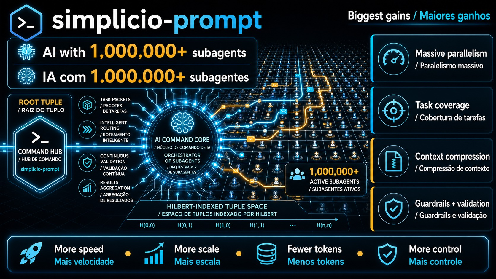
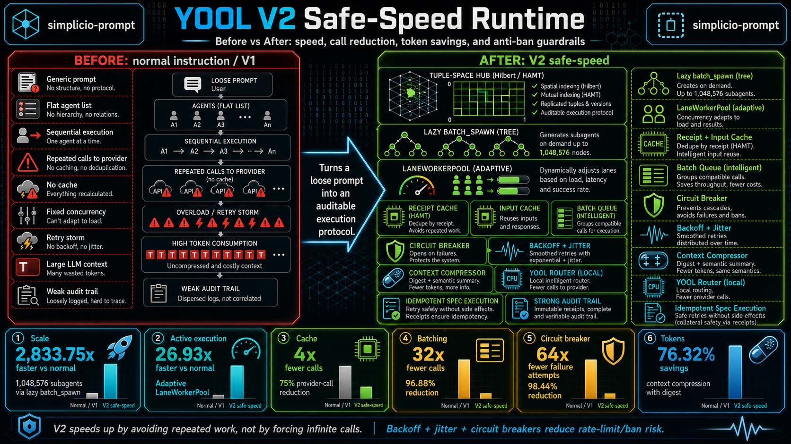
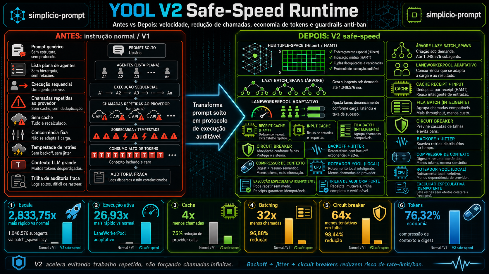

<p align="center">
  
</p>

# simplicio-prompt

> Capability-addressing pattern: **yool** (atomic action) wrapped in **tuples** (addressable envelopes) over an **HAMT** (Hash Array Mapped Trie) registry, coordinated through a **tuple-space** with **content-addressable receipts**.

This repo is the canonical spec. Vendor it into any project that wants the pattern.

## Highlight: 1,000,000+ subagents, zero enumeration

> **`simplicio-prompt` scales to 1,000,000+ subagents in a single task without
> enumerating them, without spawning a million processes, and without melting
> your provider quota.**

It does this with `batch_spawn(depth, branching, compression_threshold)` — a
lazy hierarchical fan-out over a Hilbert-indexed tuple graph. The kernel stores
**virtual-agent counts and content-addressable receipts** instead of a flat
list of agents, so the cost of representing the work is logarithmic, not
linear.

- **`depth=4, branching=32` ⇒ 1,048,576 subagents** materialized only when a
  tuple is actually visited.
- `2,833.75x` faster scale representation than a flat instruction flow
  (V2 benchmark).
- `26.93x` faster active execution than naive sequential fan-out.
- `compress_token` + `prune_idle` keep inactive subagents as auditable tokens,
  so a million-subagent task still fits in a small working set.
- `LaneWorkerPool` enforces bounded per-lane concurrency
  (`YOOL_TUPLE_LANE_CONCURRENCY=32`, `YOOL_TUPLE_MAX_LANE_CONCURRENCY=64`),
  so a million-subagent graph never turns into a million concurrent calls.
- Provider safety stays intact: receipt/input cache, jittered backoff,
  circuit breakers, and small-task batching apply at the million-subagent
  scale exactly as they do at one.

The output shape stays auditable at any scale:

```text
[Tuple Space Snapshot]
[Active Agents/Subagents]      ← materialized, small
[Total Agents/Subagents]       ← virtual, up to 1,000,000+
[Proximo Yool a executar]
[Resultado parcial]
```

See [`prompts/agent-runtime-execution-prompt.md`](prompts/agent-runtime-execution-prompt.md)
and [`kernel/yool_tuple_kernel.py`](kernel/yool_tuple_kernel.py) for the
canonical `batch_spawn` contract.

## Acknowledgement

Special thanks to [Jesse Daniel Brown, PhD](https://github.com/JesseBrown1980), my mentor, a California, USA native and author of 100+ scientific articles. His humanitarian and educational perspective on programming, AI, and scientific work helped reinforce the mission behind this repository: practical agent systems that increase human capability through safer, more auditable automation.

## V2 safe-speed infographics

### English


### Portuguese Brazil


### Infographic Explanation

The infographics compare a loose prompt flow against the `simplicio-prompt` V2
safe-speed runtime. The left side shows the old failure modes: flat agent lists,
sequential work, repeated provider calls, no cache, fixed concurrency, retry
storms, large LLM context, and weak audit trails.

The right side shows the V2 path: tuple-space routing, lazy `batch_spawn`,
adaptive `LaneWorkerPool`, receipt/input cache, small-task batching, circuit
breakers, backoff with jitter, context compression, local yool routing, and
speculative execution only for idempotent work. The practical result is faster
delivery through avoided repeat work and safer provider behavior, not through
unbounded calls.

Measured V2 benchmark highlights:

- Scale representation: `2,833.75x` faster than a normal instruction flow.
- Active execution: `26.93x` faster than normal sequential execution.
- Cache: `4x` fewer provider calls, a `75%` reduction.
- Batching: `32x` fewer small-task calls, a `96.88%` reduction.
- Circuit breaker: `64x` fewer failure attempts, a `98.44%` reduction.
- Token economy: `76.32%` estimated savings through context compression.

## Quick read

- `YOOL_TUPLE_HAMT.md` - full spec with diagrams, algorithms, examples, guardrails.
- `kernel/yool_tuple_kernel.py` - reference Python kernel with lazy `batch_spawn`,
  `compress_token`, hookwall, indexed tuple-space scans, and lane worker fan-out.
- `prompts/agent-runtime-execution-prompt.md` - ready prompt for Claude, Codex,
  Hermes, and other coding agents.
- `examples/` - runnable minimal implementations (Python, Node).
- `guardrails/` - CPU throttle + disk GC reference implementations.
- `adopters.md` - projects that vendor this spec.

## Install via npm

The repo ships as an npm package. Use it without cloning:

```bash
# print the full prompt
npx simplicio-prompt

# install into CLAUDE.md (or AGENTS.md, .cursorrules, etc.)
npx simplicio-prompt --install CLAUDE.md
npx simplicio-prompt --install AGENTS.md
npx simplicio-prompt --install .cursorrules

# print only the `## Prompt` body (no surrounding markdown)
npx simplicio-prompt --raw
```

Or add it as a dependency and consume it programmatically:

```bash
npm install simplicio-prompt
```

```js
import { getPrompt, getPromptSection, getPromptPath } from "simplicio-prompt";

const fullMarkdown = getPrompt();        // entire prompt file
const promptOnly   = getPromptSection(); // just the `## Prompt` body
const filePath     = getPromptPath();    // absolute path on disk
```

The `--install` flag wraps the prompt in `<!-- simplicio-prompt:start -->` /
`<!-- simplicio-prompt:end -->` markers so reinstalling updates the block in
place instead of duplicating it.

## How to use the prompt

Use `simplicio-prompt` as a canonical execution prompt for coding agents such as
Claude, Codex, Hermes, Cursor, Cline, or any assistant that can read repository
instructions.

1. Run `npx simplicio-prompt --install CLAUDE.md` (or paste the `## Prompt`
   section from [`prompts/agent-runtime-execution-prompt.md`](prompts/agent-runtime-execution-prompt.md)
   into `AGENTS.md`, `CLAUDE.md`, `.cursorrules`, or a custom system prompt).
2. In the target repository, just ask for work in your own words. **You do not
   need to start the message with `Implement`** — any user input (a sentence, a
   bug description, a code snippet, a one-word request) is treated as the task
   `X` and routed through the same runtime. The only opt-outs are explicit
   stand-down phrases like "stop", "cancel", "exit runtime".
3. The agent will read the canonical files listed in the prompt, decompose the
   task into a Hilbert-indexed tuple graph, create a root tuple, route active
   work through tuple-space primitives, and use `LaneWorkerPool` plus the V2
   safe-speed controls.
4. Status output is **opt-in** (default: silent). Enable with
   `YOOL_TUPLE_STATUS=true` (or `status_output=true` runtime flag). When on,
   the agent returns this shape:

```text
[Tuple Space Snapshot]
[Active Agents/Subagents]
[Total Agents/Subagents]
[Next Yool to Execute]
[Partial Result]
```

   Per-field toggles (default `false`): `YOOL_TUPLE_STATUS_SNAPSHOT`,
   `YOOL_TUPLE_STATUS_ACTIVE`, `YOOL_TUPLE_STATUS_TOTAL`,
   `YOOL_TUPLE_STATUS_NEXT`, `YOOL_TUPLE_STATUS_PARTIAL`.

For high-throughput local runs, set the runtime environment variables before
starting the agent or scripts:

```powershell
$env:YOOL_TUPLE_LANE_CONCURRENCY="32"
$env:YOOL_TUPLE_MAX_LANE_CONCURRENCY="64"
$env:YOOL_TUPLE_CPU_QUOTA_PCT="95"
$env:YOOL_TUPLE_QUEUE_MAXSIZE="8192"
$env:YOOL_TUPLE_COMPRESSION_THRESHOLD="1024"
$env:YOOL_TUPLE_CACHE_MAX_ENTRIES="16384"
$env:YOOL_TUPLE_CACHE_TTL_S="3600"
$env:YOOL_TUPLE_API_MAX_RETRIES="3"
$env:YOOL_TUPLE_API_BACKOFF_BASE_MS="100"
$env:YOOL_TUPLE_API_BACKOFF_MAX_MS="5000"
$env:YOOL_TUPLE_CIRCUIT_FAILURE_THRESHOLD="5"
$env:YOOL_TUPLE_CIRCUIT_COOLDOWN_S="30"
$env:YOOL_TUPLE_BATCH_SMALL_TASK_SIZE="32"
$env:YOOL_TUPLE_CONTEXT_COMPRESSION_CHARS="6000"
```

Run the reference kernel and tests:

```bash
python kernel/yool_tuple_kernel.py
python -m unittest discover -s tests -p "test_*.py"
```

## V2 benchmark report

The V2 report is the main evidence for the safe-speed runtime. Read it before
adopting the prompt in another project:

- [V2 Markdown report](benchmarks/v2_safe_speed_results.md)
- [V2 PDF report](benchmarks/v2_safe_speed_benchmark.pdf)
- [V2 benchmark script](benchmarks/v2_safe_speed_benchmark.py)
- [V2 PDF generator](benchmarks/generate_v2_benchmark_pdf.py)

What the V2 report shows:

- `2,833.75x` faster scale representation than normal instruction flow.
- `26.93x` faster active execution than normal sequential execution.
- `4x` fewer repeated provider calls through receipt/input cache.
- `32x` fewer small-task calls through batching.
- `64x` fewer provider failure attempts through circuit breakers.
- `76.32%` estimated token savings through context compression.

The key point: V2 speeds up by avoiding repeated work and controlling provider
pressure. It does not depend on unsafe infinite calls, unbounded concurrency, or
retry storms.

## High-throughput runtime defaults

The reference kernel is tuned for speed while keeping host guardrails explicit:

| Env var | Default | Purpose |
|---|---:|---|
| `YOOL_TUPLE_LANE_CONCURRENCY` / `YOOL_LANE_CONCURRENCY` | `32` | Preferred workers per lane. |
| `YOOL_TUPLE_MAX_LANE_CONCURRENCY` / `YOOL_MAX_LANE_CONCURRENCY` | `64` | Ceiling for workers per lane. |
| `YOOL_TUPLE_CPU_QUOTA_PCT` / `YOOL_CPU_QUOTA_PCT` | `95` | Default per-yool CPU budget. |
| `YOOL_TUPLE_QUEUE_MAXSIZE` / `YOOL_QUEUE_MAXSIZE` | `8192` | Lane queue scan cap. |
| `YOOL_TUPLE_COMPRESSION_THRESHOLD` / `YOOL_COMPRESSION_THRESHOLD` | `1024` | Active materialized agents before pruning. |
| `YOOL_TUPLE_CACHE_MAX_ENTRIES` / `YOOL_CACHE_MAX_ENTRIES` | `16384` | Receipt/input-hash cache size. |
| `YOOL_TUPLE_CACHE_TTL_S` / `YOOL_CACHE_TTL_S` | `3600` | Cache TTL in seconds. |
| `YOOL_TUPLE_API_MAX_RETRIES` / `YOOL_API_MAX_RETRIES` | `3` | Retry budget for transient API/LLM failures. |
| `YOOL_TUPLE_API_BACKOFF_BASE_MS` / `YOOL_API_BACKOFF_BASE_MS` | `100` | Initial jittered backoff delay. |
| `YOOL_TUPLE_API_BACKOFF_MAX_MS` / `YOOL_API_BACKOFF_MAX_MS` | `5000` | Backoff ceiling. |
| `YOOL_TUPLE_CIRCUIT_FAILURE_THRESHOLD` / `YOOL_CIRCUIT_FAILURE_THRESHOLD` | `5` | Failures before opening provider breaker. |
| `YOOL_TUPLE_CIRCUIT_COOLDOWN_S` / `YOOL_CIRCUIT_COOLDOWN_S` | `30` | Provider cooldown after breaker opens. |
| `YOOL_TUPLE_BATCH_SMALL_TASK_SIZE` / `YOOL_BATCH_SMALL_TASK_SIZE` | `32` | Default small-task batch size. |
| `YOOL_TUPLE_CONTEXT_COMPRESSION_CHARS` / `YOOL_CONTEXT_COMPRESSION_CHARS` | `6000` | Large LLM context compression threshold. |

Safe speedups now live in the kernel, not only in the prompt: receipt/input
cache, adaptive lane concurrency, jittered backoff, provider circuit breakers,
small-task batching, prompt/context compression, local yool routing, and
speculative execution only for tuples marked `idempotent=True`.

Run the reference kernel and tests:

```bash
python kernel/yool_tuple_kernel.py
python -m unittest discover -s tests -p "test_*.py"
```

Benchmark reports:

- [Prompt vs normal Markdown](benchmarks/prompt_vs_normal_results.md)
- [Prompt vs normal PDF](benchmarks/prompt_vs_normal_benchmark.pdf)
- [V2 safe-speed Markdown](benchmarks/v2_safe_speed_results.md)
- [V2 safe-speed PDF](benchmarks/v2_safe_speed_benchmark.pdf)

## Why a separate repo

The pattern is cross-project. SendSprint, llm-project-mapper, future agents - all consume the same spec. One source of truth, vendored on demand.

## License

Private. Internal use only.
