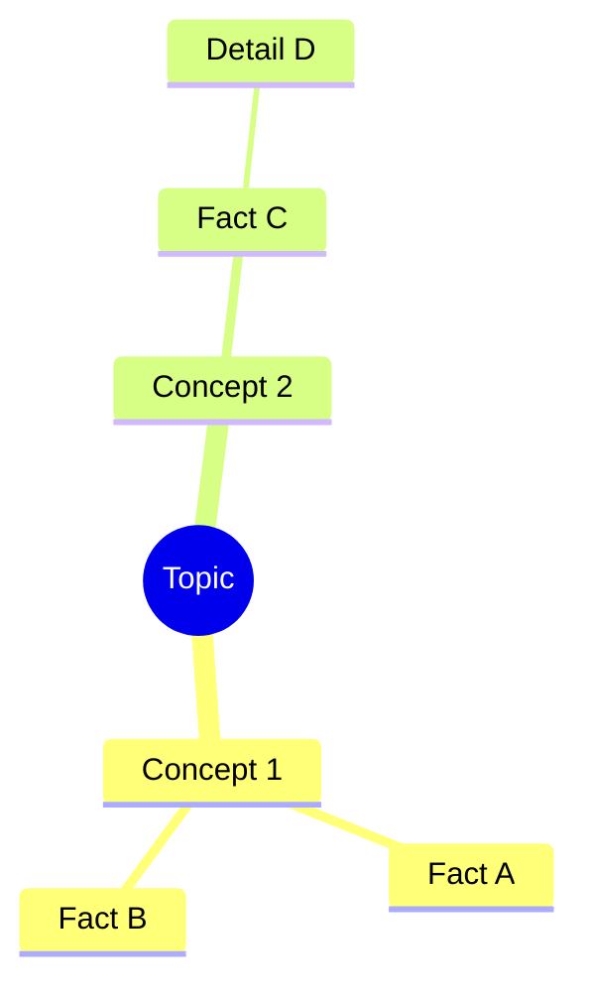

# Mind Map Generator (NotebookLM Style)

This skill allows you to transform fragmented memories and episodes from the `context_graph` into structured, visual Mermaid.js Mind Maps.

## Workflow
1. When the user asks to "Map out [Topic]":
2. Use the `context_graph` tool with action `search` and query the topic.
3. Review the returned episodes/decisions.
4. Synthesize the findings into a hierarchical Mermaid.js mind map format.
5. Return the Mermaid code wrapped in a markdown code block (` ```mermaid `) so it renders visually in compatible UI clients.

## Example Output Format


## Rules
- ONLY include facts supported by the `context_graph` or explicitly provided documents.
- Keep node text short (1-4 words).
- Group related nodes under broader categories to show connections.
