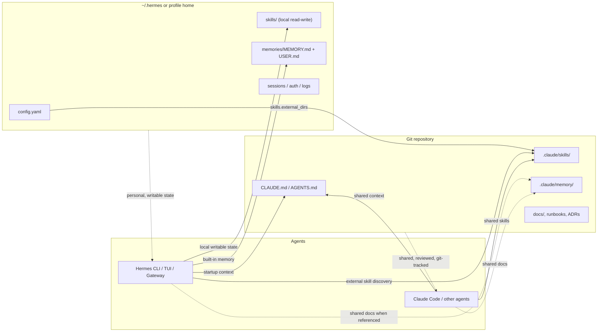

# Repo-Centric Shared Setup

A good team setup splits agent state into two layers:

- **Git-tracked repo context** for instructions, workflows, and coordination that every agent should share.
- **Hermes home state** for writable skills, built-in memory, sessions, auth, and personal preferences.

That gives you a repo that works well with Hermes, Claude Code, Codex, and other agents without forcing all mutable state into git.

## Why use a repo-centric setup?

Use this pattern when you want to:

- keep project instructions next to the code they describe
- share the same agent contract across multiple tools
- review prompt and workflow changes in pull requests
- let Hermes keep its own writable memory and sessions outside the repo
- coordinate multiple agents on the same codebase without losing a shared source of truth

## Architecture



## Recommended repo layout

```text
my-repo/
├── CLAUDE.md                  # Shared project contract across agent tools
├── AGENTS.md                  # Optional Hermes-first file if you want one
├── .claude/
│   ├── skills/
│   │   └── release-checklist/
│   │       └── SKILL.md
│   └── memory/
│       ├── architecture.md
│       └── decisions.md
├── docs/
└── .gitignore
```

A practical rule:

- Put **stable repo-wide instructions** in `CLAUDE.md` or `AGENTS.md`.
- Put **reusable project workflows** in `.claude/skills/`.
- Put **shared notes, ADRs, incident writeups, and handoff docs** in `.claude/memory/` or `docs/`.
- Let Hermes keep **sessions, auth, built-in memory, and local skill edits** in `~/.hermes/`.

## Configure `skills.external_dirs`

Hermes always keeps a local writable skills directory under `~/.hermes/skills/` (or the active profile's `HERMES_HOME`). To load repo-owned skills too, point Hermes at the repo directory with `skills.external_dirs`.

### Linux / macOS

```yaml
# ~/.hermes/config.yaml
skills:
  external_dirs:
    - ~/src/acme-platform/.claude/skills
    - ~/src/shared-agent-skills
    - ${ACME_REPO}/.claude/skills
```

### WSL using a Windows checkout

```yaml
# ~/.hermes/config.yaml inside WSL
skills:
  external_dirs:
    - /mnt/c/Users/alice/src/acme-platform/.claude/skills
    - /mnt/c/Users/alice/src/shared-agent-skills
```

:::tip WSL path rule
When Hermes runs inside WSL, use Linux mount paths like `/mnt/c/Users/<you>/...` in `config.yaml`, not raw Windows paths like `C:\Users\<you>\...`.
:::

Paths support `~` expansion and `${VAR}` environment variable substitution.

## Precedence rules

Hermes already has clear precedence. The important repo-centric rules are:

| Area | Precedence |
|---|---|
| Project context files | `.hermes.md` / `HERMES.md` → `AGENTS.md` → `CLAUDE.md` → `.cursorrules` |
| Skill lookup | `~/.hermes/skills/` first, then each `skills.external_dirs` entry in config order |
| Skill writes | New or edited skills are written to `~/.hermes/skills/`, not back into repo-owned external dirs |
| Repo memory vs Hermes memory | Repo files stay repo files; Hermes built-in memory stays in `~/.hermes/memories/` |

If you keep both `AGENTS.md` and `CLAUDE.md`, remember that **Hermes prefers `AGENTS.md`**. If you want one canonical shared file for all tools, either:

- keep only `CLAUDE.md`, or
- keep `AGENTS.md` very small and have it mirror or reference the shared rules.

## Shared repo memory vs Hermes built-in memory

These layers solve different problems:

| Store | Lives where | Git-tracked? | Loaded automatically? | Best for |
|---|---|---:|---:|---|
| `CLAUDE.md` / `AGENTS.md` | repo root | yes | yes | stable project rules and coordination contract |
| `.claude/memory/` | repo | yes | no | shared notes, ADRs, architecture docs, handoffs |
| `MEMORY.md` | `~/.hermes/memories/` | no | yes | Hermes's own learned environment notes |
| `USER.md` | `~/.hermes/memories/` | no | yes | personal preferences and communication style |

Important distinction:

- **`.claude/memory/` is repo content**, not a special Hermes memory backend.
- **Hermes built-in memory** is `MEMORY.md` and `USER.md`, stored outside the repo and managed by Hermes.

So if something must show up for Hermes every session, put it in `CLAUDE.md` or `AGENTS.md`. If something should be shared in git but only read when relevant, keep it in `.claude/memory/` or `docs/`.

See also:

- [Context Files](/docs/user-guide/features/context-files)
- [Persistent Memory](/docs/user-guide/features/memory)

## Multi-agent coordination

Repo-centric setup works best when each layer has a clear job:

1. **Repo contract** — `CLAUDE.md` or `AGENTS.md`
   - coding conventions
   - architecture boundaries
   - deployment rules
   - review expectations

2. **Repo skills** — `.claude/skills/`
   - reusable workflows every agent should share
   - release checklists
   - migration playbooks
   - internal runbooks

3. **Hermes personal state** — `~/.hermes/`
   - session history
   - auth and provider config
   - Hermes built-in memory
   - local skill overrides and agent-created skills

For parallel work, give each agent its own branch or worktree and let the repo-centric files stay shared:

- `hermes -w` for disposable isolated worktrees
- `git worktree add ...` for named long-lived worktrees
- separate Hermes profiles if you want isolated providers, memory, or auth

See [Git Worktrees](/docs/user-guide/git-worktrees) for the isolation pattern.

## Git workflow

Treat repo-centric agent files like code:

- commit `CLAUDE.md`, `AGENTS.md`, `.claude/skills/`, and shared repo notes intentionally
- review those changes in PRs, because they change agent behavior
- keep personal Hermes state out of git (`~/.hermes/` is not a project artifact)
- use one branch/worktree per agent when running multiple agents in parallel
- decide explicitly whether repo-local outputs like `.hermes/plans/` should be committed or gitignored

A simple default is:

- **commit** shared instructions and shared skills
- **gitignore** local scratch output and personal agent state
- **merge via PR** once the workflow or instruction change is reviewed

## Recommended operating pattern

If you want a concrete default:

1. Put the shared project contract in `CLAUDE.md`.
2. Add reusable repo workflows under `.claude/skills/`.
3. Point Hermes at that directory with `skills.external_dirs`.
4. Keep Hermes built-in memory in `~/.hermes/memories/`.
5. Run each substantial agent task in its own branch or worktree.

That gives you shared repo knowledge without giving up Hermes's own memory, sessions, and writable local skills.