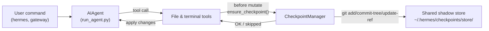

# Контрольные точки и `/rollback`

Hermes Agent может автоматически создавать снимок твоего проекта перед **разрушительными операциями** и восстанавливать его одной командой. Контрольные точки **opt‑in** начиная с версии v2 — большинство пользователей никогда не используют `/rollback`, а хранилище shadow‑store со временем становится нетривиальным, поэтому по умолчанию — отключено.

Включи контрольные точки для сессии с помощью `--checkpoints`:

```bash
hermes chat --checkpoints
```

Или включи их глобально в `~/.hermes/config.yaml`:

```yaml
checkpoints:
  enabled: true
```

Эта система безопасности работает благодаря внутреннему **Checkpoint Manager**, который хранит единый общий shadow‑git‑репозиторий в `~/.hermes/checkpoints/store/` — твой реальный проектный `.git` никогда не трогается. Каждый проект, в котором работает агент, использует одно и то же хранилище, поэтому объектная база git, основанная на адресации содержимым, дедуплицирует данные между проектами и между ходами.

## Что вызывает создание контрольной точки

Контрольные точки создаются автоматически перед:

- **Инструментами работы с файлами** — `write_file` и `patch`
- **Разрушительными терминальными командами** — `rm`, `rmdir`, `cp`, `install`, `mv`, `sed -i`, `truncate`, `dd`, `shred`, перенаправления вывода (`>`), а также `git reset`/`clean`/`checkout`

Агент создаёт **не более одной контрольной точки на каталог за ход**, поэтому длительные сессии не засоряют снимками.

## Быстрый справочник

Slash‑команды в сессии:

| Command | Description |
|---------|-------------|
| `/rollback` | Список всех контрольных точек со статистикой изменений |
| `/rollback <N>` | Восстановить контрольную точку N (также отменяет последний ход чата) |
| `/rollback diff <N>` | Предпросмотр diff между контрольной точкой N и текущим состоянием |
| `/rollback <N> <file>` | Восстановить один файл из контрольной точки N |

CLI для просмотра и управления хранилищем вне сессии:

| Command | Description |
|---------|-------------|
| `hermes checkpoints` | Показать общий размер, количество проектов, разбивку по проектам |
| `hermes checkpoints status` | То же, что и простое `checkpoints` |
| `hermes checkpoints list` | Псевдоним для `status` |
| `hermes checkpoints prune` | Принудительная очистка: удалить орфаны/устаревшее, выполнить GC, соблюсти лимит размера |
| `hermes checkpoints clear` | Удалить всё хранилище контрольных точек (спросит подтверждение) |
| `hermes checkpoints clear-legacy` | Удалить только архивы `legacy-*` из миграции v1 |

## Как работают контрольные точки

В общих чертах:

- Hermes обнаруживает, когда инструменты собираются **изменить файлы** в рабочем дереве.
- Один раз за ход разговора (для каждого каталога) он:
  - Определяет разумный корень проекта для файла.
  - Инициализирует или переиспользует **единый общий shadow‑store** в `~/.hermes/checkpoints/store/`.
  - Добавляет изменения в индекс проекта, строит дерево и фиксирует их в рефе проекта (`refs/hermes/<project-hash>`).
- Эти рефы проекта образуют историю контрольных точек, которую можно просматривать и восстанавливать через `/rollback`.



## Конфигурация

Настройка в `~/.hermes/config.yaml`:

```yaml
checkpoints:
  enabled: false              # master switch (default: false — opt-in)
  max_snapshots: 20           # max checkpoints per project (enforced via ref rewrite + gc)
  max_total_size_mb: 500      # hard cap on total store size; oldest commits dropped
  max_file_size_mb: 10        # skip any single file larger than this

  # Auto-maintenance (on by default): sweep ~/.hermes/checkpoints/ at startup
  # and delete project entries whose working directory no longer exists
  # (orphans) or whose last_touch is older than retention_days. Runs at most
  # once per min_interval_hours, tracked via a .last_prune marker.
  auto_prune: true
  retention_days: 7
  delete_orphans: true
  min_interval_hours: 24
```

Отключить всё:

```yaml
checkpoints:
  enabled: false
  auto_prune: false
```

Когда `enabled: false`, Checkpoint Manager ничего не делает и не пытается выполнять git‑операции. При `auto_prune: false` хранилище будет расти, пока ты не запустишь `hermes checkpoints prune` вручную.

## Список контрольных точек

Из CLI‑сессии:

```
/rollback
```

Hermes отвечает отформатированным списком со статистикой изменений:

```text
📸 Checkpoints for /path/to/project:

  1. 4270a8c  2026-03-16 04:36  before patch  (1 file, +1/-0)
  2. eaf4c1f  2026-03-16 04:35  before write_file
  3. b3f9d2e  2026-03-16 04:34  before terminal: sed -i s/old/new/ config.py  (1 file, +1/-1)

  /rollback <N>             restore to checkpoint N
  /rollback diff <N>        preview changes since checkpoint N
  /rollback <N> <file>      restore a single file from checkpoint N
```

## Просмотр хранилища из оболочки

```bash
hermes checkpoints
```

Пример вывода:

```text
Checkpoint base: /home/you/.hermes/checkpoints
Total size:      142.3 MB
  store/         138.1 MB
  legacy-*       4.2 MB
Projects:        12

  WORKDIR                                                       COMMITS    LAST TOUCH  STATE
  /home/you/code/hermes-agent                                        20       2h ago  live
  /home/you/code/experiments/rl-runner                                8       1d ago  live
  /home/you/code/old-prototype                                        3       9d ago  orphan
  ...

Legacy archives (1):
  legacy-20260506-050616                           4.2 MB

Clear with: hermes checkpoints clear-legacy
```

Принудительная полная очистка (игнорирует 24‑часовой маркер идемпотентности):

```bash
hermes checkpoints prune --retention-days 3 --max-size-mb 200
```

## Предпросмотр изменений с `/rollback diff`

Перед тем как выполнить восстановление, посмотри, что изменилось с момента контрольной точки:

```
/rollback diff 1
```

Показывается сводка `git diff stat`, а затем сам diff.

## Восстановление с `/rollback`

```
/rollback 1
```

Что происходит «за кулисами»:

1. Проверяется, что целевой коммит существует в shadow‑store.
2. Делается **снимок перед откатом** текущего состояния, чтобы потом можно было «отменить отмену».
3. Восстанавливаются отслеживаемые файлы в рабочем каталоге.
4. **Отменяется последний ход разговора**, чтобы контекст агента соответствовал восстановленному состоянию файловой системы.

## Восстановление одного файла

Восстанови один файл из контрольной точки, не затрагивая остальные файлы каталога:

```
/rollback 1 src/broken_file.py
```

## Защита и ограничения производительности

- **Наличие Git** — если `git` не найден в `PATH`, контрольные точки автоматически отключаются.
- **Объём каталога** — Hermes пропускает слишком широкие каталоги (корень `/`, домашний `$HOME`).
- **Размер репозитория** — каталоги с более чем 50 000 файлов игнорируются.
- **Ограничение размера отдельного файла** — файлы больше `max_file_size_mb` (по умолчанию 10 МБ) исключаются из снимка. Это предохраняет от случайного захвата наборов данных, весов моделей или сгенерированных медиа.
- **Ограничение общего размера хранилища** — когда хранилище превышает `max_total_size_mb` (по умолчанию 500 МБ), самый старый коммит каждого проекта удаляется по круговому алгоритму, пока размер не впишется в лимит.
- **Реальная очистка** — `max_snapshots` принудительно применяется путём перезаписи рефа проекта и последующего запуска `git gc --prune=now`, чтобы «свободные» объекты не накапливались.
- **Снимки без изменений** — если с последнего снимка нет изменений, контрольная точка не создаётся.
- **Некритичные ошибки** — все ошибки внутри Checkpoint Manager записываются на уровне debug; твои инструменты продолжают работать.

## Где находятся контрольные точки

```text
~/.hermes/checkpoints/
  ├── store/                 # single shared bare git repo
  │   ├── HEAD, objects/     # git internals (shared across projects)
  │   ├── refs/hermes/<hash> # per-project branch tip
  │   ├── indexes/<hash>     # per-project git index
  │   ├── projects/<hash>.json  # workdir + created_at + last_touch
  │   └── info/exclude
  ├── .last_prune            # auto-prune idempotency marker
  └── legacy-<ts>/           # archived pre-v2 per-project shadow repos
```

Каждый `<hash>` вычисляется из абсолютного пути рабочего каталога. Обычно тебе не нужно трогать их вручную — используй `hermes checkpoints status` / `prune` / `clear`.

### Миграция с v1

До переписывания в v2 каждый рабочий каталог имел собственный полноценный shadow‑git‑репозиторий непосредственно в `~/.hermes/checkpoints/<hash>/`. Такая структура не могла дедуплицировать объекты между проектами и имела задокументированный неработающий очиститель — хранилище росло без ограничений.

При первом запуске v2 все предшествующие shadow‑репозитории перемещаются в `~/.hermes/checkpoints/legacy-<timestamp>/`, после чего новая единая схема начинает работать чисто. История `/rollback` из старой версии всё ещё доступна через ручной осмотр legacy‑архива с помощью `git`; когда убедишься, что она больше не нужна, выполни:

```bash
hermes checkpoints clear-legacy
```

чтобы освободить место. Legacy‑архивы также очищаются `auto_prune` после `retention_days`.

## Лучшие практики

- **Включай контрольные точки только при необходимости** — `hermes chat --checkpoints` или в профиле `enabled: true`.
- **Используй `/rollback diff` перед восстановлением** — предварительно посмотри, что изменится, и выбери нужную точку.
- **Отдавай предпочтение `/rollback` вместо `git reset`**, когда нужно отменить только изменения, внесённые агентом.
- **Периодически проверяй `hermes checkpoints status`**, если часто пользуешься контрольными точками — он покажет, какие проекты активны и сколько хранилище стоит.
- **Комбинируй с Git worktrees** для максимальной безопасности — держи каждую сессию Hermes в отдельном worktree/branch, а контрольные точки используй как дополнительный слой.

Для запуска нескольких агентов параллельно в одном репозитории смотри руководство по [Git worktrees](./git-worktrees.md).