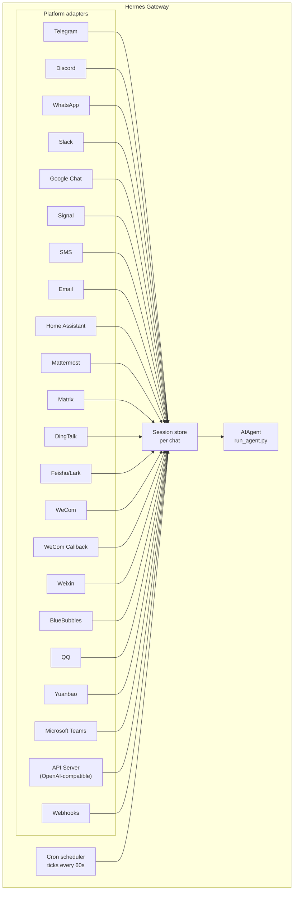

# Шлюз обмена сообщениями

Общайся с Hermes через Telegram, Discord, Slack, WhatsApp, Signal, SMS, Email, Home Assistant, Mattermost, Matrix, DingTalk, Feishu/Lark, WeCom, Weixin, BlueBubbles (iMessage), QQ, Yuanbao, Microsoft Teams, LINE, ntfy или через браузер. Шлюз — это единый фоновый процесс, который подключается ко всем настроенным платформам, управляет сессиями, запускает cron‑задачи и доставляет голосовые сообщения.

Для полного набора функций голоса — включая режим микрофона в CLI, озвученные ответы в сообщениях и разговоры в голосовых каналах Discord — смотри [Режим голоса](/user-guide/features/voice-mode) и [Использовать режим голоса с Hermes](/guides/use-voice-mode-with-hermes).

:::tip
Ботам нужны как поставщик модели, так и поставщики инструментов (TTS, web). Подписка на [Nous Portal](/integrations/nous-portal) объединяет всё это.
:::
## Сравнение платформ

| Платформа | Голос | Изображения | Файлы | Треды | Реакции | Набор | Стриминг |
|----------|:-----:|:------:|:-----:|:-------:|:---------:|:------:|:---------:|
| Telegram | ✅ | ✅ | ✅ | ✅ | — | ✅ | ✅ |
| Discord | ✅ | ✅ | ✅ | ✅ | ✅ | ✅ | ✅ |
| Slack | ✅ | ✅ | ✅ | ✅ | ✅ | ✅ | ✅ |
| Google Chat | — | ✅ | ✅ | ✅ | — | ✅ | — |
| WhatsApp | — | ✅ | ✅ | — | — | ✅ | ✅ |
| Signal | — | ✅ | ✅ | — | — | ✅ | ✅ |
| SMS | — | — | — | — | — | — | — |
| Email | — | ✅ | ✅ | ✅ | — | — | — |
| Home Assistant | — | — | — | — | — | — | — |
| Mattermost | ✅ | ✅ | ✅ | ✅ | — | ✅ | ✅ |
| Matrix | ✅ | ✅ | ✅ | ✅ | ✅ | ✅ | ✅ |
| DingTalk | — | ✅ | ✅ | — | ✅ | — | ✅ |
| Feishu/Lark | ✅ | ✅ | ✅ | ✅ | ✅ | ✅ | ✅ |
| WeCom | ✅ | ✅ | ✅ | — | — | ✅ | ✅ |
| WeCom Callback | — | — | — | — | — | — | — |
| Weixin | ✅ | ✅ | ✅ | — | — | ✅ | ✅ |
| BlueBubbles | — | ✅ | ✅ | — | ✅ | ✅ | — |
| QQ | ✅ | ✅ | ✅ | — | — | ✅ | — |
| Yuanbao | ✅ | ✅ | ✅ | — | — | ✅ | ✅ |
| Microsoft Teams | — | ✅ | — | ✅ | — | ✅ | — |
| LINE | — | ✅ | ✅ | — | — | ✅ | — |
| ntfy | — | — | — | — | — | — | — |

**Голос** = ответы в виде TTS‑аудио и/или транскрипция голосовых сообщений. **Изображения** = отправка/получение изображений. **Файлы** = отправка/получение вложений. **Треды** = ветвленные беседы. **Реакции** = эмодзи‑реакции на сообщения. **Набор** = индикатор набора текста во время обработки. **Стриминг** = постепенное обновление сообщения через редактирование.
## Архитектура



Каждый адаптер платформы получает сообщения, направляет их через хранилище сессий для каждого чата и передаёт их AIAgent для обработки. Шлюз также запускает cron‑планировщик, который каждые 60 секунд выполняет все ожидающие задачи.
## Быстрая настройка

Самый простой способ настроить платформы обмена сообщениями — интерактивный мастер:

```bash
hermes gateway setup        # Interactive setup for all messaging platforms
```

Он проведёт тебя через настройку каждой платформы с помощью выбора стрелками, покажет, какие платформы уже настроены, и предложит запустить или перезапустить gateway, когда всё будет готово.
## Команды шлюза

```bash
hermes gateway              # Run in foreground
hermes gateway setup        # Configure messaging platforms interactively
hermes gateway install      # Install as a user service (Linux) / launchd service (macOS)
sudo hermes gateway install --system   # Linux only: install a boot-time system service
hermes gateway start        # Start the default service
hermes gateway stop         # Stop the default service
hermes gateway status       # Check default service status
hermes gateway status --system         # Linux only: inspect the system service explicitly
```
## Команды чата (внутри обмена сообщениями)

| Command | Description |
|---------|-------------|
| `/new` or `/reset` | Начать новый разговор |
| `/model [provider:model]` | Показать или изменить модель (поддерживается синтаксис `provider:model`) |
| `/personality [name]` | Установить личность |
| `/retry` | Повторить последнее сообщение |
| `/undo` | Удалить последний обмен |
| `/status` | Показать информацию о сессии |
| `/whoami` | Показать твой доступ к слеш‑командам в этом контексте (admin / user / unrestricted) |
| `/stop` | Остановить работающего агента |
| `/approve` | Одобрить ожидающую опасную команду |
| `/deny` | Отклонить ожидающую опасную команду |
| `/sethome` | Установить этот чат как домашний канал |
| `/compress` | Вручную сжать контекст разговора |
| `/title [name]` | Установить или показать название сессии |
| `/resume [name]` | Возобновить ранее названную сессию |
| `/usage` | Показать использование токенов в этой сессии |
| `/insights [days]` | Показать аналитические данные и статистику использования |
| `/reasoning [level\|show\|hide]` | Изменить уровень рассуждения или переключить его отображение |
| `/voice [on\|off\|tts\|join\|leave\|status]` | Управлять голосовыми ответами в сообщениях и поведением голосового канала Discord |
| `/rollback [number]` | Показать список или восстановить контрольные точки файловой системы |
| `/background <prompt>` | Запустить запрос в отдельной фоновой сессии |
| `/reload-mcp` | Перезагрузить серверы MCP из конфигурации |
| `/update` | Обновить Hermes Agent до последней версии |
| `/help` | Показать доступные команды |
| `/<skill-name>` | Вызвать любой установленный skill |
## Управление сессиями

### Сохранение сессии

Сессии сохраняются между сообщениями, пока они не будут сброшены. Агент запоминает контекст твоего разговора.

### Политики сброса

Сессии сбрасываются в соответствии с настраиваемыми политиками:

| Политика | По умолчанию | Описание |
|----------|--------------|----------|
| Daily | 4:00 AM | Сброс в определённый час каждый день |
| Idle | 1440 min | Сброс после N минут бездействия |
| Both | (combined) | Срабатывает первое из условий |

Настрой переопределения для каждой платформы в `~/.hermes/gateway.json`:

```json
{
  "reset_by_platform": {
    "telegram": { "mode": "idle", "idle_minutes": 240 },
    "discord": { "mode": "idle", "idle_minutes": 60 }
  }
}
```
## Безопасность

**По умолчанию шлюз отклоняет всех пользователей, которые не находятся в списке разрешённых или не сопряжены через DM.** Это безопасный вариант по умолчанию для бота с доступом к терминалу.

```bash
# Restrict to specific users (recommended):
TELEGRAM_ALLOWED_USERS=123456789,987654321
DISCORD_ALLOWED_USERS=123456789012345678
SIGNAL_ALLOWED_USERS=+155****4567,+155****6543
SMS_ALLOWED_USERS=+155****4567,+155****6543
EMAIL_ALLOWED_USERS=trusted@example.com,colleague@work.com
MATTERMOST_ALLOWED_USERS=3uo8dkh1p7g1mfk49ear5fzs5c
MATRIX_ALLOWED_USERS=@alice:matrix.org
DINGTALK_ALLOWED_USERS=user-id-1
FEISHU_ALLOWED_USERS=ou_xxxxxxxx,ou_yyyyyyyy
WECOM_ALLOWED_USERS=user-id-1,user-id-2
WECOM_CALLBACK_ALLOWED_USERS=user-id-1,user-id-2
TEAMS_ALLOWED_USERS=aad-object-id-1,aad-object-id-2

# Or allow
GATEWAY_ALLOWED_USERS=123456789,987654321

# Or explicitly allow all users (NOT recommended for bots with terminal access):
GATEWAY_ALLOW_ALL_USERS=true
```

### Сопряжение через DM (альтернатива спискам разрешённых)

Вместо ручной настройки идентификаторов пользователей, неизвестные пользователи получают одноразовый код сопряжения, когда пишут боту в DM:

```bash
# The user sees: "Pairing code: XKGH5N7P"
# You approve them with:
hermes pairing approve telegram XKGH5N7P

# Other pairing commands:
hermes pairing list          # View pending + approved users
hermes pairing revoke telegram 123456789  # Remove access
```

Коды сопряжения истекают через 1 час, ограничены по частоте запросов и используют криптографическую случайность.

### Администраторы vs обычные пользователи

Списки разрешённых отвечают на вопрос «может ли этот человек вообще достучаться до бота?». **Разделение администратор / пользователь** отвечает на вопрос «теперь, когда он в системе, что ему разрешено делать?»

Каждый разрешённый пользователь попадает в один из двух уровней в зависимости от области (DM vs группа/канал):

- **Администратор** — полный доступ. Может выполнять любую зарегистрированную слеш‑команду (встроенную + плагин) и использовать все ограниченные возможности.
- **Обычный пользователь** — ограниченный доступ. Может общаться с агентом как обычно, но может запускать только те слеш‑команды, которые ты явно разрешил. Всегда доступными базовыми командами являются `/help` и `/whoami`.

Уровни настраиваются отдельно для каждой платформы и каждой области. Статус администратора в DM не подразумевает статус администратора в группе/канале — у каждой области свой список администраторов.

**Что сейчас регулируют уровни:** слеш‑команды. Разделение работает через живой реестр команд, поэтому охватывает как встроенные, так и зарегистрированные плагинами команды без отдельной привязки к функциям. Обычный чат не затронут — не‑администраторы по‑прежнему могут общаться с агентом.

**Что может быть ограничено в будущем:** дополнительные поверхности возможностей (доступ к инструментам, переключение моделей, ресурсоёмкие операции) будут привязаны к тому же различию администратор / пользователь, когда мы их добавим. Настройка разделения сейчас позволяет будущим ограничениям внедряться без необходимости переопределять, кто является администратором.

#### Конфигурация

```yaml
gateway:
  platforms:
    discord:
      extra:
        allow_from: ["111", "222", "333"]
        allow_admin_from: ["111"]                    # admins → all slash commands
        user_allowed_commands: [status, model]       # what non-admins may run
        # Optional: separate group/channel scope
        group_allow_admin_from: ["111"]
        group_user_allowed_commands: [status]
```

**Обратная совместимость:** если `allow_admin_from` не задан для области, разделение уровней отключается для этой области, и каждый разрешённый пользователь получает полный доступ. Существующие установки продолжают работать без изменений — включай разделение, когда понадобится различие.

#### Проверка твоего доступа

Выполни `/whoami` на любой платформе, чтобы увидеть активную область, твой уровень (admin / user / unrestricted) и какие слеш‑команды ты можешь запускать. Смотри страницы [Telegram](/user-guide/messaging/telegram#slash-command-access-control) и [Discord](/user-guide/messaging/discord#slash-command-access-control) для примеров, специфичных для платформ.
## Прерывание агента

Отправляй любое сообщение, пока агент работает, чтобы прервать его. Ключевые поведения:

- **Выполняющиеся в терминале команды завершаются немедленно** (SIGTERM, затем SIGKILL через 1 с)
- **Вызовы инструментов отменяются** — выполняется только текущий, остальные пропускаются
- **Несколько сообщений объединяются** — сообщения, отправленные во время прерывания, соединяются в один запрос
- **Команда `/stop`** — прерывает без постановки в очередь последующего сообщения

### Queue vs interrupt vs steer (режим busy-input)

По умолчанию отправка сообщения занятому агенту прерывает его. Доступны два других режима:

- `queue` — последующие сообщения ждут и выполняются в следующем ходу после завершения текущей задачи.
- `steer` — последующие сообщения внедряются в текущий запуск через `/steer`, попадая к агенту после следующего вызова инструмента. Прерывания нет, новый ход не начинается. При отсутствии начала работы агента переходит в поведение `queue`.

```yaml
display:
  busy_input_mode: steer   # or queue, or interrupt (default)
  busy_ack_enabled: true   # set to false to suppress the ⚡/⏳/⏩ chat reply entirely
```

При первом отправлении сообщения занятому агенту на любой платформе Hermes добавляет однострочное напоминание в busy‑ack, объясняющее переключатель (`"💡 First-time tip — …"`). Напоминание срабатывает один раз за установку — флаг `onboarding.seen.busy_input_prompt` фиксирует его. Удали этот ключ, чтобы увидеть совет снова.

Если busy‑ack слишком шумный — особенно при голосовом вводе или быстрых сообщениях — установи `display.busy_ack_enabled: false`. Твой ввод всё равно будет ставиться в очередь/управляться/прерываться как обычно, только ответ в чате будет заглушен.
## Уведомления о прогрессе инструмента

Настраивай, сколько активности инструмента отображается в `~/.hermes/config.yaml`:

```yaml
display:
  tool_progress: all    # off | new | all | verbose
  tool_progress_command: false  # set to true to enable /verbose in messaging
```

При включении бот отправляет сообщения о статусе по мере работы:

```text
💻 `ls -la`...
🔍 web_search...
📄 web_extract...
🐍 execute_code...
```
## Фоновые сессии

Запусти запрос в отдельной фоновой сессии, чтобы агент работал над ним независимо, пока основной чат остаётся отзывчивым:

```
/background Check all servers in the cluster and report any that are down
```

Hermes подтверждает сразу:

```
🔄 Background task started: "Check all servers in the cluster..."
   Task ID: bg_143022_a1b2c3
```

### Как это работает

Каждый запрос `/background` создаёт **отдельный экземпляр агента**, который работает асинхронно:

- **Изолированная сессия** — у фонового агента своя сессия со своей историей диалога. Он не знает контекста текущего чата и получает только указанный тобой запрос.
- **Та же конфигурация** — наследует твою модель, провайдер, наборы инструментов, настройки рассуждения и маршрутизацию провайдера из текущей настройки шлюза.
- **Без блокировки** — основной чат остаётся полностью интерактивным. Отправляй сообщения, запускай другие команды или создавай новые фоновые задачи, пока агент работает.
- **Доставка результата** — когда задача завершается, результат отправляется обратно в **тот же чат или канал**, где была выполнена команда, с префиксом «✅ Background task complete». Если она не удалась, ты увидишь «❌ Background task failed» с описанием ошибки.

### Уведомления о фоновых процессах

Когда агент, работающий в фоновой сессии, использует `terminal(background=true)` для запуска длительных процессов (серверов, сборок и т.п.), шлюз может отправлять обновления статуса в твой чат. Управляй этим параметром `display.background_process_notifications` в `~/.hermes/config.yaml`:

```yaml
display:
  background_process_notifications: all    # all | result | error | off
```

| Режим | Что ты получаешь |
|------|-----------------|
| `all` | Обновления вывода **и** финальное сообщение о завершении (по умолчанию) |
| `result` | Только финальное сообщение о завершении (независимо от кода выхода) |
| `error` | Только финальное сообщение, если код выхода ненулевой |
| `off` | Не получать сообщения от наблюдателя процесса |

То же можно задать через переменную окружения:

```bash
HERMES_BACKGROUND_NOTIFICATIONS=result
```

### Примеры использования

- **Мониторинг серверов** — «/background Check the health of all services and alert me if anything is down»
- **Длительные сборки** — «/background Build and deploy the staging environment», пока ты продолжаешь общение
- **Исследовательские задачи** — «/background Research competitor pricing and summarize in a table»
- **Операции с файлами** — «/background Organize the photos in ~/Downloads by date into folders»

:::tip
Фоновые задачи в мессенджерах работают по принципу «запусти и забудь» — ждать их не нужно. Результаты автоматически появляются в том же чате, как только задача завершится.
:::
## Управление сервисом

### Linux (systemd)

```bash
hermes gateway install               # Install as user service
hermes gateway start                 # Start the service
hermes gateway stop                  # Stop the service
hermes gateway status                # Check status
journalctl --user -u hermes-gateway -f  # View logs

# Enable lingering (keeps running after logout)
sudo loginctl enable-linger $USER

# Or install a boot-time system service that still runs as your user
sudo hermes gateway install --system
sudo hermes gateway start --system
sudo hermes gateway status --system
journalctl -u hermes-gateway -f
```

Используй пользовательский сервис на ноутбуках и рабочих станциях. Используй системный сервис на VPS или безголовых хостах, которые должны автоматически запускаться при загрузке без зависимости от **systemd linger**.

Избегай одновременной установки юзер‑ и системных юнитов шлюза, если только ты действительно не планируешь этого. Hermes выдаст предупреждение, если обнаружит оба, потому что поведение команд `start/stop/status` становится неоднозначным.

:::info Множественные установки
Если ты запускаешь несколько установок Hermes на одной машине (с разными каталогами `HERMES_HOME`), каждая получает собственное имя systemd‑сервиса. По умолчанию `~/.hermes` использует `hermes-gateway`; другие установки используют `hermes-gateway-<hash>`. Команды `hermes gateway` автоматически выбирают правильный сервис для текущего `HERMES_HOME`.
:::

### macOS (launchd)

```bash
hermes gateway install               # Install as launchd agent
hermes gateway start                 # Start the service
hermes gateway stop                  # Stop the service
hermes gateway status                # Check status
tail -f ~/.hermes/logs/gateway.log   # View logs
```

Сгенерированный plist находится в `~/Library/LaunchAgents/ai.hermes.gateway.plist`. Он содержит три переменные окружения:

- **PATH** — твой полный `PATH` оболочки на момент установки, с добавленными `bin/` виртуального окружения и `node_modules/.bin`. Это гарантирует, что пользовательские инструменты (Node.js, ffmpeg и т.п.) доступны подпроцессам шлюза, например мосту WhatsApp.
- **VIRTUAL_ENV** — указывает на Python‑виртуальное окружение, чтобы инструменты могли корректно находить пакеты.
- **HERMES_HOME** — ограничивает шлюз твоей установкой Hermes.

:::tip PATH меняется после установки
plist‑файлы launchd статичны — если после настройки шлюза ты установил новые инструменты (например, новую версию Node.js через nvm или ffmpeg через Homebrew), запусти `hermes gateway install` ещё раз, чтобы захватить обновлённый `PATH`. Шлюз обнаружит устаревший plist и автоматически перезагрузится.
:::

:::info Множественные установки
Как и в случае с сервисом systemd, каждый каталог `HERMES_HOME` получает собственный launchd‑лейбл. По умолчанию `~/.hermes` использует `ai.hermes.gateway`; другие установки используют `ai.hermes.gateway-<suffix>`.
:::
## Платформенно-специфические наборы инструментов

Каждая платформа имеет свой набор инструментов:

| Платформа | Набор инструментов | Возможности |
|----------|-------------------|--------------|
| CLI | `hermes-cli` | Полный доступ |
| Telegram | `hermes-telegram` | Все инструменты, включая терминал |
| Discord | `hermes-discord` | Все инструменты, включая терминал |
| WhatsApp | `hermes-whatsapp` | Все инструменты, включая терминал |
| Slack | `hermes-slack` | Все инструменты, включая терминал |
| Google Chat | `hermes-google_chat` | Все инструменты, включая терминал |
| Signal | `hermes-signal` | Все инструменты, включая терминал |
| SMS | `hermes-sms` | Все инструменты, включая терминал |
| Email | `hermes-email` | Все инструменты, включая терминал |
| Home Assistant | `hermes-homeassistant` | Все инструменты + управление устройствами HA (ha_list_entities, ha_get_state, ha_call_service, ha_list_services) |
| Mattermost | `hermes-mattermost` | Все инструменты, включая терминал |
| Matrix | `hermes-matrix` | Все инструменты, включая терминал |
| DingTalk | `hermes-dingtalk` | Все инструменты, включая терминал |
| Feishu/Lark | `hermes-feishu` | Все инструменты, включая терминал |
| WeCom | `hermes-wecom` | Все инструменты, включая терминал |
| WeCom Callback | `hermes-wecom-callback` | Все инструменты, включая терминал |
| Weixin | `hermes-weixin` | Все инструменты, включая терминал |
| BlueBubbles | `hermes-bluebubbles` | Все инструменты, включая терминал |
| QQBot | `hermes-qqbot` | Все инструменты, включая терминал |
| Yuanbao | `hermes-yuanbao` | Все инструменты, включая терминал |
| Microsoft Teams | `hermes-teams` | Все инструменты, включая терминал |
| API Server | `hermes-api-server` | Все инструменты (за исключением `clarify`, `send_message`, `text_to_speech` — программный доступ не имеет интерактивного пользователя) |
| Webhooks | `hermes-webhook` | Все инструменты, включая терминал |
## Управление мультиплатформенным шлюзом

Шлюз обычно запускает несколько адаптеров одновременно (Telegram + Discord + Slack и т.д.). Ниже описаны операции day‑2, охватывающие все платформы.

### Команда `/platform`

После запуска шлюза используй слеш‑команду `/platform` из любой подключённой CLI‑сессии или чата, чтобы просматривать и управлять отдельными адаптерами без перезапуска всего шлюза:

```
/platform list                  # show all adapters and their state
/platform pause <name>          # stop dispatching new messages to one adapter
/platform resume <name>         # re-enable a paused adapter
```

`/platform list` показывает, находится ли каждый адаптер в состоянии `running`, `paused` (вручную) или `paused-by-breaker` (см. ниже). При паузе адаптер остаётся загруженным, а его фоновые циклы продолжают работать — входящие сообщения отбрасываются, но соединение остаётся открытым, поэтому возобновление происходит мгновенно.

См. также более общую команду‑сводку статуса [`/platforms`](../../reference/slash-commands.md#info).

### Автоматический circuit breaker

Каждый адаптер обёрнут circuit breaker. Повторяющиеся ошибки, поддающиеся повторной попытке (сбои сети, ответы с ограничением скорости, 5xx‑ответы upstream, разрывы websocket), приводят к срабатыванию breaker — адаптер автоматически ставится на паузу, оператор получает уведомление в домашний канал другой активной платформы (если он настроен), и в журнал записывается структурированная строка.

Breaker **не** возобновляет работу автоматически — он остаётся открытым, пока ты вручную не выполнит команду `/platform resume <name>`. Это сделано намеренно: если платформа находится в длительном сбое, не хочется, чтобы шлюз постоянно пытался переподключаться.

### Что проверять, когда платформа на паузе

Когда адаптер поставлен на паузу, проверь:

1. **Журнал шлюза** (`~/.hermes/logs/gateway.log` или журнал unit systemd / launchd). Ищи название платформы и `circuit breaker`, `paused` или `disabled`. Событие срабатывания содержит количество неудач и последнюю ошибку.
2. **Вывод `/platform list`** — показывает текущее состояние и последнюю причину.
3. **Статус‑страницу провайдера** (Telegram Bot API status, Discord status и т.д.). Breaker сработал из‑за проблем с платформой; не пытайся возобновлять работу, пока она не восстановится.

Как только upstream станет здоровым, `/platform resume <name>` очистит breaker и разблокирует адаптер.

### Уведомления о перезапуске

Когда шлюз перезапускается (или выключается с активными сессиями), он может отправить одноразовое сообщение «агент вернулся» / «агент был прерван» в домашний канал каждой платформы. Это контролируется для каждой платформы флагом `gateway_restart_notification` в `gateway-config.yaml`, который по умолчанию установлен в `true`:

```yaml
gateway:
  platforms:
    telegram:
      home_chat_id: "123456789"
      gateway_restart_notification: false   # opt out for this platform
    discord:
      home_chat_id: "987654321"
      # gateway_restart_notification omitted → defaults to true
```

Отключи его на шумных или низкоприоритетных платформах, оставив включённым для основного чата. Уведомление отправляется один раз при каждом перезапуске, независимо от количества активных сессий.

### Возобновление сессии после перезапуска шлюза

Когда шлюз выключается с активным вызовом инструмента или генерацией, затронутые сессии помечаются как `restart_interrupted`. При следующем запуске шлюз планирует авто‑возобновление для каждой из них — пользователь получает короткое уведомление в чате («Отправь любое сообщение после перезапуска, и я попробую продолжить с того места, где ты остановился»), а сессия продолжает работу с последнего зафиксированного хода после ответа.

Это поведение включено по умолчанию и записывается в журнал при старте шлюза:

```
Scheduled auto-resume for N restart-interrupted session(s)
```

Настройка не требуется. Если не нужен такой heads‑up, установи `gateway_restart_notification: false` для платформы.

### Мобильные настройки прогресса по умолчанию

Telegram обычно используется в мобильных клиентах, поэтому значения по умолчанию оптимизированы под эту среду:

- **`tool_progress`** по умолчанию **`off`** — нет потока «крошек» прогресса инструмента в чате.
- **`busy_ack_detail`** по умолчанию **`off`** — подтверждения занятости и длительные heartbeat‑сообщения остаются лаконичными (без отладочной детали `iteration 21/60`).
- **`interim_assistant_messages`** остаётся **on** — реальные комментарии помощника в середине хода (модель буквально говорит, что собирается сделать) являются сигналом, а не шумом.
- **`long_running_notifications`** остаётся **on** — один редактируемый пузырёк «⏳ Working — N min» обновляется каждые несколько минут, обеспечивая heartbeat вместо того, чтобы смотреть `typing…` полчаса.

Откажись от любого из включённых по умолчанию параметров или верни подробный прогресс для конкретной платформы:

```yaml
display:
  platforms:
    telegram:
      # Re-enable the tool-progress stream
      tool_progress: new
      # Show "iteration N/M, running: tool" in heartbeats and busy acks
      busy_ack_detail: true
      # Or quiet them entirely
      interim_assistant_messages: false
      long_running_notifications: false
```

### Очистка пузырьков прогресса (opt‑in)

Сообщения о прогрессе инструмента, heartbeat «still working…» и статус‑коллбэк‑пузырьки также могут автоматически удаляться после получения окончательного ответа. Включи это для платформы через `display.platforms.<platform>.cleanup_progress`:

```yaml
display:
  platforms:
    telegram:
      cleanup_progress: true
    discord:
      cleanup_progress: true
```

По умолчанию `false`. Только платформы, чей адаптер реализует `delete_message`, учитывают эту настройку (в данный момент Telegram и Discord). При неудачных запусках **пропускается** очистка, чтобы пузырьки оставались как «крошки».
## Следующие шаги

- [Настройка Telegram](telegram.md)
- [Настройка Discord](discord.md)
- [Настройка Slack](slack.md)
- [Настройка Google Chat](google_chat.md)
- [Настройка WhatsApp](whatsapp.md)
- [Настройка Signal](signal.md)
- [Настройка SMS (Twilio)](sms.md)
- [Настройка Email](email.md)
- [Интеграция с Home Assistant](homeassistant.md)
- [Настройка Mattermost](mattermost.md)
- [Настройка Matrix](matrix.md)
- [Настройка DingTalk](dingtalk.md)
- [Настройка Feishu/Lark](feishu.md)
- [Настройка WeCom](wecom.md)
- [Настройка обратного вызова WeCom](wecom-callback.md)
- [Настройка Weixin (WeChat)](weixin.md)
- [Настройка BlueBubbles (iMessage)](bluebubbles.md)
- [Настройка QQBot](qqbot.md)
- [Настройка Yuanbao](yuanbao.md)
- [Настройка Microsoft Teams](teams.md)
- [Конвейер встреч Microsoft Teams](teams-meetings.md)
- [Open WebUI + API Server](open-webui.md)
- [Webhooks](webhooks.md)