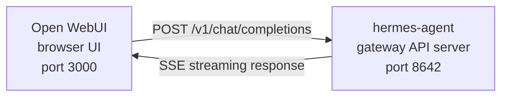

# Интеграция Open WebUI

[Open WebUI](https://github.com/open-webui/open-webui) (126k★) — самый популярный саморазмещаемый чат‑интерфейс для ИИ. С помощью встроенного API‑сервера Hermes Agent ты можешь использовать Open WebUI как полированный веб‑фронтенд для своего агента — с управлением беседами, пользовательскими аккаунтами и современным чат‑интерфейсом.
## Архитектура



Open WebUI подключается к API‑серверу Hermes Agent так же, как он подключался бы к OpenAI. Hermes обрабатывает запросы своим полным набором инструментов — терминал, операции с файлами, веб‑поиск, память, навыки — и возвращает окончательный ответ.

:::important Расположение выполнения
API‑сервер является **runtime‑окружением агента Hermes**, а не чистым прокси LLM. Для каждого запроса Hermes создаёт серверный `AIAgent` на хосте API‑сервера. Вызовы инструментов выполняются там, где запущен этот API‑сервер.

Например, если ноутбук указывает Open WebUI или другой клиент, совместимый с OpenAI, на API‑сервер Hermes, находящийся на удалённой машине, `pwd`, файловые инструменты, браузерные инструменты, локальные инструменты MCP и другие инструменты рабочего пространства будут работать на удалённом хосте API‑сервера, а не на ноутбуке.
:::

Open WebUI общается с сервером Hermes напрямую, поэтому для этой интеграции `API_SERVER_CORS_ORIGINS` не требуется.
## Быстрая настройка

### Однокомандный локальный bootstrap (macOS/Linux, без Docker)

Если ты хочешь, чтобы Hermes + Open WebUI были соединены локально с многоразовым лаунчером, выполни:

```bash
cd ~/.hermes/hermes-agent
bash scripts/setup_open_webui.sh
```

Что делает скрипт:

- гарантирует, что `~/.hermes/.env` содержит `API_SERVER_ENABLED`, `API_SERVER_HOST`, `API_SERVER_KEY`, `API_SERVER_PORT` и `API_SERVER_MODEL_NAME`
- перезапускает шлюз Hermes, чтобы запустился API‑сервер
- устанавливает Open WebUI в `~/.local/open-webui-venv`
- записывает лаунчер в `~/.local/bin/start-open-webui-hermes.sh`
- на macOS устанавливает пользовательскую службу `launchd`; на Linux с `systemd --user` устанавливает пользовательскую службу там

Значения по умолчанию:

- API Hermes: `http://127.0.0.1:8642/v1`
- Open WebUI: `http://127.0.0.1:8080`
- название модели, рекламируемое Open WebUI: `Hermes Agent`

Полезные переопределения:

```bash
OPEN_WEBUI_NAME='My Hermes UI' \
OPEN_WEBUI_ENABLE_SIGNUP=true \
HERMES_API_MODEL_NAME='My Hermes Agent' \
bash scripts/setup_open_webui.sh
```

На Linux автоматическая настройка фоновой службы требует работающей сессии `systemd --user`. Если ты находишься на безголовом SSH‑боксе и хочешь пропустить установку службы, выполни:

```bash
OPEN_WEBUI_ENABLE_SERVICE=false bash scripts/setup_open_webui.sh
```

### 1. Включить API‑сервер

```bash
hermes config set API_SERVER_ENABLED true
hermes config set API_SERVER_KEY your-secret-key
```

`hermes config set` автоматически направляет флаг в `config.yaml`, а секрет — в `~/.hermes/.env`. Если шлюз уже запущен, перезапусти его, чтобы изменения вступили в силу:

```bash
hermes gateway stop && hermes gateway
```

### 2. Запустить шлюз Hermes Agent

```bash
hermes gateway
```

Ты увидишь:

```
[API Server] API server listening on http://127.0.0.1:8642
```

### 3. Проверить доступность API‑сервера

```bash
curl -s http://127.0.0.1:8642/health
# {"status": "ok", ...}

curl -s -H "Authorization: Bearer your-secret-key" http://127.0.0.1:8642/v1/models
# {"object":"list","data":[{"id":"hermes-agent", ...}]}
```

Если `/health` не проходит, шлюз не подхватил `API_SERVER_ENABLED=true` — перезапусти его. Если `/v1/models` возвращает `401`, твой заголовок `Authorization` не совпадает с `API_SERVER_KEY`.

### 4. Запустить Open WebUI

```bash
docker run -d -p 3000:8080 \
  -e OPENAI_API_BASE_URL=http://host.docker.internal:8642/v1 \
  -e OPENAI_API_KEY=your-secret-key \
  -e ENABLE_OLLAMA_API=false \
  --add-host=host.docker.internal:host-gateway \
  -v open-webui:/app/backend/data \
  --name open-webui \
  --restart always \
  ghcr.io/open-webui/open-webui:main
```

`ENABLE_OLLAMA_API=false` отключает бекенд Ollama по умолчанию, который иначе будет показываться пустым и захламлять выбор модели. Убери эту настройку, если у тебя действительно запущен Ollama рядом.

Первый запуск занимает 15–30 секунд: Open WebUI скачивает модели эмбеддингов sentence‑transformer (~150 МБ) при первом старте. Дождись, пока вывод `docker logs open-webui` стабилизируется, прежде чем открывать интерфейс.

### 5. Открыть UI

Перейди по адресу **http://localhost:3000**. Создай учётную запись администратора (первый пользователь становится администратором). Ты увидишь своего агента в выпадающем списке моделей (названный по твоему профилю, или **hermes-agent** для профиля по умолчанию). Начинай чат!
## Настройка Docker Compose

Для более постоянного развертывания создай файл `docker-compose.yml`:

```yaml
services:
  open-webui:
    image: ghcr.io/open-webui/open-webui:main
    ports:
      - "3000:8080"
    volumes:
      - open-webui:/app/backend/data
    environment:
      - OPENAI_API_BASE_URL=http://host.docker.internal:8642/v1
      - OPENAI_API_KEY=your-secret-key
      - ENABLE_OLLAMA_API=false
    extra_hosts:
      - "host.docker.internal:host-gateway"
    restart: always

volumes:
  open-webui:
```

Затем:

```bash
docker compose up -d
```
## Настройка через Admin UI

Если ты предпочитаешь настраивать соединение через пользовательский интерфейс, а не через переменные окружения:

1. Войди в Open WebUI по адресу **http://localhost:3000**
2. Нажми на **аватар профиля** → **Admin Settings**
3. Перейди в **Connections**
4. В разделе **OpenAI API** нажми на **значок гаечного ключа** (Manage)
5. Нажми **+ Add New Connection**
6. Введи:
   - **URL**: `http://host.docker.internal:8642/v1`
   - **API Key**: точно такое же значение, как `API_SERVER_KEY` в Hermes
7. Нажми **галочку**, чтобы проверить соединение
8. **Save**

Твоя модель агента теперь должна появиться в выпадающем списке моделей (названа по твоему профилю или **hermes-agent** для профиля по умолчанию).

:::warning
Переменные окружения действуют только при **первом запуске** Open WebUI. После этого настройки соединения сохраняются во внутренней базе данных. Чтобы изменить их позже, используй Admin UI или удали Docker‑том и запусти заново.
:::
## Тип API: Chat Completions vs Responses

Open WebUI поддерживает два режима API при подключении к бэкенду:

| Mode | Format | When to use |
|------|--------|-------------|
| **Chat Completions** (default) | `/v1/chat/completions` | Рекомендуется. Работает «из коробки». |
| **Responses** (experimental) | `/v1/responses` | Для серверного состояния диалога через `previous_response_id`. |

### Использование Chat Completions (рекомендовано)

Это режим по умолчанию и не требует дополнительной настройки. Open WebUI отправляет запросы в стандартном формате OpenAI, а Hermes Agent отвечает соответственно. Каждый запрос включает полную историю диалога.

### Использование Responses API

Чтобы переключиться в режим **Responses API**:

1. Перейти в **Admin Settings** → **Connections** → **OpenAI** → **Manage**
2. Отредактировать соединение **hermes-agent**
3. Изменить **API Type** с «Chat Completions» на **«Responses (Experimental)»**
4. Сохранить

При использовании Responses API Open WebUI отправляет запросы в формате Responses (`input` array + `instructions`), и Hermes Agent может сохранять полную историю вызовов инструментов между ходами через `previous_response_id`. Когда `stream: true`, Hermes также передаёт нативные для спецификации элементы `function_call` и `function_call_output`, что позволяет клиентам, рендерящим события Responses, отображать пользовательский UI для структурированных вызовов инструментов.

:::note
Open WebUI в настоящее время управляет историей диалога на клиенте даже в режиме **Responses** — он отправляет полную историю сообщений в каждом запросе, а не использует `previous_response_id`. Основное преимущество режима **Responses** сегодня — структурированный поток событий: дельты текста, элементы `function_call` и `function_call_output` приходят как SSE‑события OpenAI Responses вместо чанков Chat Completions.
:::
## Как это работает

Когда ты отправляешь сообщение в Open WebUI:

1. Open WebUI отправляет запрос `POST /v1/chat/completions` с твоим сообщением и историей диалога.
2. Hermes Agent создаёт на сервере экземпляр `AIAgent`, используя профиль API‑сервера, конфигурацию модели/провайдера, память, навыки и настроенные наборы инструментов API‑сервера.
3. Агент обрабатывает твой запрос — он может вызывать инструменты (терминал, операции с файлами, веб‑поиск и т.д.) на хосте API‑сервера.
4. По мере выполнения инструментов **сообщения о прогрессе передаются в UI в реальном времени**, чтобы ты видел, что делает агент (например `` `💻 ls -la` ``, `` `🔍 Python 3.12 release` ``).
5. Финальный текстовый ответ агента передаётся обратно в Open WebUI в виде потока.
6. Open WebUI отображает ответ в своём чат‑интерфейсе.

Твой агент имеет доступ к тем же инструментам и возможностям, что и экземпляр Hermes на этом API‑сервере. Если API‑сервер удалённый, эти инструменты также находятся удалённо.

Если тебе нужны инструменты, работающие с твоим **локальным** рабочим пространством уже сегодня, запусти Hermes локально и укажи ему чистого провайдера LLM или совместимый с OpenAI прокси‑модель (например vLLM, LiteLLM, Ollama, llama.cpp, OpenAI, OpenRouter и т.д.). Будущий режим разделённого выполнения «удалённый мозг, локальные руки» отслеживается в [#18715](https://github.com/NousResearch/hermes-agent/issues/18715); это не поведение текущего API‑сервера.

:::tip Прогресс инструментов
При включённом стриминге (по умолчанию) ты увидишь короткие индикаторы в потоке, когда инструменты работают — эмодзи инструмента и его ключевой аргумент. Они появляются в потоке ответа до финального ответа агента, давая тебе видимость того, что происходит за кулисами.
:::
## Справочник конфигурации

### Hermes Agent (API‑сервер)

| Variable | Default | Description |
|----------|---------|-------------|
| `API_SERVER_ENABLED` | `false` | Включить API‑сервер |
| `API_SERVER_PORT` | `8642` | Порт HTTP‑сервера |
| `API_SERVER_HOST` | `127.0.0.1` | Адрес привязки |
| `API_SERVER_KEY` | _(required)_ | Bearer‑токен для аутентификации. Должен совпадать с `OPENAI_API_KEY`. |

### Open WebUI

| Variable | Description |
|----------|-------------|
| `OPENAI_API_BASE_URL` | URL API Hermes Agent (включая `/v1`) |
| `OPENAI_API_KEY` | Не может быть пустым. Должен совпадать с вашим `API_SERVER_KEY`. |
## Устранение неполадок

### В выпадающем списке не появляются модели

- **Проверь, что в URL есть суффикс `/v1`**: `http://host.docker.internal:8642/v1` (а не просто `:8642`)
- **Убедись, что gateway запущен**: `curl http://localhost:8642/health` должен вернуть `{"status": "ok"}`
- **Проверь список моделей**: `curl -H "Authorization: Bearer your-secret-key" http://localhost:8642/v1/models` должен вернуть список, содержащий `hermes-agent`
- **Сетевые настройки Docker**: изнутри контейнера `localhost` означает сам контейнер, а не хост. Используй `host.docker.internal` или `--network=host`.
- **Пустой бекенд Ollama скрывает список**: если ты не указал `ENABLE_OLLAMA_API=false`, Open WebUI показывает пустой раздел Ollama над моделями Hermes. Перезапусти контейнер с `-e ENABLE_OLLAMA_API=false` или отключи Ollama в **Admin Settings → Connections**.

### Тест соединения проходит, но модели не загружаются

Это почти всегда из‑за отсутствующего суффикса `/v1`. Тест соединения в Open WebUI — простая проверка доступности, он не проверяет, работает ли список моделей.

### Ответ занимает много времени

Hermes Agent может выполнять несколько вызовов инструментов (чтение файлов, запуск команд, веб‑поиск) перед тем, как сформировать окончательный ответ. Это нормально для сложных запросов. Ответ появляется сразу, когда агент завершит работу.

### Ошибки «Invalid API key»

Убедись, что переменная `OPENAI_API_KEY` в Open WebUI совпадает с `API_SERVER_KEY` в Hermes Agent.

:::warning
Open WebUI сохраняет настройки совместимых с OpenAI соединений в своей базе данных после первого запуска. Если ты случайно сохранил неправильный ключ в административном интерфейсе, изменение только переменных окружения недостаточно — обнови или удали сохранённое соединение в **Admin Settings → Connections**, либо сбрось каталог данных / базу данных Open WebUI.
:::
## Многопользовательская настройка с профилями

Чтобы запускать отдельные экземпляры Hermes для каждого пользователя — каждый со своей конфигурацией, памятью и инструментами — используй [профили](/user-guide/profiles). Каждый профиль запускает собственный API‑сервер на отдельном порту и автоматически рекламирует имя профиля как модель в Open WebUI.

### 1. Создай профили и настрой API‑серверы

`API_SERVER_*` — переменные окружения, а не ключи YAML‑конфига, поэтому запиши их в файл `.env` каждого профиля. Выбирай порты вне диапазона платформы по умолчанию (`8644` — адаптер webhook, `8645` — wecom‑callback, `8646` — msgraph‑webhook), например `8650+`:

```bash
hermes profile create alice
cat >> ~/.hermes/profiles/alice/.env <<EOF
API_SERVER_ENABLED=true
API_SERVER_PORT=8650
API_SERVER_KEY=alice-secret
EOF

hermes profile create bob
cat >> ~/.hermes/profiles/bob/.env <<EOF
API_SERVER_ENABLED=true
API_SERVER_PORT=8651
API_SERVER_KEY=bob-secret
EOF
```

### 2. Запусти каждый gateway

```bash
hermes -p alice gateway &
hermes -p bob gateway &
```

### 3. Добавь соединения в Open WebUI

В **Admin Settings** → **Connections** → **OpenAI API** → **Manage** добавь по одному соединению на каждый профиль:

| Connection | URL | API Key |
|-----------|-----|---------|
| Alice | `http://host.docker.internal:8650/v1` | `alice-secret` |
| Bob | `http://host.docker.internal:8651/v1` | `bob-secret` |

В выпадающем списке моделей появятся `alice` и `bob` как отдельные модели. Ты можешь назначать модели пользователям Open WebUI через панель администратора, предоставляя каждому пользователю его собственный изолированный агент Hermes.

:::tip Пользовательские имена моделей
Имя модели по умолчанию совпадает с именем профиля. Чтобы переопределить его, задай `API_SERVER_MODEL_NAME` в файле `.env` профиля:
```bash
hermes -p alice config set API_SERVER_MODEL_NAME "Alice's Agent"
```
:::
## Linux Docker (без Docker Desktop)

В Linux без Docker Desktop `host.docker.internal` по умолчанию не разрешается. Варианты:

HOLD_15