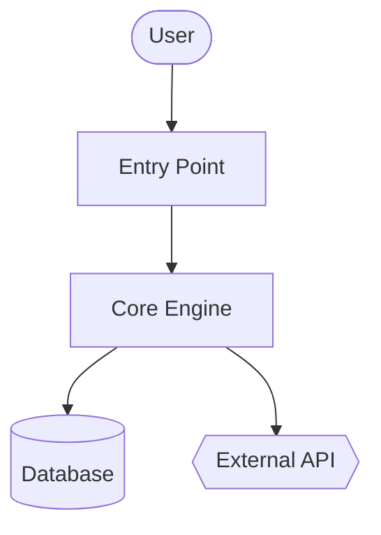
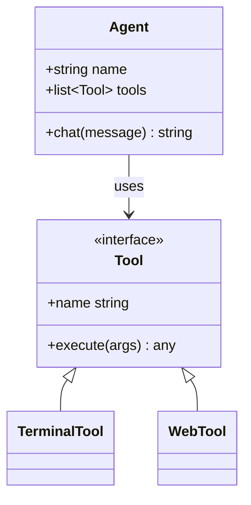
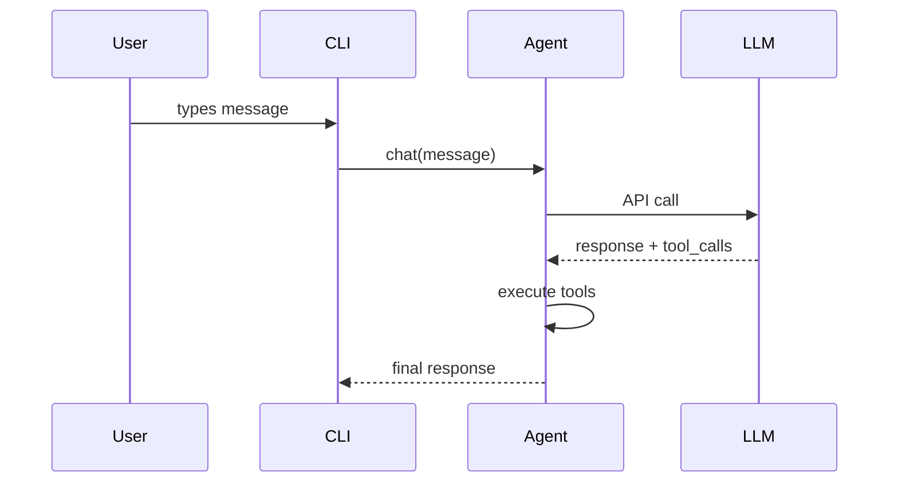

\{/* This page is auto-generated from the skill's SKILL.md by website/scripts/generate-skill-docs.py. Edit the source SKILL.md, not this page. */\}

# Вики кода

Создавай wiki‑документы и диаграммы Mermaid для любой кодовой базы.
## Метаданные навыка

| | |
|---|---|
| Источник | Optional — install with `hermes skills install official/software-development/code-wiki` |
| Путь | `optional-skills/software-development/code-wiki` |
| Версия | `0.1.0` |
| Автор | Teknium (teknium1), Hermes Agent |
| Лицензия | MIT |
| Платформы | linux, macos, windows |
| Теги | `Documentation`, `Mermaid`, `Architecture`, `Diagrams`, `Wiki`, `Code-Analysis` |
| Связанные навыки | [`codebase-inspection`](/docs/user-guide/skills/bundled/github/github-codebase-inspection), [`github-repo-management`](/docs/user-guide/skills/bundled/github/github-github-repo-management) |
:::info
Следующий текст — полное определение навыка, которое Hermes загружает, когда этот навык активируется. Это то, что агент видит в виде инструкций, когда навык включён.
:::

# Навык Code Wiki

Создаёт всестороннюю вики для любого кодового репозитория — обзор, архитектуру, глубокие разборы модулей, диаграммы классов и последовательностей Mermaid. Вдохновлён Google CodeWiki, но работает с локальными репозиториями, приватными репозиториями и любыми языками. Использует только существующие инструменты Hermes (`terminal`, `read_file`, `search_files`, `write_file`); без Docker, без внешних сервисов, без дополнительных зависимостей.

Этот навык генерирует **справочную документацию** (что/как). Он не создаёт стратегический нарратив (почему — это отдельный навык).
## Когда использовать

- Пользователь говорит «document this codebase», «generate a wiki», «make architecture diagrams»
- Нужно быстро ознакомиться с незнакомым репозиторием и получить структурированную справку
- Пользователь указывает URL‑адрес GitHub и просит документацию
- Требуется стабильный артефакт (markdown + Mermaid), который отобразится на GitHub

**Не использовать для**

- Документации одного файла или одной функции — отвечай напрямую
- API‑справки для конкретного эндпоинта — используй `read_file` и отвечай inline
- Стратегического «зачем это существует» повествования — другой навык, другая цель
- Кодовых баз, которые пользователь активно разрабатывает в текущей сессии — отвечай на вопросы по мере их поступления
## Предварительные требования

- Переменные окружения не требуются.
- `git` в PATH для отслеживания SHA репозитория и удалённых клонов.
- Опционально: `pygount` для статистики разбивки по языкам (см. навык `codebase-inspection`).
## Как запустить

Вызови инструмент `terminal` из корня целевого репозитория, затем используй `read_file` / `search_files` / `write_file` для создания вики. Путь вывода по умолчанию — `~/.hermes/wikis/<repo-name>/`. Записывай в репозиторий (`docs/wiki/`) только когда пользователь явно запрашивает это.
## Быстрая справка

| Шаг | Действие |
|---|---|
| 1 | Разрешить цель — текущий рабочий каталог, указанный путь или `git clone --depth 50 <url>` во временный каталог |
| 2 | Сканировать структуру — `ls`, `find -maxdepth 3`, файлы манифеста, README |
| 3 | Выбрать 8–10 модулей для документирования |
| 4 | Создать `README.md` (обзор + карта модулей) |
| 5 | Создать `architecture.md` с диаграммой Mermaid |
| 6 | Создать документацию по каждому модулю в `modules/` |
| 7 | Создать `diagrams/class-diagram.md` (Mermaid classDiagram) |
| 8 | Создать `diagrams/sequences.md` (Mermaid sequenceDiagram, 2–4 рабочих процесса) |
| 9 | Создать `getting-started.md` |
| 10 | Создать `api.md`, если применимо, иначе пропустить |
| 11 | Создать `.codewiki-state.json` |
| 12 | Сообщить пользователю пути к файлам |
## Процедура

### 1. Разрешить цель

Для URL‑а GitHub:

```bash
WIKI_TMP=$(mktemp -d)
git clone --depth 50 <url> "$WIKI_TMP/repo"
cd "$WIKI_TMP/repo"
REPO_SHA=$(git rev-parse HEAD)
REPO_NAME=$(basename <url> .git)
```

Для локального пути (или текущей директории, если не указано):

```bash
cd <path>
REPO_SHA=$(git rev-parse HEAD 2>/dev/null || echo "uncommitted")
REPO_NAME=$(basename "$PWD")
```

Затем задать каталог вывода:

```bash
OUTPUT_DIR="$HOME/.hermes/wikis/$REPO_NAME"
mkdir -p "$OUTPUT_DIR/modules" "$OUTPUT_DIR/diagrams"
```

### 2. Сканировать структуру репозитория

Используй инструмент `terminal` для работы в оболочке, `read_file` — для манифестов:

```bash
# Shallow tree first
ls -la

# Deeper tree, noise filtered
find . -type d \
  -not -path '*/\.*' \
  -not -path '*/node_modules*' \
  -not -path '*/venv*' \
  -not -path '*/__pycache__*' \
  -not -path '*/dist*' \
  -not -path '*/build*' \
  -not -path '*/target*' \
  -maxdepth 3 | sort

# Language breakdown (skip if pygount unavailable)
pygount --format=summary \
  --folders-to-skip=".git,node_modules,venv,.venv,__pycache__,.cache,dist,build,target" \
  . 2>/dev/null || true
```

Затем `read_file` нужные манифесты (`package.json`, `pyproject.toml`, `setup.py`, `Cargo.toml`, `go.mod`, `pom.xml`, `build.gradle`) и README проекта. Для их поиска используй `search_files target='files'`, а не угадывай имена.

### 3. Выбрать модули для документирования

Ограничь первый проход **8–10 модулями**. Эвристика по языкам:

- Python: пакеты верхнего уровня (каталоги с `__init__.py`), плюс каталоги подсистем
- JS/TS: `src/<subdir>`, каталоги верхнего уровня рабочего пространства
- Rust: каждый крейт в рабочем пространстве или каталоги `src/<module>` верхнего уровня
- Go: каждый каталог пакета верхнего уровня
- Смешанные/неизвестные: каталоги верхнего уровня, содержащие исходный код (не конфиги, не тесты)

Для очень больших репозиториев приоритет задаётся по:
1. Количеству импортов (модуль, импортируемый многими, считается ядром)
2. Количеству строк кода (большие модули обычно требуют отдельной документации)
3. Упоминаниям в README / документации верхнего уровня

Сообщи пользователю список модулей перед генерацией документации по каждому модулю в больших репозиториях — это даст возможность перенаправить процесс.

### 4. Создать `README.md`

`read_file` реальный README проекта плюс 2–3 файла‑точки входа. Затем `write_file`:

````markdown
# <Project Name>

<One paragraph: what it is and what it's for. Self-contained — don't assume the
reader has the source README.>

## Key Concepts

- **<Concept 1>** — <one line>
- **<Concept 2>** — <one line>

## Entry Points

- [`path/to/main.py`](https://github.com/NousResearch/hermes-agent/blob/main/optional-skills/software-development/code-wiki/<link>) — <what runs when you start it>
- [`path/to/cli.py`](https://github.com/NousResearch/hermes-agent/blob/main/optional-skills/software-development/code-wiki/<link>) — <CLI surface>

## High-Level Architecture

<2-3 sentences. Detail goes in architecture.md.>

See [architecture.md](https://github.com/NousResearch/hermes-agent/blob/main/optional-skills/software-development/code-wiki/architecture.md).

## Module Map

| Module | Purpose |
|---|---|
| [`<module>`](https://github.com/NousResearch/hermes-agent/blob/main/optional-skills/software-development/code-wiki/modules/<module>.md) | <one-line purpose> |

## Getting Started

See [getting-started.md](https://github.com/NousResearch/hermes-agent/blob/main/optional-skills/software-development/code-wiki/getting-started.md).
````

Для ссылок в локальном режиме используй относительные пути. Для клонированных репозиториев — `https://github.com/<owner>/<repo>/blob/<sha>/<path>`, чтобы ссылки сохранялись после новых коммитов.

### 5. Создать `architecture.md`

````markdown
# Architecture

<2-3 paragraphs: shape of the system. What talks to what. Where data enters,
where it exits, where state lives.>

## Components

- **<Component>** — <1-2 sentences>. See [`modules/<module>.md`](https://github.com/NousResearch/hermes-agent/blob/main/optional-skills/software-development/code-wiki/modules/<module>.md).

## System Diagram



## Data Flow

1. **<Step>** — [`<file>`](https://github.com/NousResearch/hermes-agent/blob/main/optional-skills/software-development/code-wiki/<link>)
2. **<Step>** — [`<file>`](https://github.com/NousResearch/hermes-agent/blob/main/optional-skills/software-development/code-wiki/<link>)

## Key Design Decisions

- <Anything load-bearing the reader should know>
````

**Семантика фигур Mermaid:**
- `[]` = компонент
- `[()]` = база данных / хранилище
- `{{}}` = внешний сервис
- `(())` = точка входа или терминал
- `-->` = синхронный вызов, `-.->` = асинхронный/событийный

Ограничь диаграмму ~20 узлами. При необходимости разбей на поддиаграммы.

### 6. Создать документы модулей в `modules/`

Для каждого выбранного модуля просмотри его содержимое с помощью `ls`, выдели 3–5 самых важных файлов (по размеру, по именам `core.py` / `main.py` / `__init__.py`, по количеству импортов), затем `read_file` эти файлы (используй `offset` / `limit`, чтобы читать только нужное; предпочтительно `search_files` для конкретных символов).

````markdown
# Module: `<module>`

<1-2 sentence purpose.>

## Responsibilities

- <bullet>
- <bullet>

## Key Files

- [`<module>/<file>`](https://github.com/NousResearch/hermes-agent/blob/main/optional-skills/software-development/code-wiki/<link>) — <what it does>

## Public API

<Functions/classes/constants other code uses. Group related items. Show
signatures, not full implementations.>

## Internal Structure

<How the module is organized internally. State management.>

## Dependencies

- **Used by:** <other modules>
- **Uses:** <other modules + external libs>

## Notable Patterns / Gotchas

- <Anything non-obvious>
````

### 7. Создать `diagrams/class-diagram.md`

Выбери 5–10 самых важных классов/типов. `read_file` их, затем запиши:

````markdown
# Class Diagram

## Core Types



## Notes

<Anything the diagram can't express — lifecycle, threading, etc.>
````

Для языков без классов (Go, C, Rust) используй диаграмму для отношений структур, либо пропусти `class-diagram.md` и опиши это в `architecture.md`. Не заставляй включать то, чего нет.

### 8. Создать `diagrams/sequences.md`

Выбери 2–4 самых важных рабочих процесса. Проследи каждый путь вызовов через код (прочитай точку входа, проследи вызовы функций), затем:

````markdown
# Sequence Diagrams

## Workflow: <Name>

<1 sentence describing what this does and when it runs.>



### Walkthrough

1. **User input** — [`cli.py:HermesCLI.run_session`](https://github.com/NousResearch/hermes-agent/blob/main/optional-skills/software-development/code-wiki/<link>)
2. **Message dispatch** — [`run_agent.py:AIAgent.chat`](https://github.com/NousResearch/hermes-agent/blob/main/optional-skills/software-development/code-wiki/<link>)
````

Не выдумывай участников. Каждый блок должен соответствовать реальному компоненту, который читатель может найти в коде.

### 9. Создать `getting-started.md`

````markdown
# Getting Started

## Prerequisites

<From manifest files + README. Be specific — versions if pinned.>

## Installation

```bash
<exact commands>
```

## First Run

```bash
<minimum command to see the system do something useful>
```

## Common Workflows

### <Workflow 1>
<commands>

## Configuration

- `<config-file>` — <what it controls>
- Env var `<VAR>` — <what it controls>

## Where to Go Next

- Architecture: [architecture.md](https://github.com/NousResearch/hermes-agent/blob/main/optional-skills/software-development/code-wiki/architecture.md)
- Module reference: [README.md#module-map](https://github.com/NousResearch/hermes-agent/blob/main/optional-skills/software-development/code-wiki/README.md#module-map)
````

### 10. Создать `api.md` (пропустить, если не применимо)

Пиши этот файл только если проект — библиотека или API‑сервер. Если так:

- Найди публичную поверхность API (`__init__.py`‑экспорты, спецификации OpenAPI, обработчики маршрутов, экспортируемые типы)
- Документируй каждый публичный элемент: сигнатуру, параметры, тип возвращаемого значения, однострочное описание
- Группируй по категориям

### 11. Записать файл состояния

```bash
cat > "$OUTPUT_DIR/.codewiki-state.json" <<EOF
{
  "repo_name": "$REPO_NAME",
  "source_path": "$PWD",
  "source_sha": "$REPO_SHA",
  "generated_at": "$(date -u +%Y-%m-%dT%H:%M:%SZ)",
  "generator": "hermes-agent code-wiki skill v0.1.0",
  "modules_documented": []
}
EOF
```

### 12. Отчёт пользователю

Укажи точно, что было сгенерировано и где:

```
Generated wiki at ~/.hermes/wikis/<repo-name>/:
  README.md                   project overview, module map
  architecture.md             system architecture + flowchart
  getting-started.md          setup, first run, workflows
  modules/<N files>           per-module deep-dives
  diagrams/architecture.md    Mermaid flowchart
  diagrams/class-diagram.md   Mermaid class diagram
  diagrams/sequences.md       Mermaid sequence diagrams
```

Если ты клонировал в временный каталог, напомни пользователю, что его можно удалить (`rm -rf "$WIKI_TMP"`), после того как он проверит вики.
## Управление областью

Генерация полной вики для монорепозитория объёмом 500 К строк кода чрезвычайно затратна по токенам. По умолчанию используется ограниченный охват:

- Начальное сканирование: максимальная глубина 3 каталога
- Документация по каждому модулю: не более 10 модулей, если пользователь не расширит область
- Чтения отдельных файлов: предпочтительно использовать `search_files` для символов + `read_file` с `offset`/`limit` вместо полного чтения
- Пропускать сторонний код (`vendor/`, `third_party/`, сгенерированный код, `_pb2.py`, `.min.js`)

Если пользователь говорит «обработай всё полностью», доверься ему, но сначала приблизительно оцените стоимость: «в этом репозитории ~340 исходных файлов, полное покрытие будет дорогим — подтвердить?»
## Повторный запуск / Обновление

Если файл `.codewiki-state.json` уже существует по целевому пути:

- Прочитать его, чтобы получить предыдущий SHA и список модулей
- Если SHA источника совпадает: спросить пользователя, хочет ли он выполнить регенерацию или пропустить её
- Если SHA отличается: предложить регенерировать только модули с изменёнными файлами (`git diff --name-only <old-sha> HEAD`)

Полная инкрементальная регенерация — будущее улучшение; пока допускается регенерация всего проекта.
## Подводные камни

- **Фабрикация компонентов.** Каждый узел диаграммы и заявленный вызов функции должны присутствовать в исходнике. `read_file` — до записи. Самый крупный режим отказа для автоматически сгенерированной документации — правдоподобная, но вымышленная информация.
- **Общая AI‑проза.** «Этот модуль отвечает за…» — пустой контент. Указывай, что модуль действительно делает, используя термины предметной области.
- **Переписывание кода в прозу.** Документация модуля, в которой говорится «функция `process` обрабатывает вещи, вызывая `process_item` для каждого элемента», хуже, чем просто ссылка на функцию.
- **Mermaid > 50 узлов.** Они не отображаются разборчиво. Раздели их.
- **Документирование тестов, сгенерированного кода или внешних зависимостей как кода продукта.** Пропусти их.
- **Вывод в репозиторий без запроса.** По умолчанию `~/.hermes/wikis/`. Пишем в репозиторий только по явному запросу пользователя.
- **Специальные символы Mermaid требуют кавычек:** `A["Tool / Agent"]`, а не `A[Tool / Agent]`. `<br>` — для разрывов строк внутри узла.
- **Вложенные блоки кода в SKILL.md.** При написании примера markdown, содержащего блок Mermaid, используй внешние ограждения из 4 обратных кавычек, чтобы внутренний блок из 3 обратных кавычек ```` ```mermaid ```` не закрывал внешний. (Этот SKILL.md так и делает.)
- **Обобщения в classDiagram** отображаются как `~T~` (например, `List~Tool~`), а не `<T>`.
- **Тема GitHub Mermaid фиксирована** — не включай блоки `%%{init: ...}%%`; они удаляются при рендеринге.
## Проверка

После написания проверь следующее:

1. **Блоки Mermaid сбалансированы** — открывающие и закрывающие теги совпадают в каждом файле:
   ```bash
   for f in "$OUTPUT_DIR"/diagrams/*.md "$OUTPUT_DIR"/architecture.md; do
     opens=$(grep -c '^```mermaid' "$f")
     total=$(grep -c '^```' "$f")
     echo "$f: $opens mermaid blocks, $total total fences (expect total = opens*2)"
   done
   ```
2. **Все ожидаемые файлы существуют** —
   ```bash
   ls "$OUTPUT_DIR"/{README.md,architecture.md,getting-started.md,.codewiki-state.json} \
      "$OUTPUT_DIR"/modules/ "$OUTPUT_DIR"/diagrams/
   ```
3. **Количество модулей соответствует задуманному** — `ls "$OUTPUT_DIR/modules" | wc -l` должно быть равно числу модулей, указанному в Шаге 3.
4. **Нет вымышленных путей** — проверь, что 2–3 ссылки на исходники разрешаются в реальные файлы.