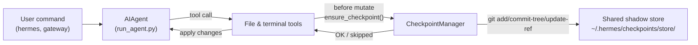

# Контрольні точки та `/rollback`

Hermes Agent може автоматично створювати знімок вашого проєкту перед **руйнівними операціями** та відновлювати його за допомогою однієї команди. Контрольні точки **за замовчуванням вимкнено** у v2 — більшість користувачів ніколи не користуються `/rollback`, а сховище shadow‑store займає значний простір з часом, тому за замовчуванням воно вимкнено.

Увімкнути контрольні точки для окремої сесії за допомогою `--checkpoints`:

```bash
hermes chat --checkpoints
```

Або увімкнути глобально у `~/.hermes/config.yaml`:

```yaml
checkpoints:
  enabled: true
```

Ця система безпеки працює завдяки внутрішньому **Checkpoint Manager**, який зберігає єдиний спільний shadow‑git‑репозиторій у `~/.hermes/checkpoints/store/` — ваш реальний проєктний `.git` ніколи не змінюється. Кожен проєкт, у якому працює агент, використовує одне сховище, тому git‑ова база об’єктів, орієнтована на вміст, дедуплікує дані між проєктами та між ходами.

## Що ініціює створення контрольної точки

Контрольні точки створюються автоматично перед:

- **Інструментами роботи з файлами** — `write_file` та `patch`
- **Руйнівними термінальними командами** — `rm`, `rmdir`, `cp`, `install`, `mv`, `sed -i`, `truncate`, `dd`, `shred`, перенаправленням виводу (`>`), а також `git reset`/`clean`/`checkout`

Агент створює **не більше однієї контрольної точки на каталог за один хід**, тому довгі сесії не спамлять знімками.

## Швидка довідка

Slash‑команди під час сесії:

| Команда | Опис |
|---------|------|
| `/rollback` | Список усіх контрольних точок зі статистикою змін |
| `/rollback <N>` | Відновити до контрольної точки N (також скасовує останній хід чату) |
| `/rollback diff <N>` | Попередньо переглянути diff між точкою N та поточним станом |
| `/rollback <N> <file>` | Відновити окремий файл з контрольної точки N |

CLI для перегляду та керування сховищем поза сесією:

| Команда | Опис |
|---------|------|
| `hermes checkpoints` | Показати загальний розмір, кількість проєктів, розподіл по проєктах |
| `hermes checkpoints status` | Те саме, що й простий `checkpoints` |
| `hermes checkpoints list` | Псевдонім для `status` |
| `hermes checkpoints prune` | Примусове очищення: видалити орфани/застарілі дані, запустити GC, застосувати обмеження розміру |
| `hermes checkpoints clear` | Видалити всю базу контрольних точок (запитує підтвердження) |
| `hermes checkpoints clear-legacy` | Видалити лише архіви `legacy-*` з міграції v1 |

## Як працюють контрольні точки

На високому рівні:

- Hermes виявляє, коли інструменти збираються **модифікувати файли** у вашому робочому дереві.
- Один раз за хід розмови (на каталог) він:
  - Визначає розумний корінь проєкту для файлу.
  - Ініціалізує або повторно використовує **єдиний спільний shadow‑store** у `~/.hermes/checkpoints/store/`.
  - Додає зміни до індексу проєкту, будує дерево та комітить у проєктний ref (`refs/hermes/<project-hash>`).
- Ці проєктні ref формують історію контрольних точок, яку можна переглядати та відновлювати за допомогою `/rollback`.



## Налаштування

Налаштуйте у `~/.hermes/config.yaml`:

```yaml
checkpoints:
  enabled: false              # master switch (default: false — opt-in)
  max_snapshots: 20           # max checkpoints per project (enforced via ref rewrite + gc)
  max_total_size_mb: 500      # hard cap on total store size; oldest commits dropped
  max_file_size_mb: 10        # skip any single file larger than this

  # Auto-maintenance (on by default): sweep ~/.hermes/checkpoints/ at startup
  # and delete project entries whose working directory no longer exists
  # (orphans) or whose last_touch is older than retention_days. Runs at most
  # once per min_interval_hours, tracked via a .last_prune marker.
  auto_prune: true
  retention_days: 7
  delete_orphans: true
  min_interval_hours: 24
```

Щоб вимкнути все:

```yaml
checkpoints:
  enabled: false
  auto_prune: false
```

Коли `enabled: false`, Checkpoint Manager працює як no‑op і ніколи не виконує git‑операції. Коли `auto_prune: false`, сховище буде рости, доки ви вручну не запустите `hermes checkpoints prune`.

## Перелік контрольних точок

З CLI‑сесії:

```
/rollback
```

Hermes відповідає відформатованим списком зі статистикою змін:

```text
📸 Checkpoints for /path/to/project:

  1. 4270a8c  2026-03-16 04:36  before patch  (1 file, +1/-0)
  2. eaf4c1f  2026-03-16 04:35  before write_file
  3. b3f9d2e  2026-03-16 04:34  before terminal: sed -i s/old/new/ config.py  (1 file, +1/-1)

  /rollback <N>             restore to checkpoint N
  /rollback diff <N>        preview changes since checkpoint N
  /rollback <N> <file>      restore a single file from checkpoint N
```

## Перегляд сховища з оболонки

```bash
hermes checkpoints
```

Приклад виводу:

```text
Checkpoint base: /home/you/.hermes/checkpoints
Total size:      142.3 MB
  store/         138.1 MB
  legacy-*       4.2 MB
Projects:        12

  WORKDIR                                                       COMMITS    LAST TOUCH  STATE
  /home/you/code/hermes-agent                                        20       2h ago  live
  /home/you/code/experiments/rl-runner                                8       1d ago  live
  /home/you/code/old-prototype                                        3       9d ago  orphan
  ...

Legacy archives (1):
  legacy-20260506-050616                           4.2 MB

Clear with: hermes checkpoints clear-legacy
```

Примусове повне очищення (ігнорує 24‑годинний маркер ідемпотентності):

```bash
hermes checkpoints prune --retention-days 3 --max-size-mb 200
```

## Попередній перегляд змін за допомогою `/rollback diff`

Перед тим як виконати відновлення, перегляньте, що змінилося з моменту створення контрольної точки:

```
/rollback diff 1
```

Показується підсумок `git diff stat`, а потім сам diff.

## Відновлення за допомогою `/rollback`

```
/rollback 1
```

За лаштунками Hermes:

1. Перевіряє, чи існує цільовий коміт у shadow‑store.
2. Робить **snapshot перед відкатом** поточного стану, щоб можна було «скасувати скасування» пізніше.
3. Відновлює відстежувані файли у вашому робочому каталозі.
4. **Скасовує останній хід розмови**, щоб контекст агента відповідав відновленому стану файлової системи.

## Відновлення окремого файлу

Відновити лише один файл з контрольної точки, не зачіпаючи інші файли каталогу:

```
/rollback 1 src/broken_file.py
```

## Захист безпеки та продуктивності

- **Наявність Git** — якщо `git` не знайдено у `PATH`, контрольні точки автоматично вимикаються.
- **Область каталогу** — Hermes пропускає надто широкі каталоги (корінь `/`, домашній `$HOME`).
- **Розмір репозиторію** — каталоги з більш ніж 50 000 файлів пропускаються.
- **Обмеження розміру файлу** — файли більші за `max_file_size_mb` (за замовчуванням 10 МБ) виключаються зі знімка. Це запобігає випадковому захопленню наборів даних, ваг моделей чи згенерованих медіа.
- **Обмеження загального розміру сховища** — коли сховище перевищує `max_total_size_mb` (за замовчуванням 500 МБ), найстаріший коміт у кожному проєкті видаляється за принципом round‑robin, доки розмір не впаде під ліміт.
- **Реальне очищення** — `max_snapshots` застосовується шляхом перезапису проєктного ref та запуску `git gc --prune=now` після цього, щоб «вільні» об’єкти не накопичувалися.
- **Снимки без змін** — якщо з останнього знімка немає змін, контрольна точка пропускається.
- **Некритичні помилки** — усі помилки всередині Checkpoint Manager записуються на рівні debug; ваші інструменти продовжують працювати.

## Де зберігаються контрольні точки

```text
~/.hermes/checkpoints/
  ├── store/                 # single shared bare git repo
  │   ├── HEAD, objects/     # git internals (shared across projects)
  │   ├── refs/hermes/<hash> # per-project branch tip
  │   ├── indexes/<hash>     # per-project git index
  │   ├── projects/<hash>.json  # workdir + created_at + last_touch
  │   └── info/exclude
  ├── .last_prune            # auto-prune idempotency marker
  └── legacy-<ts>/           # archived pre-v2 per-project shadow repos
```

Кожен `<hash>` генерується з абсолютного шляху робочого каталогу. Зазвичай вам не потрібно їх вручну торкатися — використовуйте `hermes checkpoints status` / `prune` / `clear`.

### Міграція з v1

До перепису v2 кожен робочий каталог мав власне повне shadow‑git‑репо безпосередньо у `~/.hermes/checkpoints/<hash>/`. Така структура не могла дедуплікувати об’єкти між проєктами і мала неефективний pruner — сховище росло без обмежень.

При першому запуску v2 усі попередні shadow‑репо переміщуються у `~/.hermes/checkpoints/legacy-<timestamp>/`, і нова одностороння структура стартує чистою. Історія `/rollback` з v1 все ще доступна через ручний перегляд legacy‑архіву за допомогою `git`; коли ви впевнені, що вона більше не потрібна, виконайте:

```bash
hermes checkpoints clear-legacy
```

щоб звільнити місце. Legacy‑архіви також очищаються `auto_prune` після `retention_days`.

## Кращі практики

- **Увімкнути контрольні точки лише коли це потрібно** — `hermes chat --checkpoints` або у профілі `enabled: true`.
- **Використовувати `/rollback diff` перед відновленням** — перегляньте, що зміниться, щоб обрати правильну точку.
- **Використовувати `/rollback` замість `git reset`**, коли потрібно скасувати лише зміни, внесені агентом.
- **Час від часу перевіряти `hermes checkpoints status`**, якщо ви регулярно користуєтеся контрольними точками — це покаже, які проєкти активні і скільки сховище займає.
- **Комбінувати з Git worktrees** для максимальної безпеки — тримайте кожну сесію Hermes у власному worktree/branch, а контрольні точки використовуйте як додатковий шар.

Для запуску кількох агентів паралельно в одному репозиторії дивіться посібник про [Git worktrees](./git-worktrees.md).