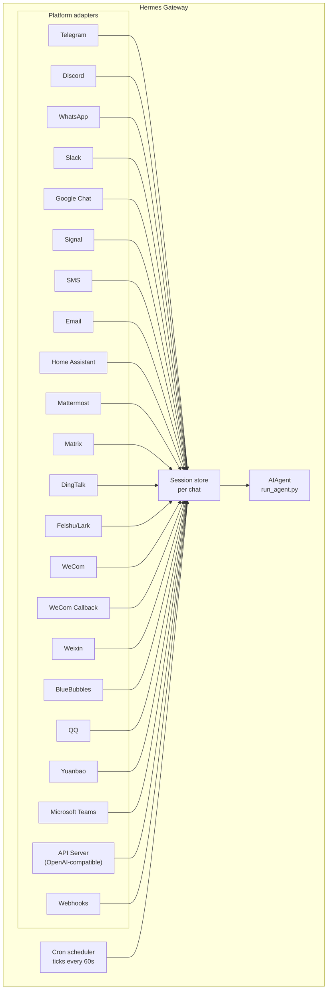

# Шлюз обміну повідомленнями

Спілкуйся з Hermes через Telegram, Discord, Slack, WhatsApp, Signal, SMS, Email, Home Assistant, Mattermost, Matrix, DingTalk, Feishu/Lark, WeCom, Weixin, BlueBubbles (iMessage), QQ, Yuanbao, Microsoft Teams, LINE, ntfy або свій браузер. Шлюз — це єдиний фоновий процес, який підключається до всіх налаштованих платформ, керує сесіями, виконує cron‑завдання та надсилає голосові повідомлення.

Для повного набору голосових можливостей — включаючи режим мікрофона в CLI, голосові відповіді в обміні повідомленнями та розмови у голосових каналах Discord — дивись [Voice Mode](/user-guide/features/voice-mode) та [Use Voice Mode with Hermes](/guides/use-voice-mode-with-hermes).

:::tip
Ботам потрібні і провайдер моделі, і провайдери інструментів (TTS, web). Підписка на [Nous Portal](/integrations/nous-portal) об’єднує їх усіх.
:::
## Порівняння платформ

| Платформа | Голос | Зображення | Файли | Теми | Реакції | Набір | Стрімінг |
|----------|:-----:|:------:|:-----:|:-------:|:---------:|:------:|:---------:|
| Telegram | ✅ | ✅ | ✅ | ✅ | — | ✅ | ✅ |
| Discord | ✅ | ✅ | ✅ | ✅ | ✅ | ✅ | ✅ |
| Slack | ✅ | ✅ | ✅ | ✅ | ✅ | ✅ | ✅ |
| Google Chat | — | ✅ | ✅ | ✅ | — | ✅ | — |
| WhatsApp | — | ✅ | ✅ | — | — | ✅ | ✅ |
| Signal | — | ✅ | ✅ | — | — | ✅ | ✅ |
| SMS | — | — | — | — | — | — | — |
| Email | — | ✅ | ✅ | ✅ | — | — | — |
| Home Assistant | — | — | — | — | — | — | — |
| Mattermost | ✅ | ✅ | ✅ | ✅ | — | ✅ | ✅ |
| Matrix | ✅ | ✅ | ✅ | ✅ | ✅ | ✅ | ✅ |
| DingTalk | — | ✅ | ✅ | — | ✅ | — | ✅ |
| Feishu/Lark | ✅ | ✅ | ✅ | ✅ | ✅ | ✅ | ✅ |
| WeCom | ✅ | ✅ | ✅ | — | — | ✅ | ✅ |
| WeCom Callback | — | — | — | — | — | — | — |
| Weixin | ✅ | ✅ | ✅ | — | — | ✅ | ✅ |
| BlueBubbles | — | ✅ | ✅ | — | ✅ | ✅ | — |
| QQ | ✅ | ✅ | ✅ | — | — | ✅ | — |
| Yuanbao | ✅ | ✅ | ✅ | — | — | ✅ | ✅ |
| Microsoft Teams | — | ✅ | — | ✅ | — | ✅ | — |
| LINE | — | ✅ | ✅ | — | — | ✅ | — |
| ntfy | — | — | — | — | — | — | — |

**Voice** = TTS‑аудіо відповіді та/або транскрипція голосових повідомлень. **Images** = надсилання/отримання зображень. **Files** = надсилання/отримання файлових вкладень. **Threads** = розмови у вигляді тем. **Reactions** = реакції‑емодзі на повідомлення. **Typing** = індикатор набору під час обробки. **Streaming** = поступове оновлення повідомлення через редагування.
## Архітектура



Кожен адаптер платформи отримує повідомлення, маршрутизує їх через сховище сесій на рівні чату та передає їх AIAgent для обробки. Шлюз також запускає планувальник cron, який кожні 60 секунд виконує заплановані завдання.
## Швидке налаштування

Найпростіший спосіб налаштувати платформи обміну повідомленнями — це інтерактивний майстер:

```bash
hermes gateway setup        # Interactive setup for all messaging platforms
```

Він проведе тебе через налаштування кожної платформи за допомогою вибору клавішами‑стрілками, покаже, які платформи вже налаштовано, і запропонує запустити/перезапустити gateway, коли все буде готово.
## Команди шлюзу

```bash
hermes gateway              # Run in foreground
hermes gateway setup        # Configure messaging platforms interactively
hermes gateway install      # Install as a user service (Linux) / launchd service (macOS)
sudo hermes gateway install --system   # Linux only: install a boot-time system service
hermes gateway start        # Start the default service
hermes gateway stop         # Stop the default service
hermes gateway status       # Check default service status
hermes gateway status --system         # Linux only: inspect the system service explicitly
```
## Команди чату (в межах обміну повідомленнями)

| Команда | Опис |
|---------|------|
| `/new` or `/reset` | Почати нову розмову |
| `/model [provider:model]` | Показати або змінити модель (підтримується синтаксис `provider:model`) |
| `/personality [name]` | Встановити особистість |
| `/retry` | Повторити останнє повідомлення |
| `/undo` | Видалити останній обмін |
| `/status` | Показати інформацію про сесію |
| `/whoami` | Показати твої права доступу до слеш‑команд у цьому контексті (admin / user / unrestricted) |
| `/stop` | Зупинити запущеного агента |
| `/approve` | Підтвердити очікуючу небезпечну команду |
| `/deny` | Відхилити очікуючу небезпечну команду |
| `/sethome` | Встановити цей чат як домашній канал |
| `/compress` | Ручне стискання контексту розмови |
| `/title [name]` | Встановити або показати назву сесії |
| `/resume [name]` | Відновити раніше названу сесію |
| `/usage` | Показати використання токенів у цій сесії |
| `/insights [days]` | Показати аналітику та інсайти використання |
| `/reasoning [level\|show\|hide]` | Змінити інтенсивність міркувань або перемкнути їх відображення |
| `/voice [on\|off\|tts\|join\|leave\|status]` | Керувати голосовими відповідями в обміні та поведінкою голосових каналів Discord |
| `/rollback [number]` | Переглянути або відновити контрольні точки файлової системи |
| `/background <prompt>` | Запустити запит у окремій фоновой сесії |
| `/reload-mcp` | Перезавантажити сервери MCP з конфігурації |
| `/update` | Оновити Hermes Agent до останньої версії |
| `/help` | Показати доступні команди |
| `/<skill-name>` | Викликати будь‑який встановлений skill |
## Управління сесіями

### Постійність сесії

Сесії зберігаються між повідомленнями, доки їх не відкотити. Агент пам’ятає контекст вашої розмови.

### Політики відкату

Сесії відкачуються згідно з налаштовуваними політиками:

| Політика | За замовчуванням | Опис |
|----------|------------------|------|
| Daily | 4:00 AM | Відкат у вказану годину кожного дня |
| Idle | 1440 min | Відкат після N хвилин без активності |
| Both | (combined) | Яка політика спрацює першою |

Налаштуй перевизначення параметрів для платформи у `~/.hermes/gateway.json`:

```json
{
  "reset_by_platform": {
    "telegram": { "mode": "idle", "idle_minutes": 240 },
    "discord": { "mode": "idle", "idle_minutes": 60 }
  }
}
```
## Безпека

**За замовчуванням шлюз відхиляє всіх користувачів, які не знаходяться у білому списку або не спарені через DM.** Це безпечне налаштування за замовчуванням для бота з доступом до терміналу.

```bash
# Restrict to specific users (recommended):
TELEGRAM_ALLOWED_USERS=123456789,987654321
DISCORD_ALLOWED_USERS=123456789012345678
SIGNAL_ALLOWED_USERS=+155****4567,+155****6543
SMS_ALLOWED_USERS=+155****4567,+155****6543
EMAIL_ALLOWED_USERS=trusted@example.com,colleague@work.com
MATTERMOST_ALLOWED_USERS=3uo8dkh1p7g1mfk49ear5fzs5c
MATRIX_ALLOWED_USERS=@alice:matrix.org
DINGTALK_ALLOWED_USERS=user-id-1
FEISHU_ALLOWED_USERS=ou_xxxxxxxx,ou_yyyyyyyy
WECOM_ALLOWED_USERS=user-id-1,user-id-2
WECOM_CALLBACK_ALLOWED_USERS=user-id-1,user-id-2
TEAMS_ALLOWED_USERS=aad-object-id-1,aad-object-id-2

# Or allow
GATEWAY_ALLOWED_USERS=123456789,987654321

# Or explicitly allow all users (NOT recommended for bots with terminal access):
GATEWAY_ALLOW_ALL_USERS=true
```

### Парування DM (альтернатива білому списку)

Замість ручного налаштування ідентифікаторів користувачів, невідомі користувачі отримують одноразовий код парування, коли вони надсилають боті DM:

```bash
# The user sees: "Pairing code: XKGH5N7P"
# You approve them with:
hermes pairing approve telegram XKGH5N7P

# Other pairing commands:
hermes pairing list          # View pending + approved users
hermes pairing revoke telegram 123456789  # Remove access
```

Коди парування діють 1 годину, мають обмеження швидкості та використовують криптографічну випадковість.

### Адміністратори vs звичайні користувачі

Білий список відповідає на питання «чи може ця особа взагалі дістатися до бота?». **Розподіл admin / user** відповідає на питання «тепер, коли вона в системі, що їй дозволено робити?»

Кожен дозволений користувач потрапляє в один з двох рівнів у межах певного контексту (DM vs група/канал):

- **Admin** — повний доступ. Може виконувати будь‑яку зареєстровану slash‑команду (вбудовану + плагін) та користуватися всіма обмеженими можливостями.
- **Regular user** — обмежений доступ. Може спілкуватися з агентом у звичайному режимі, але може запускати лише ті slash‑команди, які ти явно дозволив. Завжди дозволений базовий рівень — `/help` і `/whoami`.

Рівні налаштовуються окремо для кожної платформи та кожного контексту. Статус admin у DM не означає статус admin у групі/каналі — у кожного контексту свій список адміністраторів.

**Що сьогодні контролює розподіл:** slash‑команди. Розподіл працює через реєстр живих команд, тому охоплює вбудовані та зареєстровані плагінами команди без додаткового налаштування під кожну функцію. Звичайний чат не підлягає обмеженням — не‑адміністратори все ще можуть спілкуватися з агентом.

**Що може бути обмежено в майбутньому:** інші поверхні можливостей (доступ до інструментів, перемикання моделей, дорогі операції) будуть підпорядковуватись тому ж розподілу admin / user, коли ми їх додамо. Налаштування розподілу зараз дозволяє майбутнім обмеженням працювати без необхідності змінювати модель того, хто є адміністратором.

#### Конфігурація

```yaml
gateway:
  platforms:
    discord:
      extra:
        allow_from: ["111", "222", "333"]
        allow_admin_from: ["111"]                    # admins → all slash commands
        user_allowed_commands: [status, model]       # what non-admins may run
        # Optional: separate group/channel scope
        group_allow_admin_from: ["111"]
        group_user_allowed_commands: [status]
```

**Зворотна сумісність:** якщо `allow_admin_from` не встановлено для контексту, розподіл рівнів вимикається для цього контексту, і кожен дозволений користувач отримує повний доступ. Існуючі інсталяції продовжують працювати без змін — підключай розподіл, коли захочеш розрізняти ролі.

#### Перевірка твого доступу

Використай `/whoami` на будь‑якій платформі, щоб побачити активний контекст, твій рівень (admin / user / unrestricted) та які slash‑команди ти можеш виконувати. Дивись сторінки [Telegram](/user-guide/messaging/telegram#slash-command-access-control) і [Discord](/user-guide/messaging/discord#slash-command-access-control) для прикладів, специфічних для платформ.
## Переривання агента

Надсилай будь‑яке повідомлення, доки агент працює, щоб його перервати. Ключові поведінки:

- **Команди терміналу, що виконуються, вбиваються одразу** (SIGTERM, потім SIGKILL через 1 с)
- **Виклики інструментів скасовуються** — виконується лише поточний, інші пропускаються
- **Кілька повідомлень об’єднуються** — повідомлення, надіслані під час переривання, з’єднуються в один запит
- **Команда `/stop`** — перериває без постановки черги на наступне повідомлення

### Queue vs interrupt vs steer (режим busy‑input)

За замовчуванням надсилання повідомлення зайнятому агенту його перериває. Доступні ще два режими:

- `queue` — наступні повідомлення чекають і виконуються як наступний хід після завершення поточного завдання.
- `steer` — наступні повідомлення впроваджуються у поточний запуск через `/steer`, надходять до агента після наступного виклику інструменту. Без переривання, без нового ходу. Повертається до поведінки `queue`, якщо агент ще не розпочав роботу.

```yaml
display:
  busy_input_mode: steer   # or queue, or interrupt (default)
  busy_ack_enabled: true   # set to false to suppress the ⚡/⏳/⏩ chat reply entirely
```

Перший раз, коли ти надсилаєш повідомлення зайнятому агенту на будь‑якій платформі, Hermes додає однорядкове нагадування до **busy‑ack**, пояснюючи перемикач (`"💡 First-time tip — …"`). Нагадування спрацьовує один раз за інсталяцію — прапорець під `onboarding.seen.busy_input_prompt` його фіксує. Видали цей ключ, щоб побачити підказку знову.

Якщо **busy‑ack** надокучає — особливо при голосовому вводі або швидкій послідовності повідомлень — встанови `display.busy_ack_enabled: false`. Твій ввід все одно буде поставлений у чергу/керований/перериватиметься як звичайно, лише відповідь у чаті буде вимкнена.
## Сповіщення про прогрес інструменту

Керуйте кількістю активності інструменту, що відображається у `~/.hermes/config.yaml`:

```yaml
display:
  tool_progress: all    # off | new | all | verbose
  tool_progress_command: false  # set to true to enable /verbose in messaging
```

Коли увімкнено, бот надсилає повідомлення про статус під час роботи:

```text
💻 `ls -la`...
🔍 web_search...
📄 web_extract...
🐍 execute_code...
```
## Фонові сесії

Запусти підказку в окремій фоновой сесії, щоб агент працював над нею незалежно, а твій основний чат залишався реактивним:

```
/background Check all servers in the cluster and report any that are down
```

Hermes підтверджує одразу:

```
🔄 Background task started: "Check all servers in the cluster..."
   Task ID: bg_143022_a1b2c3
```

### Як це працює

Кожна підказка `/background` створює **окремий екземпляр агента**, який працює асинхронно:

- **Ізольована сесія** — фонова сесія має свою власну сесію з історією розмов. Вона не знає контексту твоєї поточної розмови і отримує лише підказку, яку ти вказав.
- **Ті ж налаштування** — успадковує твою модель, провайдера, інструменти, налаштування міркувань та маршрутизацію провайдера з поточної конфігурації шлюзу.
- **Не блокує** — твій основний чат залишається повністю інтерактивним. Надсилай повідомлення, виконуй інші команди або запускай ще фоні завдання, поки воно працює.
- **Доставка результату** — коли завдання завершується, результат надсилається назад у **той самий чат або канал**, де ти ввів команду, з префіксом «✅ Background task complete». Якщо воно не вдається, ти побачиш «❌ Background task failed» з помилкою.

### Сповіщення про фонові процеси

Коли агент, що працює у фоновой сесії, використовує `terminal(background=true)` для запуску довготривалих процесів (серверів, збірок тощо), шлюз може надсилати оновлення статусу у твій чат. Керуй цим за допомогою `display.background_process_notifications` у `~/.hermes/config.yaml`:

```yaml
display:
  background_process_notifications: all    # all | result | error | off
```

| Режим | Що ти отримуєш |
|------|-----------------|
| `all` | Оновлення виводу **і** фінальне повідомлення про завершення (за замовчуванням) |
| `result` | Тільки фінальне повідомлення про завершення (незалежно від коду виходу) |
| `error` | Тільки фінальне повідомлення, коли код виходу не нульовий |
| `off` | Жодних повідомлень про процеси |

Також можна встановити це через змінну середовища:

```bash
HERMES_BACKGROUND_NOTIFICATIONS=result
```

### Приклади використання

- **Моніторинг серверів** — "/background Перевірити стан усіх сервісів і сповістити мене, якщо щось не працює"
- **Довгі збірки** — "/background Зібрати та розгорнути середовище staging", поки ти продовжуєш спілкування
- **Дослідницькі завдання** — "/background Дослідити ціни конкурентів і підсумувати у таблиці"
- **Операції з файлами** — "/background Організувати фото у ~/Downloads за датою у папки"

:::tip
Фонова робота в платформах обміну повідомленнями — це fire-and-forget: не потрібно чекати або перевіряти їх. Результати автоматично надходять у той самий чат, коли завдання завершується.
:::
## Управління сервісом

### Linux (systemd)

```bash
hermes gateway install               # Install as user service
hermes gateway start                 # Start the service
hermes gateway stop                  # Stop the service
hermes gateway status                # Check status
journalctl --user -u hermes-gateway -f  # View logs

# Enable lingering (keeps running after logout)
sudo loginctl enable-linger $USER

# Or install a boot-time system service that still runs as your user
sudo hermes gateway install --system
sudo hermes gateway start --system
sudo hermes gateway status --system
journalctl -u hermes-gateway -f
```

Використовуй користувацьку службу на ноутбуках і dev‑машинах. Використовуй системну службу на VPS або безголових хостах, які мають автоматично запускатися після перезавантаження без залежності від systemd linger.

Уникай одночасного встановлення одиниць шлюзу користувача та системи, якщо це не потрібно. Hermes попередить, якщо виявить обидві, оскільки поведінка `start/stop/status` стає неоднозначною.

:::info Кілька інсталяцій
Якщо ти запускаєш кілька інсталяцій Hermes на одному комп’ютері (з різними каталогами `HERMES_HOME`), кожна отримує власну назву systemd‑служби. За замовчуванням `~/.hermes` використовує `hermes-gateway`; інші інсталяції — `hermes-gateway-<hash>`. Команди `hermes gateway` автоматично ціляться у правильну службу для поточного `HERMES_HOME`.
:::

### macOS (launchd)

```bash
hermes gateway install               # Install as launchd agent
hermes gateway start                 # Start the service
hermes gateway stop                  # Stop the service
hermes gateway status                # Check status
tail -f ~/.hermes/logs/gateway.log   # View logs
```

Згенерований plist розташований за шляхом `~/Library/LaunchAgents/ai.hermes.gateway.plist`. Він містить три змінні середовища:

- **PATH** — твій повний `PATH` оболонки під час встановлення, з попередньо доданими `venv/bin/` та `node_modules/.bin`. Це забезпечує доступність інструментів, встановлених користувачем (Node.js, ffmpeg тощо), для підпроцесів шлюзу, наприклад, мосту WhatsApp.
- **VIRTUAL_ENV** — вказує на Python‑віртуальне середовище, щоб інструменти могли правильно знаходити пакети.
- **HERMES_HOME** — обмежує шлюз твоєю інсталяцією Hermes.

:::tip Зміни PATH після встановлення
launchd‑plist є статичними — якщо ти встановиш нові інструменти (наприклад, нову версію Node.js через nvm або ffmpeg через Homebrew) після налаштування шлюзу, запусти `hermes gateway install` ще раз, щоб зафіксувати оновлений PATH. Шлюз виявить застарілий plist і перезавантажиться автоматично.
:::

:::info Кілька інсталяцій
Як і у випадку з systemd‑службою Linux, кожен каталог `HERMES_HOME` отримує власну мітку launchd. За замовчуванням `~/.hermes` використовує `ai.hermes.gateway`; інші інсталяції — `ai.hermes.gateway-<suffix>`.
:::
## Платформо‑специфічні набори інструментів

Кожна платформа має свій набір інструментів:

| Платформа | Набір інструментів | Можливості |
|----------|-------------------|------------|
| CLI | `hermes-cli` | Повний доступ |
| Telegram | `hermes-telegram` | Повний набір інструментів, включаючи термінал |
| Discord | `hermes-discord` | Повний набір інструментів, включаючи термінал |
| WhatsApp | `hermes-whatsapp` | Повний набір інструментів, включаючи термінал |
| Slack | `hermes-slack` | Повний набір інструментів, включаючи термінал |
| Google Chat | `hermes-google_chat` | Повний набір інструментів, включаючи термінал |
| Signal | `hermes-signal` | Повний набір інструментів, включаючи термінал |
| SMS | `hermes-sms` | Повний набір інструментів, включаючи термінал |
| Email | `hermes-email` | Повний набір інструментів, включаючи термінал |
| Home Assistant | `hermes-homeassistant` | Повний набір інструментів + керування пристроями HA (ha_list_entities, ha_get_state, ha_call_service, ha_list_services) |
| Mattermost | `hermes-mattermost` | Повний набір інструментів, включаючи термінал |
| Matrix | `hermes-matrix` | Повний набір інструментів, включаючи термінал |
| DingTalk | `hermes-dingtalk` | Повний набір інструментів, включаючи термінал |
| Feishu/Lark | `hermes-feishu` | Повний набір інструментів, включаючи термінал |
| WeCom | `hermes-wecom` | Повний набір інструментів, включаючи термінал |
| WeCom Callback | `hermes-wecom-callback` | Повний набір інструментів, включаючи термінал |
| Weixin | `hermes-weixin` | Повний набір інструментів, включаючи термінал |
| BlueBubbles | `hermes-bluebubbles` | Повний набір інструментів, включаючи термінал |
| QQBot | `hermes-qqbot` | Повний набір інструментів, включаючи термінал |
| Yuanbao | `hermes-yuanbao` | Повний набір інструментів, включаючи термінал |
| Microsoft Teams | `hermes-teams` | Повний набір інструментів, включаючи термінал |
| API Server | `hermes-api-server` | Повний набір інструментів (без `clarify`, `send_message`, `text_to_speech` — програмний доступ не має інтерактивного користувача) |
| Webhooks | `hermes-webhook` | Повний набір інструментів, включаючи термінал |
## Операція мультиплатформенного шлюзу

Шлюз зазвичай запускає кілька адаптерів одночасно (Telegram + Discord + Slack тощо). Нижче розглядаються операції day‑2, які охоплюють усі платформи.

### Команда `/platform`

Після запуску шлюзу використай слеш‑команду `/platform` у будь‑якій підключеній CLI‑сесії або чаті, щоб переглянути та керувати окремими адаптерами без перезапуску всього шлюзу:

```
/platform list                  # show all adapters and their state
/platform pause <name>          # stop dispatching new messages to one adapter
/platform resume <name>         # re-enable a paused adapter
```

`/platform list` показує, чи кожен адаптер `running`, `paused` (вручну) або `paused-by-breaker` (див. нижче). Пауза залишає адаптер завантаженим і його фонові цикли живими — вхідні повідомлення відкидаються, але з’єднання залишається відкритим, тому відновлення відбувається миттєво.

Дивись також більш загальну команду підсумку статусу [`/platforms`](../../reference/slash-commands.md#info).

### Автоматичний circuit breaker

Кожен адаптер обгорнутий у circuit breaker. Повторювані відновлювані помилки (збої мережі, відповіді про обмеження швидкості, 5xx‑відповіді upstream, розриви websocket) змушують breaker спрацювати — адаптер автоматично ставиться на паузу, оператору надсилається сповіщення у домашній канал іншої живої платформи (якщо вона налаштована), і записується структурований рядок журналу.

Breaker **не** відновлює автоматично — він залишається відкритим, доки ти вручну не виконаєш `/platform resume <name>`. Це навмисно: якщо платформа перебуває у тривалій відсутності, не варто, щоб шлюз постійно перепідключався.

### Куди дивитися, коли платформа на паузі

Коли адаптер на паузі, перевір:

1. **Журнал шлюзу** (`~/.hermes/logs/gateway.log` або журнал unit systemd / launchd). Шукай назву платформи та `circuit breaker`, `paused` або `disabled`. Подія спрацьовування містить кількість помилок і останню помилку.
2. **Вивід `/platform list`** — показує поточний стан і останню причину.
3. **Сторінку статусу провайдера** (статус API Telegram‑бота, статус Discord тощо). Breaker спрацював, бо платформа була нездоровою; не намагайся відновлювати, доки вона не стане стабільною.

Коли upstream стане здоровим, `/platform resume <name>` очистить breaker і повторно активує адаптер.

### Сповіщення про перезапуск

Коли шлюз перезапускається (або вимикається під час активних сесій), він може надіслати одноразове повідомлення «агент повернувся» / «агент був перерваний» у домашній канал кожної платформи. Це керується на рівні платформи прапорцем `gateway_restart_notification` у `gateway-config.yaml`, який за замовчуванням `true`:

HOLD_17⟩

Вимкни його на шумних або низькоприоритетних платформах, залишивши увімкненим для основного чату. Сповіщення надсилається один раз за перезапуск, незалежно від кількості активних сесій.

### Відновлення сесії після перезапуску шлюзу

Коли шлюз вимикається під час активного виклику інструменту або генерації, відповідні сесії позначаються як `restart_interrupted`. При наступному запуску шлюз планує авто‑відновлення для кожної — користувач отримує коротке попередження в чаті («Надішли будь‑яке повідомлення після перезапуску, і я спробую продовжити там, де ти зупинився.») і сесія продовжується з останнього зафіксованого кроку, коли він відповість.

Ця поведінка увімкнена за замовчуванням і журналюється під час старту шлюзу:

HOLD_18⟩

Ніякої додаткової конфігурації не потрібно. Якщо не хочеш отримувати попередження, встанови `gateway_restart_notification: false` для платформи.

### Мобільно‑дружні налаштування прогресу

Telegram зазвичай використовується в мобільному інбоксі, тому типові значення налаштовані під цей інтерфейс:

- **`tool_progress`** за замовчуванням **`off`** — не заповнює чат потоком крихт кожного інструменту.
- **`busy_ack_detail`** за замовчуванням **`off`** — підтвердження зайнятості та довгі heartbeat‑повідомлення залишаються стислими (без детального `iteration 21/60`).
- **`interim_assistant_messages`** залишаються **on** — реальні коментарі асистента під час ходи (модель буквально розповідає, що збирається робити) є сигналом, а не шумом.
- **`long_running_notifications`** залишаються **on** — одне повідомлення‑редагування «⏳ Working — N min», яке оновлюється кожні кілька хвилин, забезпечує «серцебиття», замість того, щоб дивитися на `typing…` півгодини.

Вимкни будь‑яке з цих увімкнених за замовчуванням параметрів або повернись до докладного прогресу для окремої платформи:

HOLD_19⟩

### Очищення бульбашок прогресу (opt‑in)

Повідомлення про прогрес інструменту, heartbeat «still working…» та бульбашки статус‑колбеків також можна автоматично видаляти після отримання остаточної відповіді. Увімкни це per‑platform через `display.platforms.<platform>.cleanup_progress`:

HOLD_20⟩

За замовчуванням `false`. Тільки платформи, адаптер яких реалізує `delete_message`, дотримуються налаштування (наразі Telegram і Discord). Неуспішні запуски **пропускають** очищення, тому бульбашки залишаються як крихти.
## Наступні кроки

- [Налаштування Telegram](telegram.md)
- [Налаштування Discord](discord.md)
- [Налаштування Slack](slack.md)
- [Налаштування Google Chat](google_chat.md)
- [Налаштування WhatsApp](whatsapp.md)
- [Налаштування Signal](signal.md)
- [Налаштування SMS (Twilio)](sms.md)
- [Налаштування Email](email.md)
- [Інтеграція Home Assistant](homeassistant.md)
- [Налаштування Mattermost](mattermost.md)
- [Налаштування Matrix](matrix.md)
- [Налаштування DingTalk](dingtalk.md)
- [Налаштування Feishu/Lark](feishu.md)
- [Налаштування WeCom](wecom.md)
- [Налаштування WeCom Callback](wecom-callback.md)
- [Налаштування Weixin (WeChat)](weixin.md)
- [Налаштування BlueBubbles (iMessage)](bluebubbles.md)
- [Налаштування QQBot](qqbot.md)
- [Налаштування Yuanbao](yuanbao.md)
- [Налаштування Microsoft Teams](teams.md)
- [Конвеєр зустрічей Teams](teams-meetings.md)
- [Open WebUI + API Server](open-webui.md)
- [Webhooks](webhooks.md)