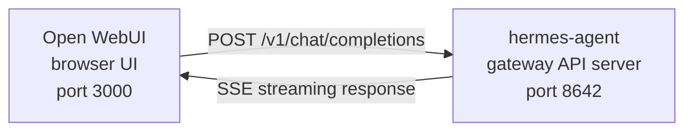

# Інтеграція Open WebUI

[Open WebUI](https://github.com/open-webui/open-webui) (126k★) — найпопулярніший самостійно розгорнутий інтерфейс чату для ШІ. За допомогою вбудованого API‑сервера Hermes Agent ти можеш використовувати Open WebUI як полірований веб‑фронтенд для свого агента — зі зручним керуванням розмовами, обліковими записами користувачів та сучасним чат‑інтерфейсом.
## Архітектура



Open WebUI підключається до API‑сервера Hermes Agent так само, як би підключався до OpenAI. Hermes обробляє запити своїм повним набором інструментів — термінал, файлові операції, веб‑пошук, пам'ять, навички — і повертає остаточну відповідь.

:::important Runtime location
API‑сервер — це **runtime‑середовище агента Hermes**, а не чистий проксі LLM. Для кожного запиту Hermes створює серверний `AIAgent` на хості API‑сервера. Виклики інструментів виконуються там, де працює цей API‑сервер.

Наприклад, якщо ноутбук вказує Open WebUI або інший сумісний з OpenAI клієнт на API‑сервер Hermes, що знаходиться на віддаленій машині, `pwd`, файлові інструменти, інструменти браузера, локальні інструменти MCP та інші інструменти робочого простору працюватимуть на віддаленому хості API‑сервера, а не на ноутбуці.
:::

Open WebUI спілкується з Hermes сервер‑до‑серверу, тому для цієї інтеграції не потрібен `API_SERVER_CORS_ORIGINS`.
## Швидке налаштування

### Однокомандний локальний bootstrap (macOS/Linux, без Docker)

Якщо ти хочеш, щоб Hermes + Open WebUI були під’єднані локально з багаторазовим лаунчером, виконай:

```bash
cd ~/.hermes/hermes-agent
bash scripts/setup_open_webui.sh
```

Що робить скрипт:

- гарантує, що `~/.hermes/.env` містить `API_SERVER_ENABLED`, `API_SERVER_HOST`, `API_SERVER_KEY`, `API_SERVER_PORT` та `API_SERVER_MODEL_NAME`
- перезапускає gateway Hermes, щоб API‑сервер запустився
- встановлює Open WebUI у `~/.local/open-webui-venv`
- створює лаунчер за адресою `~/.local/bin/start-open-webui-hermes.sh`
- на macOS встановлює користувацьку службу `launchd`; на Linux з `systemd --user` встановлює користувацьку службу там

За замовчуванням:

- API Hermes: `http://127.0.0.1:8642/v1`
- Open WebUI: `http://127.0.0.1:8080`
- назва моделі, яку рекламує Open WebUI: `Hermes Agent`

Корисні перевизначення:

```bash
OPEN_WEBUI_NAME='My Hermes UI' \
OPEN_WEBUI_ENABLE_SIGNUP=true \
HERMES_API_MODEL_NAME='My Hermes Agent' \
bash scripts/setup_open_webui.sh
```

На Linux автоматичне налаштування фонової служби вимагає працюючої сесії `systemd --user`. Якщо ти працюєш на безголовому SSH‑сервері і хочеш пропустити встановлення служби, виконай:

```bash
OPEN_WEBUI_ENABLE_SERVICE=false bash scripts/setup_open_webui.sh
```

### 1. Увімкнути API‑сервер

```bash
hermes config set API_SERVER_ENABLED true
hermes config set API_SERVER_KEY your-secret-key
```

`hermes config set` автоматично маршрутує прапорець у `config.yaml` і секрет у `~/.hermes/.env`. Якщо gateway вже запущений, перезапусти його, щоб зміна набрала сили:

```bash
hermes gateway stop && hermes gateway
```

### 2. Запустити gateway Hermes Agent

```bash
hermes gateway
```

Ти повинен побачити:

```
[API Server] API server listening on http://127.0.0.1:8642
```

### 3. Перевірити доступність API‑сервера

```bash
curl -s http://127.0.0.1:8642/health
# {"status": "ok", ...}

curl -s -H "Authorization: Bearer your-secret-key" http://127.0.0.1:8642/v1/models
# {"object":"list","data":[{"id":"hermes-agent", ...}]}
```

Якщо `/health` повертає помилку, gateway не підхопив `API_SERVER_ENABLED=true` — перезапусти його. Якщо `/v1/models` повертає `401`, твій заголовок `Authorization` не відповідає `API_SERVER_KEY`.

### 4. Запустити Open WebUI

```bash
docker run -d -p 3000:8080 \
  -e OPENAI_API_BASE_URL=http://host.docker.internal:8642/v1 \
  -e OPENAI_API_KEY=your-secret-key \
  -e ENABLE_OLLAMA_API=false \
  --add-host=host.docker.internal:host-gateway \
  -v open-webui:/app/backend/data \
  --name open-webui \
  --restart always \
  ghcr.io/open-webui/open-webui:main
```

`ENABLE_OLLAMA_API=false` вимикає бекенд Ollama за замовчуванням, який інакше показувався порожнім і захаращував вибір моделі. Прибери цей параметр, якщо у тебе дійсно працює Ollama поруч.

Перший запуск займає 15–30 секунд: Open WebUI завантажує моделі embedding sentence‑transformer (~150 МБ) під час першого старту. Дочекайся, поки `docker logs open-webui` стабілізується, перед тим як відкривати інтерфейс.

### 5. Відкрити інтерфейс

Перейди за **http://localhost:3000**. Створи свій адміністративний акаунт (перший користувач стає адміністратором). Ти повинен побачити свого агента у випадаючому списку моделей (названого за твоїм профілем, або **hermes-agent** для профілю за замовчуванням). Починай чат!
## Налаштування Docker Compose

Для більш постійної конфігурації створіть `docker-compose.yml`:

```yaml
services:
  open-webui:
    image: ghcr.io/open-webui/open-webui:main
    ports:
      - "3000:8080"
    volumes:
      - open-webui:/app/backend/data
    environment:
      - OPENAI_API_BASE_URL=http://host.docker.internal:8642/v1
      - OPENAI_API_KEY=your-secret-key
      - ENABLE_OLLAMA_API=false
    extra_hosts:
      - "host.docker.internal:host-gateway"
    restart: always

volumes:
  open-webui:
```

Потім:

```bash
docker compose up -d
```
## Налаштування через Admin UI

Якщо ти віддаєш перевагу налаштовувати підключення через інтерфейс замість змінних середовища:

1. Увійди в Open WebUI за адресою **http://localhost:3000**
2. Натисни на **avatar профілю** → **Admin Settings**
3. Перейди до **Connections**
4. У розділі **OpenAI API** натисни на **значок гайкового ключа** (Manage)
5. Натисни **+ Add New Connection**
6. Введи:
   - **URL**: `http://host.docker.internal:8642/v1`
   - **API Key**: те саме значення, що й `API_SERVER_KEY` у Hermes
7. Натисни **прапорець**, щоб перевірити підключення
8. **Save**

Твоя модель агента тепер має з’явитися у випадаючому списку моделей (названа за твоїм профілем або **hermes-agent** для профілю за замовчуванням).

:::warning
Змінні середовища впливають лише під час **першого запуску** Open WebUI. Після цього налаштування підключення зберігаються у його внутрішній базі даних. Щоб змінити їх пізніше, використай Admin UI або видали Docker‑том і запусти заново.
:::
## API Type: Chat Completions vs Responses

Open WebUI підтримує два режими API при підключенні до бекенду:

| Режим | Формат | Коли використовувати |
|------|--------|-----------------------|
| **Chat Completions** (default) | `/v1/chat/completions` | Рекомендовано. Працює «з коробки». |
| **Responses** (experimental) | `/v1/responses` | Для серверного збереження стану розмови через `previous_response_id`. |

### Using Chat Completions (recommended)

Це режим за замовчуванням і не потребує додаткової конфігурації. Open WebUI надсилає стандартні запити у форматі OpenAI, а Hermes Agent відповідає відповідно. Кожен запит містить повну історію розмови.

### Using Responses API

Щоб використати режим **Responses API**:

1. Перейди до **Admin Settings** → **Connections** → **OpenAI** → **Manage**
2. Відредагуй своє з’єднання **hermes-agent**
3. Зміни **API Type** з «Chat Completions» на **«Responses (Experimental)»**
4. Збережи

При використанні **Responses API** Open WebUI надсилає запити у форматі Responses (`input` array + `instructions`), і Hermes Agent може зберігати повну історію викликів інструментів між ходами за допомогою `previous_response_id`. Коли `stream: true`, Hermes також транслює нативні `function_call` та `function_call_output` елементи, що дозволяє реалізувати кастомний UI для структурованих викликів інструментів у клієнтах, які рендерять події Responses.

:::note
Open WebUI наразі керує історією розмови на боці клієнта навіть у режимі **Responses** — він надсилає повну історію повідомлень у кожному запиті, а не використовує `previous_response_id`. Основна перевага режиму **Responses** сьогодні — це структурований потік подій: дельти тексту, `function_call` та `function_call_output` надходять як SSE‑події OpenAI Responses замість чанків Chat Completions.
:::
## Як це працює

Коли ти надсилаєш повідомлення в Open WebUI:

1. Open WebUI надсилає запит `POST /v1/chat/completions` з твоїм повідомленням і історією розмови
2. Hermes Agent створює серверний екземпляр `AIAgent`, використовуючи профіль API‑сервера, конфігурацію моделі/провайдера, пам’ять, навички та налаштовані набори інструментів API‑сервера
3. Агент обробляє твій запит — він може викликати інструменти (термінал, операції з файлами, веб‑пошук тощо) на хості API‑сервера
4. Під час виконання інструментів **повідомлення про прогрес у рядку транслюються в UI**, щоб ти бачив, що робить агент (наприклад `` `💻 ls -la` ``, `` `🔍 Python 3.12 release` ``)
5. Остаточна текстова відповідь агента транслюється назад до Open WebUI
6. Open WebUI відображає відповідь у своєму чат‑інтерфейсі

Твій агент має доступ до тих самих інструментів і можливостей, що й екземпляр Hermes на цьому API‑сервері. Якщо API‑сервер віддалений, інструменти також віддалені.

Якщо тобі потрібні інструменти, що працюватимуть у твоєму **локальному** робочому просторі, запусти Hermes локально і вкажи його на чистого провайдера LLM або сумісний з OpenAI проксі‑модель (наприклад vLLM, LiteLLM, Ollama, llama.cpp, OpenAI, OpenRouter тощо). Майбутній режим розділеного виконання для «віддалений мозок, локальні руки» відстежується в [#18715](https://github.com/NousResearch/hermes-agent/issues/18715); це не поведінка поточного API‑сервера.

:::tip Прогрес інструменту
При ввімкненому стрімінгу (за замовчуванням) ти побачиш короткі індикатори у рядку під час роботи інструментів — емодзі інструменту та його ключовий аргумент. Вони з’являються у потоці відповіді перед остаточною відповіддю агента, даючи тобі уявлення про те, що відбувається за лаштунками.
:::
## Довідник конфігурації

### Hermes Agent (API server)

| Змінна | За замовчуванням | Опис |
|----------|-------------------|------|
| `API_SERVER_ENABLED` | `false` | Увімкнути API‑сервер |
| `API_SERVER_PORT` | `8642` | Порт HTTP‑серверу |
| `API_SERVER_HOST` | `127.0.0.1` | Адреса прив’язки |
| `API_SERVER_KEY` | _(required)_ | Токен типу **Bearer** для автентифікації. Має збігатися з `OPENAI_API_KEY`. |

### Open WebUI

| Змінна | Опис |
|----------|------|
| `OPENAI_API_BASE_URL` | URL API Hermes Agent (включно з `/v1`) |
| `OPENAI_API_KEY` | Має бути непорожнім. Має збігатися з вашим `API_SERVER_KEY`. |
## Усунення проблем

### У випадаючому списку не з’являються моделі

- **Перевір, чи URL має суфікс `/v1`**: `http://host.docker.internal:8642/v1` (а не лише `:8642`)
- **Переконайся, що gateway працює**: `curl http://localhost:8642/health` має повернути `{"status": "ok"}`
- **Перевір список моделей**: `curl -H "Authorization: Bearer your-secret-key" http://localhost:8642/v1/models` має повернути список з `hermes-agent`
- **Мережа Docker**: Усередині Docker `localhost` означає контейнер, а не твій хост. Використовуй `host.docker.internal` або `--network=host`.
- **Порожня частина backend Ollama, що перекриває вибір**: Якщо ти пропустив `ENABLE_OLLAMA_API=false`, Open WebUI показує порожню секцію Ollama над твоїми моделями Hermes. Перезапусти контейнер з `-e ENABLE_OLLAMA_API=false` або вимкни Ollama в **Admin Settings → Connections**.

### Тест підключення проходить, а моделі не завантажуються

Зазвичай це через відсутній суфікс `/v1`. Тест підключення Open WebUI — це базова перевірка зв’язку, він не перевіряє, чи працює отримання списку моделей.

### Відповідь займає багато часу

Hermes Agent може виконувати кілька викликів інструментів (читання файлів, запуск команд, веб‑пошук) перед тим, як сформувати остаточну відповідь. Це нормально для складних запитів. Відповідь з’являється одразу, коли агент завершить роботу.

### Помилки «Invalid API key»

Переконайся, що твій `OPENAI_API_KEY` в Open WebUI збігається з `API_SERVER_KEY` у Hermes Agent.

:::warning
Open WebUI зберігає налаштування сумісного з OpenAI підключення у власній базі даних після першого запуску. Якщо ти випадково зберіг неправильний ключ в Admin UI, зміна лише змінних середовища недостатня — онови або видали збережене підключення в **Admin Settings → Connections**, або скинь каталог даних / базу даних Open WebUI.
:::
## Налаштування багатокористувацького режиму з профілями

Щоб запускати окремі екземпляри Hermes для кожного користувача — кожен зі своєю конфігурацією, пам’яттю та інструментами — використовуйте [profiles](/user-guide/profiles). Кожен профіль запускає власний API‑сервер на іншому порту і автоматично рекламує назву профілю як модель в Open WebUI.

### 1. Створи профілі та налаштуй API‑сервери

`API_SERVER_*` — це змінні середовища, а не ключі YAML‑конфігурації, тому запиши їх у файл `.env` кожного профілю. Обери порти поза діапазоном за замовчуванням платформи (`8644` — адаптер вебхука, `8645` — wecom‑callback, `8646` — msgraph‑webhook), наприклад `8650+`:

```bash
hermes profile create alice
cat >> ~/.hermes/profiles/alice/.env <<EOF
API_SERVER_ENABLED=true
API_SERVER_PORT=8650
API_SERVER_KEY=alice-secret
EOF

hermes profile create bob
cat >> ~/.hermes/profiles/bob/.env <<EOF
API_SERVER_ENABLED=true
API_SERVER_PORT=8651
API_SERVER_KEY=bob-secret
EOF
```

### 2. Запусти кожен gateway

```bash
hermes -p alice gateway &
hermes -p bob gateway &
```

### 3. Додай з’єднання в Open WebUI

У **Admin Settings** → **Connections** → **OpenAI API** → **Manage** додай одне з’єднання на кожен профіль:

| Connection | URL | API Key |
|-----------|-----|---------|
| Alice | `http://host.docker.internal:8650/v1` | `alice-secret` |
| Bob | `http://host.docker.internal:8651/v1` | `bob-secret` |

У випадаючому списку моделей буде показано `alice` і `bob` як окремі моделі. Ти можеш призначати моделі користувачам Open WebUI через панель адміністратора, надаючи кожному користувачу його власного ізольованого агента Hermes.

:::tip Користувацькі назви моделей
Назва моделі за замовчуванням відповідає назві профілю. Щоб змінити її, встанови `API_SERVER_MODEL_NAME` у файлі `.env` профілю:
```bash
hermes -p alice config set API_SERVER_MODEL_NAME "Alice's Agent"
```
:::
## Linux Docker (без Docker Desktop)

У Linux без Docker Desktop `host.docker.internal` за замовчуванням не розв’язується. Варіанти:

```bash
# Option 1: Add host mapping
docker run --add-host=host.docker.internal:host-gateway ...

# Option 2: Use host networking
docker run --network=host -e OPENAI_API_BASE_URL=http://localhost:8642/v1 ...

# Option 3: Use Docker bridge IP
docker run -e OPENAI_API_BASE_URL=http://172.17.0.1:8642/v1 ...
```