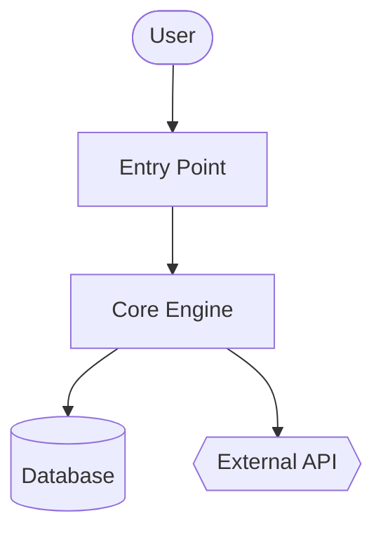
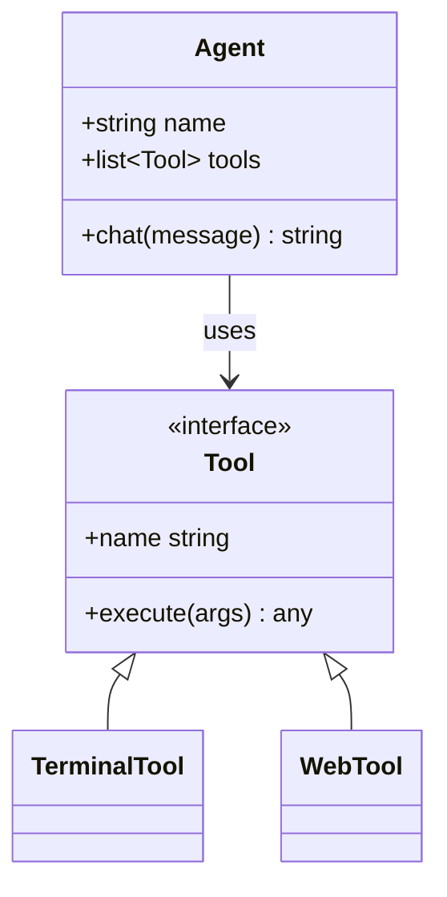
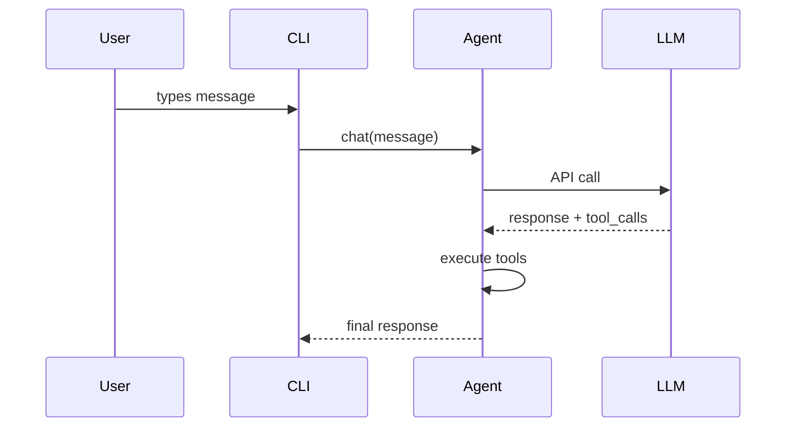

\{/* This page is auto-generated from the skill's SKILL.md by website/scripts/generate-skill-docs.py. Edit the source SKILL.md, not this page. */\}

# Вікі коду

Генеруй wiki‑документи + діаграми Mermaid для будь‑якої кодової бази.
## Метадані навички

| | |
|---|---|
| Джерело | Опціонально — встановити за допомогою `hermes skills install official/software-development/code-wiki` |
| Шлях | `optional-skills/software-development/code-wiki` |
| Версія | `0.1.0` |
| Автор | Teknium (teknium1), Hermes Agent |
| Ліцензія | MIT |
| Платформи | linux, macos, windows |
| Теги | `Documentation`, `Mermaid`, `Architecture`, `Diagrams`, `Wiki`, `Code-Analysis` |
| Пов’язані навички | [`codebase-inspection`](/docs/user-guide/skills/bundled/github/github-codebase-inspection), [`github-repo-management`](/docs/user-guide/skills/bundled/github/github-github-repo-management) |
:::info
The following is the complete skill definition that Hermes loads when this skill is triggered. This is what the agent sees as instructions when the skill is active.
:::

# Code Wiki Skill

Генеруй всебічну вікі для будь‑якої кодової бази — огляд, архітектуру, глибокі розбори по модулях, діаграми класів і послідовностей Mermaid. Натхненний Google CodeWiki, але працює з локальними репозиторіями, приватними репозиторіями та будь‑якою мовою. Використовує лише існуючі інструменти Hermes (`terminal`, `read_file`, `search_files`, `write_file`); без Docker, без зовнішніх сервісів, без додаткових залежностей.

Ця навичка створює **референційну документацію** (what/how). Вона не створює стратегічний наратив (why — це інша навичка).
## Коли використовувати

- Користувач каже «задокументуй цей код», «згенеруй вікі», «створи діаграми архітектури»
- Ознайомлення з незнайомим репозиторієм і потрібна структурована довідка
- Користувач вказує URL GitHub і просить документацію
- Потрібен стабільний артефакт (markdown + Mermaid), який відображається на GitHub

Не використовуйте це для:

- Документації одного файлу або однієї функції — відповідай безпосередньо
- API‑референсу для конкретної кінцевої точки — використай `read_file` і відповідай вбудовано
- Стратегічного «чому це існує» наративу — інший навик, інша мета
- Кодових баз, які користувач активно розробляє під час цієї сесії — просто відповідай на питання по мірі їх надходження
## Передумови

- Не потрібні змінні середовища.
- `git` у PATH для відстеження SHA репозиторію та віддалених клонів.
- За бажанням: `pygount` для статистики розподілу мов (дивись навичку `codebase-inspection`).
## Як запустити

Використовуй інструмент `terminal` у кореневій директорії цільового репозиторію, потім застосовуй `read_file` / `search_files` / `write_file` для створення вікі. Типове розташування виведення — `~/.hermes/wikis/<repo-name>/`. Записуй у репозиторій (`docs/wiki/`) лише тоді, коли користувач явно запитує це.
## Швидка довідка

| Крок | Дія |
|---|---|
| 1 | Визначити ціль — локальний cwd, заданий шлях або `git clone --depth 50 <url>` у тимчасову директорію |
| 2 | Сканувати структуру — `ls`, `find -maxdepth 3`, файли маніфесту, README |
| 3 | Вибрати 8–10 модулів для документування |
| 4 | Створити `README.md` (огляд + карта модулів) |
| 5 | Створити `architecture.md` з Mermaid‑flowchart |
| 6 | Створити документацію для кожного модуля в `modules/` |
| 7 | Створити `diagrams/class-diagram.md` (Mermaid classDiagram) |
| 8 | Створити `diagrams/sequences.md` (Mermaid sequenceDiagram, 2–4 робочих процеси) |
| 9 | Створити `getting-started.md` |
| 10 | Створити `api.md`, якщо потрібно, інакше пропустити |
| 11 | Створити `.codewiki-state.json` |
| 12 | Повідомити шляхи користувачу |
## Процедура

### 1. Визначення цілі

Для URL GitHub:

```bash
WIKI_TMP=$(mktemp -d)
git clone --depth 50 <url> "$WIKI_TMP/repo"
cd "$WIKI_TMP/repo"
REPO_SHA=$(git rev-parse HEAD)
REPO_NAME=$(basename <url> .git)
```

Для локального шляху (або cwd, якщо не вказано):

```bash
cd <path>
REPO_SHA=$(git rev-parse HEAD 2>/dev/null || echo "uncommitted")
REPO_NAME=$(basename "$PWD")
```

Потім встанови каталог виведення:

```bash
OUTPUT_DIR="$HOME/.hermes/wikis/$REPO_NAME"
mkdir -p "$OUTPUT_DIR/modules" "$OUTPUT_DIR/diagrams"
```

### 2. Сканування структури репозиторію

Використовуй інструмент `terminal` для роботи в оболонці, `read_file` для маніфестів:

```bash
# Shallow tree first
ls -la

# Deeper tree, noise filtered
find . -type d \
  -not -path '*/\.*' \
  -not -path '*/node_modules*' \
  -not -path '*/venv*' \
  -not -path '*/__pycache__*' \
  -not -path '*/dist*' \
  -not -path '*/build*' \
  -not -path '*/target*' \
  -maxdepth 3 | sort

# Language breakdown (skip if pygount unavailable)
pygount --format=summary \
  --folders-to-skip=".git,node_modules,venv,.venv,__pycache__,.cache,dist,build,target" \
  . 2>/dev/null || true
```

Потім `read_file` відповідні маніфести (`package.json`, `pyproject.toml`, `setup.py`, `Cargo.toml`, `go.mod`, `pom.xml`, `build.gradle`) та README проєкту. Використовуй `search_files target='files'`, щоб знайти їх, а не вгадувати назви.

### 3. Вибір модулів для документування

Обмеж початковий прохід **8–10 модулями**. Евристика за мовою:

- Python: пакети верхнього рівня (директорії з `__init__.py`), плюс підсистемні директорії
- JS/TS: `src/<subdir>`, директорії робочих просторів верхнього рівня
- Rust: кожен crate у робочому просторі або директорії `src/<module>` верхнього рівня
- Go: кожна директорія пакету верхнього рівня
- Змішані/незнайомі: директорії верхнього рівня, що містять вихідний код (не конфігурації, не тести)

Для дуже великих репозиторіїв пріоритети:
1. Кількість імпортів (модуль, який імпортується багатьма, — ядро)
2. LOC (більші модулі зазвичай потребують окремої документації)
3. Згадки у README / документації верхнього рівня

Виведи список модулів користувачу перед генерацією документів по модулях у великих репо — це дасть йому можливість перенаправити процес.

### 4. Написання `README.md`

`read_file` фактичний README проєкту плюс 2–3 файли входу. Потім `write_file`:

````markdown
# <Project Name>

<One paragraph: what it is and what it's for. Self-contained — don't assume the
reader has the source README.>

## Key Concepts

- **<Concept 1>** — <one line>
- **<Concept 2>** — <one line>

## Entry Points

- [`path/to/main.py`](https://github.com/NousResearch/hermes-agent/blob/main/optional-skills/software-development/code-wiki/<link>) — <what runs when you start it>
- [`path/to/cli.py`](https://github.com/NousResearch/hermes-agent/blob/main/optional-skills/software-development/code-wiki/<link>) — <CLI surface>

## High-Level Architecture

<2-3 sentences. Detail goes in architecture.md.>

See [architecture.md](https://github.com/NousResearch/hermes-agent/blob/main/optional-skills/software-development/code-wiki/architecture.md).

## Module Map

| Module | Purpose |
|---|---|
| [`<module>`](https://github.com/NousResearch/hermes-agent/blob/main/optional-skills/software-development/code-wiki/modules/<module>.md) | <one-line purpose> |

## Getting Started

See [getting-started.md](https://github.com/NousResearch/hermes-agent/blob/main/optional-skills/software-development/code-wiki/getting-started.md).
````

Для цільових посилань у локальному режимі використай відносні шляхи. Для клонованих репо використай `https://github.com/<owner>/<repo>/blob/<sha>/<path>`, щоб посилання залишалися дійсними після майбутніх комітів.

### 5. Написання `architecture.md`

````markdown
# Architecture

<2-3 paragraphs: shape of the system. What talks to what. Where data enters,
where it exits, where state lives.>

## Components

- **<Component>** — <1-2 sentences>. See [`modules/<module>.md`](https://github.com/NousResearch/hermes-agent/blob/main/optional-skills/software-development/code-wiki/modules/<module>.md).

## System Diagram



## Data Flow

1. **<Step>** — [`<file>`](https://github.com/NousResearch/hermes-agent/blob/main/optional-skills/software-development/code-wiki/<link>)
2. **<Step>** — [`<file>`](https://github.com/NousResearch/hermes-agent/blob/main/optional-skills/software-development/code-wiki/<link>)

## Key Design Decisions

- <Anything load-bearing the reader should know>
````

**Семантика форм у Mermaid:**
- `[]` = компонент
- `[()]` = база даних / сховище
- `{{}}` = зовнішній сервіс
- `(())` = точка входу або термінал
- `-->` = синхронний виклик, `-.->` = асинхронний/подія

Обмеж ~20 вузлів на діаграму. Якщо більше — розділи на під‑діаграми.

### 6. Написання документів по модулях у `modules/`

Для кожного обраного модуля оглянь його структуру за допомогою `ls`, визнач 3–5 найважливіших файлів (за розміром, назвою `core.py` / `main.py` / `__init__.py`, кількістю імпортів), потім `read_file` ці файли (використовуй `offset` / `limit`, щоб читати лише потрібне; краще `search_files` для конкретних символів).

````markdown
# Module: `<module>`

<1-2 sentence purpose.>

## Responsibilities

- <bullet>
- <bullet>

## Key Files

- [`<module>/<file>`](https://github.com/NousResearch/hermes-agent/blob/main/optional-skills/software-development/code-wiki/<link>) — <what it does>

## Public API

<Functions/classes/constants other code uses. Group related items. Show
signatures, not full implementations.>

## Internal Structure

<How the module is organized internally. State management.>

## Dependencies

- **Used by:** <other modules>
- **Uses:** <other modules + external libs>

## Notable Patterns / Gotchas

- <Anything non-obvious>
````

### 7. Написання `diagrams/class-diagram.md`

Вибери 5–10 найважливіших класів/типів. `read_file` їх, потім запиши:

````markdown
# Class Diagram

## Core Types



## Notes

<Anything the diagram can't express — lifecycle, threading, etc.>
````

Для мов без класів (Go, C, Rust): використай діаграму для зв’язків структур, або пропусти `class-diagram.md` і поясни це прозово в `architecture.md`. Не примушуй.

### 8. Написання `diagrams/sequences.md`

Вибери 2–4 найважливіших робочих процеси. Прослідкуй кожний шлях викликів у коді (прочитай точку входу, слідкуй за викликами функцій), потім:

````markdown
# Sequence Diagrams

## Workflow: <Name>

<1 sentence describing what this does and when it runs.>



### Walkthrough

1. **User input** — [`cli.py:HermesCLI.run_session`](https://github.com/NousResearch/hermes-agent/blob/main/optional-skills/software-development/code-wiki/<link>)
2. **Message dispatch** — [`run_agent.py:AIAgent.chat`](https://github.com/NousResearch/hermes-agent/blob/main/optional-skills/software-development/code-wiki/<link>)
````

Не вигадуй учасників. Кожен блок має відповідати реальному компоненту, який читач може знайти в коді.

### 9. Написання `getting-started.md`

````markdown
# Getting Started

## Prerequisites

<From manifest files + README. Be specific — versions if pinned.>

## Installation

```bash
<exact commands>
```

## First Run

```bash
<minimum command to see the system do something useful>
```

## Common Workflows

### <Workflow 1>
<commands>

## Configuration

- `<config-file>` — <what it controls>
- Env var `<VAR>` — <what it controls>

## Where to Go Next

- Architecture: [architecture.md](https://github.com/NousResearch/hermes-agent/blob/main/optional-skills/software-development/code-wiki/architecture.md)
- Module reference: [README.md#module-map](https://github.com/NousResearch/hermes-agent/blob/main/optional-skills/software-development/code-wiki/README.md#module-map)
````

### 10. Написання `api.md` (пропусти, якщо не застосовано)

Пиши це лише якщо проєкт — бібліотека або API‑сервер. Якщо так:

- Знайди публічну API‑поверхню (`__init__.py` експорти, OpenAPI‑специфікації, обробники маршрутів, експортовані типи)
- Документуй кожен публічний елемент з підписом, параметрами, типом повернення, однорядковим описом
- Групуй за категоріями

### 11. Запис файлу стану

```bash
cat > "$OUTPUT_DIR/.codewiki-state.json" <<EOF
{
  "repo_name": "$REPO_NAME",
  "source_path": "$PWD",
  "source_sha": "$REPO_SHA",
  "generated_at": "$(date -u +%Y-%m-%dT%H:%M:%SZ)",
  "generator": "hermes-agent code-wiki skill v0.1.0",
  "modules_documented": []
}
EOF
```

### 12. Звіт користувачу

Вкажи точно, що було згенеровано і де:

```
Generated wiki at ~/.hermes/wikis/<repo-name>/:
  README.md                   project overview, module map
  architecture.md             system architecture + flowchart
  getting-started.md          setup, first run, workflows
  modules/<N files>           per-module deep-dives
  diagrams/architecture.md    Mermaid flowchart
  diagrams/class-diagram.md   Mermaid class diagram
  diagrams/sequences.md       Mermaid sequence diagrams
```

Якщо ти клонував у тимчасову директорію, нагадай користувачу, що її можна видалити (`rm -rf "$WIKI_TMP"`), після того як він переглянув вікі.
## Контроль області

Генерування повної вікі для монорепозиторію обсягом 500 K LOC є надзвичайно дорогим у токенах. За замовчуванням використовується обмежена область:

- Початкове сканування: максимальна глибина — 3 каталоги
- Документація по модулях: обмеження — 10 модулів, якщо користувач не розширює область
- Читання файлів: надавай перевагу `search_files` для символів + `read_file` з `offset`/`limit` замість повного читання
- Пропускати vendored‑код (`vendor/`, `third_party/`, згенерований код, `_pb2.py`, `.min.js`)

Якщо користувач каже «зробити все повністю», повір йому — але спочатку оцінити вартість: «у цьому репозиторії ~340 джерельних файлів, повне охоплення буде дорогим — підтвердити?»
## Перезапуск / Оновлення

Якщо файл `.codewiki-state.json` вже існує за цільовим шляхом:

- Прочитай його, щоб отримати попередній SHA та список модулів
- Якщо SHA джерела збігається: запитай у користувача, чи хоче він перегенерувати або пропустити
- Якщо SHA відрізняється: запропонуй перегенерувати лише модулі з зміненими файлами (`git diff --name-only <old-sha> HEAD`)

Повна інкрементальна перегенерація — це майбутнє покращення; наразі прийнятно перегенерувати все цілком.
## Підводні камені

- **Фабрикація компонентів.** Кожен вузол діаграми та заявлений виклик функції мають бути в коді. `read_file` перед записом. Найбільший режим відмови для автоматично згенерованої документації — правдоподібна, але вигадана інформація.
- **Загальний AI‑текст.** «Цей модуль відповідає за…» не несе змісту. Пояснюй, що модуль дійсно робить, використовуючи термінологію домену.
- **Перефразування коду prose‑ом.** Документація модуля, яка каже «функція `process` обробляє речі, викликаючи `process_item` для кожного елементу», гірша, ніж просто посилання на функцію.
- **Mermaid > 50 вузлів.** Вони не відображаються чітко. Розділяй їх.
- **Документування тестів, згенерованого коду або вендорних залежностей як продуктового коду.** Пропускай їх.
- **Вивід у репозиторій без запиту.** За замовчуванням — `~/.hermes/wikis/`. Записуй у репозиторій лише коли користувач явно цього вимагає.
- **Спеціальні символи Mermaid потребують лапок:** `A["Tool / Agent"]`, а не `A[Tool / Agent]`. `<br>` — для розриву рядка всередині вузла.
- **Вкладені блоки коду у SKILL.md.** При написанні markdown‑прикладу, що містить блок Mermaid, використовуйте зовнішні огороджувачі з 4 бектиками, щоб 3‑бектиковий внутрішній ```` ```mermaid ```` не закривав зовнішній. (Цей SKILL.md так і робить.)
- **Генерики у classDiagram** відображаються як `~T~` (наприклад `List~Tool~`), а не `<T>`.
- **Тема GitHub Mermaid фіксована** — не включайте блоки `%%{init: ...}%%`; вони видаляються під час рендерингу.
## Перевірка

Після написання перевір:

1. **Блоки Mermaid збалансовані** — відкриваючі та закриваючі теги рівні у кожному файлі:
   ```bash
   for f in "$OUTPUT_DIR"/diagrams/*.md "$OUTPUT_DIR"/architecture.md; do
     opens=$(grep -c '^```mermaid' "$f")
     total=$(grep -c '^```' "$f")
     echo "$f: $opens mermaid blocks, $total total fences (expect total = opens*2)"
   done
   ```
2. **Усі очікувані файли існують** —
   ```bash
   ls "$OUTPUT_DIR"/{README.md,architecture.md,getting-started.md,.codewiki-state.json} \
      "$OUTPUT_DIR"/modules/ "$OUTPUT_DIR"/diagrams/
   ```
3. **Кількість модулів відповідає запланованій** — `ls "$OUTPUT_DIR/modules" | wc -l` має дорівнювати кількості модулів, які ти зазначив у кроці 3.
4. **Не створено вигаданих шляхів** — перевірка 2–3 посилань на джерела, щоб вони вказували на реальні файли.